**apis-main Specification**
====================
**Rev 0.75**

# **Contents**
- [**apis-main Specification**](#apis-main-specification)
- [**Contents**](#contents)
- [**1. Terms and Abbreviations**](#1-terms-and-abbreviations)
- [**2. Overview**](#2-overview)
- [**3. Software Composition**](#3-software-composition)
  - [**3.1. Software Architecture**](#31-software-architecture)
  - [**3.2. Services within apis-main**](#32-services-within-apis-main)
- [**4. Detailed Description of Actions**](#4-detailed-description-of-actions)
  - [**4.1. Formation of Clusters**](#41-formation-of-clusters)
  - [**4.2. Grid Master Selection**](#42-grid-master-selection)
  - [**4.3. apis-main Processing**](#43-apis-main-processing)
  - [**4.4. Grid Master Processing**](#44-grid-master-processing)
  - [**4.5. Processing of Energy sharing**](#45-processing-of-energy-sharing)
  - [**4.6. Various Locking Processes**](#46-various-locking-processes)
- [**5. Communication Specifications**](#5-communication-specifications)
  - [**5.1. Web API between apis-main and Device Driver**](#51-web-api-between-apis-main-and-device-driver)
  - [**5.2. Expected Return Values of apis-main-Device Driver Get Web API**](#52-expected-return-values-of-apis-main-device-driver-get-web-api)
    - [**5.2.1. Expected Return Values of “/dcdc/get”**](#521-expected-return-values-of-dcdcget)
    - [**5.2.2. Expected Return Values of “/dcdc/get/status”**](#522-expected-return-values-of-dcdcgetstatus)
    - [**5.2.3. Expected Return Values of “/dcdc/set?dig=\<Grid current value\>”**](#523-expected-return-values-of-dcdcsetdiggrid-current-value)
    - [**5.2.4. Expected Return Values of “/dcdc/set?dvg=\<Grid voltage value\>\&drg=\<Grid droop rate\>”**](#524-expected-return-values-of-dcdcsetdvggrid-voltage-valuedrggrid-droop-rate)
    - [**5.2.5. Expected Return Values of “/dcdc/set?mode=\<Mode\>\&dvg=\<Grid voltage value\>\&dig=\<Grid current value\>\&dig=\<Grid droop rate\>”**](#525-expected-return-values-of-dcdcsetmodemodedvggrid-voltage-valuediggrid-current-valuediggrid-droop-rate)
    - [**5.2.6. Expected Return Values of “/battery/get”**](#526-expected-return-values-of-batteryget)
    - [**5.2.7. Expected Return Values of “/all/get”**](#527-expected-return-values-of-allget)
    - [**5.2.8. Expected Return Values of “/version/get”**](#528-expected-return-values-of-versionget)
  - [**5.3. Device Driver–Hardware Communication Specifications**](#53-device-driverhardware-communication-specifications)
- [**6. Configuration Files**](#6-configuration-files)
  - [**6.1. config.json**](#61-configjson)
  - [**6.2. hwConfig.json**](#62-hwconfigjson)
  - [**6.3. scenario.json**](#63-scenariojson)
  - [**6.4. policy.json**](#64-policyjson)
  - [**6.5. cluster.xml**](#65-clusterxml)
  - [**6.6. logging.properties**](#66-loggingproperties)
  - [**6.7. start.sh**](#67-startsh)
  - [**6.8. stop-kill.sh**](#68-stop-killsh)
  - [**6.9. key.pem**](#69-keypem)
  - [**6.10. cert.pem**](#610-certpem)
- [**7. DC Grid Control Functions**](#7-dc-grid-control-functions)
  - [**7.1. Select Voltage Reference**](#71-select-voltage-reference)
  - [**7.2. Voltage Ramp-Up**](#72-voltage-ramp-up)
  - [**7.3. Voltage Reference Authorization**](#73-voltage-reference-authorization)
  - [**7.4. Current Compensation Function**](#74-current-compensation-function)
  - [**7.5. Constant Voltage (CV) Transfer**](#75-constant-voltage-cv-transfer)
  - [**7.6. Voltage Optimization**](#76-voltage-optimization)
- [**8. Grid Master Data Collection**](#8-grid-master-data-collection)
- [**9. Logging Functions**](#9-logging-functions)
  - [**9.1. apis-main Action Log**](#91-apis-main-action-log)
  - [**9.2. Output Destination of apis-main Action Log**](#92-output-destination-of-apis-main-action-log)
  - [**9.3. energy sharing Log**](#93-energy-sharing-log)
- [**10. Error Handling/Protection Functions**](#10-error-handlingprotection-functions)
  - [**10.1. apis-main Error Handling**](#101-apis-main-error-handling)
- [**11. Other Functions**](#11-other-functions)
  - [**11.1Topology Detection**](#111topology-detection)
  - [**11.2. Gateway Function**](#112-gateway-function)
- [**12. Safety Confirmation Functions**](#12-safety-confirmation-functions)
  - [**12.1. Global Safety Check**](#121-global-safety-check)
  - [**12.2. Local Safety Check**](#122-local-safety-check)
    - [**12.2.1. Static Local Safety Check**](#1221-static-local-safety-check)
    - [**12.2.2. Dynamic Local Safety Check**](#1222-dynamic-local-safety-check)
- [**13. Security**](#13-security)
  - [**13.1. Communication Security between apis-mains**](#131-communication-security-between-apis-mains)
  - [**13.2. Device Driver Access Restriction**](#132-device-driver-access-restriction)
- [**14. Privacy**](#14-privacy)
- [**15. Open Source Software Licenses**](#15-open-source-software-licenses)
- [**16. Operating Environment**](#16-operating-environment)
  - [**16.2. Recommended Hardware Specifications**](#162-recommended-hardware-specifications)
  - [**16.2. Recommended Operating System Specifications**](#162-recommended-operating-system-specifications)

 

# **1. Terms and Abbreviations**

| **Term**         |**Description**|
| ---------------- | ------------------------------------------------------------------------------------------------------------------------------------------------------------------------------------------------------------------------------------------------------------------------- |
| apis-main        | Software for energy sharing developed by Sony CSL that enables autonomous decentralized control.|
| PP2P             | Short for Physical Peer to Peer. Distinguished from conventional P2P in that it is not a technology for facilitating electricity trading using a digital ledger management system like blockchain. Instead, it enables physical energy sharing between specific partners. |
| Grid Master      | Name of service included in apis-main. Controls the DC grid for energy sharing.|
| Hazelcast        | In-memory distributed computing library that accelerates applications by distributing data across multiple machines and carrying out parallel processing.|
| Vert.x           | A framework for implementing load balanced programs. Using Hazelcast, the Event Bus is clustered and processed with load balancing.|
| Event Bus        | The basic processing unit of a Vert.x program is called a Verticle. The Event Bus is an asynchronous interface for verticle-to-verticle communications.|
| Shared Memory    | Shared information in a Hazelcast cluster. APIs participating in the cluster can reference, edit, and delete the shared memory.|
| EZA2500          | In this document, refers to EZA-2500-32048SC0, a custom product in the EZA2500 series, manufactured by TDK-Lambda.|
| dcdc_batt_comm | Device Driver developed by Sony CSL for controlling EZA2500 and obtaining battery information.|

 

# **2. Overview**

apis-main is the name of energy sharing software for autonomous distributed control of energy developed by Sony CSL. apis-main is installed in each node (battery system connected the DC grid via a bidirectional DC/DC converter). Via the Device Driver, the software periodically obtains the remaining capacity of the battery and automatically carries out energy sharing between nodes by carrying out negotiations with other apis-mains in accordance with behavior rulesets determined by each node’s remaining battery capacity. (These behavior rulesets refer to sets of rules for making decisions such as whether to send a charge/discharge request to other apis-mains or accept a charge/discharge request from another apis-main on the basis of the remaining capacity of the node’s battery.) Negotiations between apis-mains use a communication line such as Ethernet, and the energy sharing takes place with direct current on the DC grid. apis-main does not rely on software that carries out centralized control of nodes. All nodes have the same software, apis-main, and autonomous distributed control is carried out with only apis-main in each node. (apis-main achieves control by launching an ad-hoc centralized management program called Grid Master. Grid Master can be launched by any apis-main based on predetermined rules.)

 

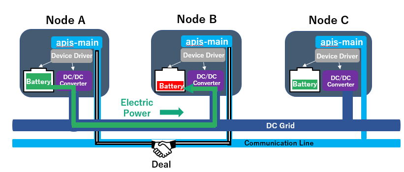  
Fig. 2-1

 

Fig. 2-2 shows an example of energy sharing between batteries. In the case of flow of power from Battery A to Battery B, energy sharing takes place by setting the mode of the bidirectional DC/DC converter in each node. The mode is set by the apis-main in each node via the Device Driver. For the discharge node, the mode is set to Constant Current Mode (CC Mode). For the charge node, the mode is set to Constant Voltage Mode (CV Mode).

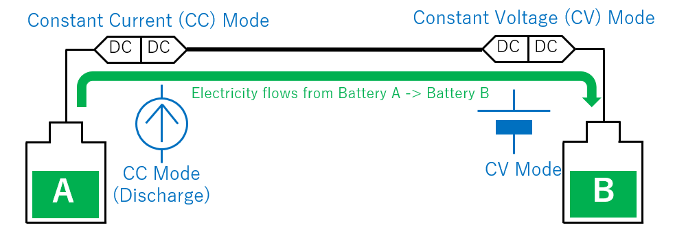  
Fig. 2-2

 

An example of the steps of negotiation between apis-mains is as follows. (See Fig. 2-3.)

1.  Each apis-main periodically gets its own battery’s remaining capacity via the Device Driver.

2.  An apis-main compares its remaining battery capacity obtained in ① with its own behavior ruleset A.

3.  After comparing with behavior ruleset A, it issues requests to other apis-mains if needed.

4.  Upon receiving requests, other apis-mains get their batteries’ remaining capacities.

5.  apis-mains compare their remaining battery capacities obtained in ④ with their own behavior ruleset B.

6.  After comparing with behavior ruleset B, if it is possible to accept the request, an apis-main accepts the request.

7.  The apis-main that issues the request chooses the appropriate acceptance from multiple acceptances. (See 6.3 scenario.json for the selection algorithm.)

8.  Energy sharing deal information is created from the request and chosen acceptance.

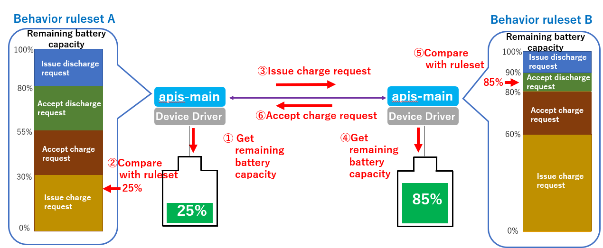  
Fig. 2-3

 

A single apis-main connected to the communication line and DC grid is shown in Fig. 2-4.

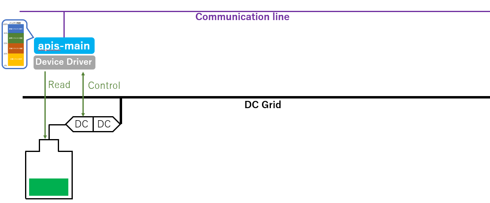  
Fig. 2-4

 

Next, the structure composed of multiple apis-mains are shown in Fig. 2-5.

  
Fig. 2-5

 

As shown in Fig. 2-6, apis-mains can carry out multiple energy sharing in parallel.

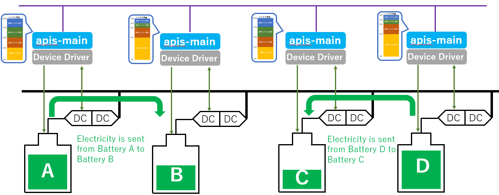  
Fig. 2-6

 

As shown in Fig. 2-7, an important point of notice when controlling the DC grid is that voltage conflict can occur when there are two or more DC/DC converters in CV Mode on the DC grid.

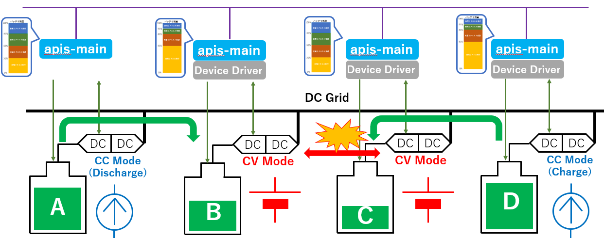  
Fig. 2-7

 

Because of this, control energy sharing by setting one DC/DC converter to CV Mode and all other DC/DC converters to CC Mode on the DC grid, as shown in Fig. 2-8.

  
Fig. 2-8

 

To carry out the above control, a service in apis-main called Grid Master controls the DC grid. Apis-mains Formation of Clusters when they start up by communicating via communication lines. They select one node in the cluster that will run Grid Master in accordance with predetermined rules. Grid Master controls all DC/DC converters in a cluster via Device Drivers to carry out energy sharing on the DC grid. All apis-mains can serve as Grid Master. Grid Master can be dynamically transferred in accordance with predetermined rules.

  
Fig. 2-9

 

# **3. Software Composition**

## **3.1. Software Architecture**

Fig. 3-1 shows the software architecture. The Java Development Kit (JDK) is installed on the Linux operating system. apis-main runs on two frameworks: event-driven load balancing platform Vert.x and in-memory distributed computing platform Hazelcast. Information is transferred between apis-main and the Device Driver via Web API. (For versions of verified open source software used, see 15. Open Source Software Licenses.)

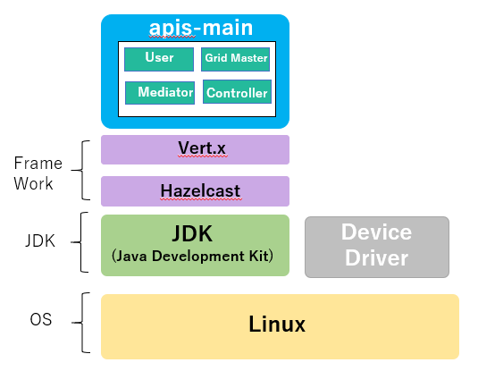  
Fig. 3-1

## **3.2. Services within apis-main**

A node includes apis-main, the software that realizes energy sharing, and the Device Driver, which communicates with the battery and the DC/DC converter. apis-main is composed of the following four services (see Fig. 3-2).

1)  User Service  
   The file describing the battery charge/discharge requests for each remaining battery capacity (described as a behavior ruleset in “2. Overview”) is called a Scenario file. The User Service makes decisions on charging and discharging requests by comparing the Scenario file content with the current remaining battery capacity. If it determines that charging/discharging is necessary, it sends a request to the Mediator Service to carry out negotiations with other apis-mains.

2)  Mediator Service  
   Based on the request from the User Service, it carries out negotiations with other apis-mains and create energy sharing deal information. It also activates Grid Master as necessary.

3)  Grid Master Service  
   Carries out energy sharing by receiving energy sharing deal information created by its own apis-main or another apis-main and controlling the DC/DC converters necessary for energy sharing. During a energy sharing, the service monitors the amount of power being interchanged and stops the interchange after the power amount as determined by the energy sharing deal information is reached. Energy sharing records are stored in the non-volatile memory of the hardware of both apis-mains involved in the energy sharing.

4)  Controller Service  
   Gets DC/DC converter and battery information requested by User Service.
   Also, upon request from its own apis-main’s Grid Master Service or from another apis-main, carries out energy sharing by controlling the DC/DC converter.

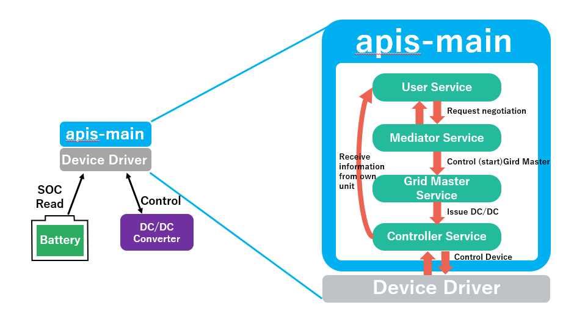  
Fig. 3-2

 

# **4. Detailed Description of Actions**
    
## **4.1. Formation of Clusters**

When apis-mains are started, a Hazelcast Cluster Manager implemented by the Vert.x framework is used to form clusters of multiple apis-mains on the communication line. For apis-mains to join the same cluster, the same cluster name must be specified in their cluster.xml configuration files.

## **4.2. Grid Master Selection**

When an apis-main is started, its Mediator Service’s Gird Master Management function looks into the existence of Grid Master in a cluster at a random time. If there is no Grid Master in the cluster immediately after startup, the appropriate Grid Master is selected in accordance with configuration rules. There are three methods for selecting Grid Master: “voltageReference”, “fixed”, and “anywhere”.

 

1)  voltageReference  
   In this method, the node with the Voltage Reference (CV Mode) at the time of energy sharing is selected as the Grid Master. The Grid Master is also transferred to another node if the Voltage Reference is transferred.
   Because the node that becomes the Voltage Reference is determined at the time energy sharing begins, Grid Master is not determined immediately after apis-mains start up. Because of this, the existence of Grid Master is inquired during apis-main startup. If there is no response, the inquiry node tries to become the Grid Master on its own. (To prevent multiple Grid Masters from simultaneously activating, a node waits for a random amount of time before trying to start its own Grid Master Service. Before starting, it again confirms whether or not Grid Master exists. If not, it starts its own Grid Master Service.)

1)  fixed  
   This selection method chooses a fixed node as Grid Master. When selecting a fixed Grid Master, the apis-main of the node specified as fixed must be started first in the cluster.

2)  anywhere  
   The node whose apis-main starts up first becomes the Grid Master. Afterwards, if a problem occurs and Grid Master becomes unavailable, the node that detects the unavailability or absence of Grid Master tries to become the new Grid Master.

 

## **4.3. apis-main Processing**

apis-main carries out the following processing loop continuously.

 1. The apis-main sends a Hello message to the Event Bus to confirm that another apis-main with the same ID does not exist in the cluster. (If it exists, the apis-main shuts itself down as error handling.)
 
2. The apis-main’s own local error information is taken out from the cache and handled. Each apis-main sends information about errors that occur to all nodes on the Event Bus. The node receiving the error information stores only its own and local error information in its own cache. Global error information is stored in the cache of nodes running Grid Master. Specific descriptions of errors and handling methods are given below. (See 10.1. apis-main Error Handling.)
 
3. The global error information in Grid Master is confirmed.
 
4. Its own mode setting is confirmed. (See types of mode settings below.)
    Run: This is a standard setting when energy sharing is running, which enables the generation of energy sharing.
    Soft Stop: The existing energy sharing is carried out, but new energy sharing is not created.
    Force Stop: The existing energy sharing is stopped and new energy sharing is not created.
    Manual: Mode that allows the DC/DC converter, etc., to run manually for inspection and testing purposes.

5. apis-main gets its DC/DC converter and battery information via the Controller Service.
 
6. Local safety check is carried out. (See 12.2 Local Safety Check.)
 
7. apis-main gets its Scenario information.
 
8. apis-main compares its own battery information with the Scenario information. If it determines the battery to be in excess capacity or insufficient capacity, the User Service sends instruction to the Mediator Service to issue a energy sharing request to all apis-mains in the cluster.

9. The Mediator Service that receives a energy sharing request from another apis-main passes this request to its own User Service. The User Service evaluates whether or not the request can be handled based on the remaining battery capacity in its own node and the Scenario file. If the request can be supported, the power possible for interchange is calculated and the result is returned as acceptance information to the requesting node. If the request cannot be supported, the request is ignored and acceptance information is not sent.
 
10. The Mediator Service in the node that requested the energy sharing passes processing to the User Service in the node. It selects the optimal energy sharing partner node in accordance with selection algorithm specified in the Scenario file, based on the power possible for interchange given in the responses of other apis-mains. The energy sharing deal information is then stored in Hazelcast’s shared memory and awaits processing by Grid Master.

 

## **4.4. Grid Master Processing**

Grid Master carries out the following processing loop continuously.

1. Before Grid Master is started, a lock is applied by registering its ID in Hazelcast’s shared memory so that another apis-main does not become Grid Master. (When Grid Master is transferred, the registered ID is deleted from shared memory.)
 
2. Grid Master sends a Hello message to the Event Bus to confirm that there is no duplicate Grid Master in the cluster. If a duplicate is found, error handling is carried out.
 
3. Global error information issued by each apis-main to the Event Bus is saved in the cache.
 
4. Global error information is taken out from the cache and error handling is carried out. (See 10. Error Handling/Protection Functions)
 
5. Grid Master gets DC/DC converter and battery information from all apis-mains. (See 8. Grid Master Data Collection.)
 
6. It calculates the total number of nodes in the cluster and the average remaining battery capacity on the DC grid.
 
7. Global Safety Check is carried out. (See 12.1 Global Safety Check.)
 
8. Energy sharing is carried out sequentially based on energy sharing deal information registered in Hazelcast’s shared memory.
 
9. When a transfer of Grid Master occurs, Grid Master is moved to the appropriate node.  
(When Grid Master is moved, hand-over information such as existing energy sharing information exists in Hazelcast’s shared memory. There is thus no need for communication between the old and new Grid Masters to hand over information. After the new Grid Master starts up, it begins operations by referring to Grid Master information in the shared memory.)

 

## **4.5. Processing of Energy sharing**

Energy sharing deal information registered in Hazelcast’s shared memory has one of the following statuses: “Not activated”, “Activated”, “Started”, “Stopped”, and “Deactivated”.

Grid Master gathers all energy sharing deal information registered in shared memory and carries out the optimal process for each status, one at a time.

 

1) Not activated  
   Indicates status where energy sharing is not carried out and the DC grid’s voltage is not ramped up.
   If energy sharing transaction information in shared memory has this status, Grid Master sends instruction to apis-main on the Voltage Reference side to set its DC/DC converter to CV Mode. When set to CV Mode, the DC/DC converter ramps up to the voltage specified by the DC grid. After ramp-up is complete, the status moves to (2) Activated. (See 7.2 Voltage Ramp-Up.)

1) Activated  
   Indicates the state where DC grid voltage ramp-up has completed and energy sharing can begin. If energy sharing is already taking place and DC grid voltage ramp up is complete, the new status of energy sharing deal information is Activated. If the status of energy sharing deal information in shared memory is Activated, Grid Master sets each of DC/DC converters of apis-mains carrying out the energy sharing to CC Mode, and the status changes to (3) Started.

2) Started  
   This status of energy sharing deal information in shared memory indicates that energy sharing has started. Grid Master confirms that the accumulation of power being interchanged in Grid Master’s own loop processing is reaching the target power amount. If the amount is reached, Grid Master instructs to the apis-main of the discharge node to set the mode of its DC/DC converter to Wait in order to stop the energy sharing. The status is changed to (4) Stopped.

3) Stopped  
   If energy sharing deal information registered in shared memory has this status, the accumulated amount of power already interchanged has reached the target amount, and the DC/DC converter on the discharging side is in Wait mode. The Grid Master instructs the charge node’s apis-main to set the mode of the DC/DC converter to Wait, and the status changes to (5) Deactivate. At that time, other energy sharing continue. If the energy sharing of a DC/DC converter that moved into CV Mode stops, the CV Mode is transferred. (See 7.5 Constant Voltage (CV) Transfer).

4) Deactivate  
   This status of the energy sharing deal information in shared memory indicates that the energy sharing has already been completed. The results of energy sharing in both the discharge node and charge node are written as files, and the energy sharing information is removed from shared memory. (Saving the final energy sharing results is carried out at the end of the energy sharing process. The energy sharing information in both the discharge and charge nodes involved in the energy sharing is saved in files.)

## **4.6. Various Locking Processes**

apis-main applies exclusive locks that restrict simultaneous access to maintain the data integrity of Hazelcast’s shared memory and local memory of each node. It also applies interlocks that restrict other actions when certain conditions are not met.

1)  Shared memory lock  
   * Grid Master interlock  
    Before the Grid Master service is started, a lock is applied by assigning an ID to the service in shared memory so that another node cannot start Grid Master Service.
    When transferring Grid Master, the Grid Master service is terminated. The Grid Master interlock in shared memory is removed and a new lock is applied by assigning an ID to another node. Grid Master is then transferred.

2)  Local memory locks  
   * Energy sharing interlock  
    This lock is applied by Grid Master to both nodes carrying out the energy sharing. The number of energy sharing is determined by the maximum current of the DC/DC converter and the current per energy sharing.
   * Exclusive lock for energy sharing interlock  
    Acquiring/releasing the energy sharing interlock is done asynchronously. However, to ensure integrity, synchronization is achieved by using an exclusive lock.
   * Get data exclusive lock  
    To prevent conflicts when writing to the local data cache when getting data for the Device Driver by apis-main, this exclusive lock is used when apis-main issues the Get Data command and control commands. Exclusive locking is applied to all/get, /dcdc/get/status and /dcdc/set.
   * Grid Master processing loop exclusive lock  
    Used to exclusively control Grid Master’s main loop processing so that Grid Master is not transferred (does not start or stop) and does not stop during its main loop processing.
   * Shared memory energy sharing read & write exclusive lock  
    Used to prevent simultaneous writes to the shared memory by multiple threads within a node.

3)  File system lock
   * Interchange direction interlock  
    This is an exclusive lock for achieving exclusive control between multiple processes in the same node.  
    It is used when starting multiple processes in the same node with the Gateway function (explained below). Exclusive control between processes (between apis-mains) is carried out by using the file system. (See 11.2 Gateway Function.)

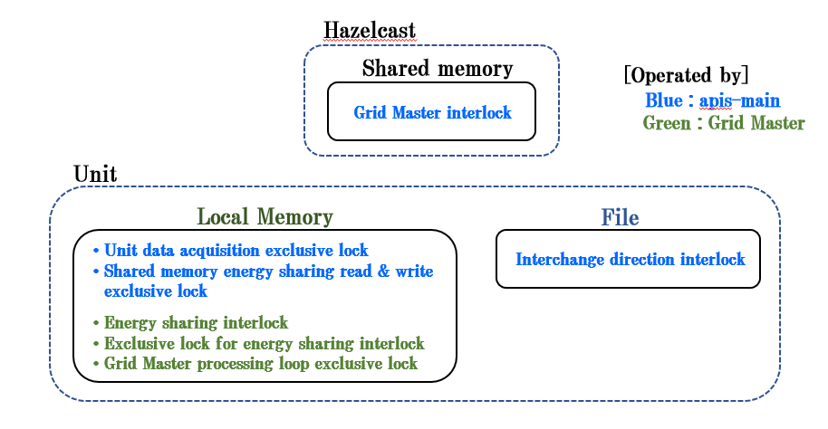  
Fig. 4-1

 

# **5. Communication Specifications**
    
## **5.1. Web API between apis-main and Device Driver**

Information is exchanged between apis-main and the Device Driver through the Web API. The following describes the Web API specifications.

<table>
<tbody>
<tr class="even">
<td rowspan="5">Control DC/DC converter</td>
<td>/dcdc/get</td>
<td>Get information.</td>
</tr>
<tr class="odd">
<td>/dcdc/get/status</td>
<td>Get status information only.</td>
</tr>
<tr class="even">
<td>/dcdc/set?dig=&lt;Grid current value&gt;</td>
<td>Set DC grid side current value.</td>
</tr>
<tr class="odd">
<td>/dcdc/set?dvg=&lt;Grid voltage value&gt; &amp;drg=&lt;Grid droop rate&gt;</td>
<td>Set DC grid side voltage &amp; droop values.</td>
</tr>
<tr class="even">
<td>
/dcdc/set?mode=&lt;Mode&gt;

&amp;dvg=&lt;Grid voltage value&gt;

&amp;dig=&lt;Grid current value&gt; &amp;drg=&lt;Grid droop rate&gt;
</td>
<td>Set DC grid side mode &amp; voltage value &amp; current value &amp; Droop value.</td>
</tr>
<tr class="odd">
<td>Get battery information</td>
<td>/battery/get</td>
<td>Get information.</td>
</tr>
<tr class="even">
<td>Get information on all Devices</td>
<td>/all/get</td>
<td>Get information obtained by /dcdc/get +/battery/get</td>
</tr>
<tr class="odd">
<td>Get version information</td>
<td>/version/get</td>
<td>Get Device Driver version.</td>
</tr>
</tbody>
</table>

 

## **5.2. Expected Return Values of apis-main-Device Driver Get Web API**
    
### **5.2.1. Expected Return Values of “/dcdc/get”**

　The following shows the parameters of expected return values from the Device Driver when using the /dcdc/get Web API. (For a description of each perimeter, see the DCDC entry in the table in “8. Grid Master Data Collection.”)

<Examples\>

{

"status" : {

    "status" : "0x0000",　　　　　　

    "alarmState" : "No alarm",　　　

    "operationMode" : "Waiting"　　

},

"meter" : {

    "wg" : -2.44,

    "tmp" : 29.59,

    "vb" : 51.47,

    "wb" : -12.21,

    "vg" : 358.27,

    "ib" : -0.24,

    "ig" : 0

},

"vdis" : {

    "dvg" : 349.99,

    "drg" : 0

},

"param" : {

    "dig" : 3,

}

}

 

### **5.2.2. Expected Return Values of “/dcdc/get/status”**

The following shows the parameters of expected return values from the Device Driver when using the /dcdc/get/status Web API. (For a description of each perimeter, see the DC/DC entry in the table in “8. Grid Master Data Collection.”)

<Examples\>

{

"status" : {

    "status" : "0x0000",　

    "alarmState" : "No alarm",

    "operationMode" : "Waiting"

},

"meter" : {

          "wg" : -2.44,

          "tmp" : 30.08,

          "vb" : 51.45,

          "wb" : -12.21,

          "vg" : 358.29,

          "ib" : -0.23,

          "ig" : 0

}

}

### **5.2.3. Expected Return Values of “/dcdc/set?dig=\<Grid current value\>”**

　The following shows the parameters of expected return values from the Device Driver when using the /dcdc/set?dig=\<Grid current value\> Web API. (For a description of each perimeter, see the DC/DC entry in the table in “8. Grid Master Data Collection.”)

\<Examples\>

{

"meter" : {

    "wg" : -2.44,

    "tmp" : 29.59,

    "vb" : 51.47,

    "wb" : -12.21,

    "vg" : 358.27,

    "ib" : -0.24,

    "ig" : 0

},

"param": {

    "dig": 7.8125,

},

}

 

### **5.2.4. Expected Return Values of “/dcdc/set?dvg=\<Grid voltage value\>\&drg=\<Grid droop rate\>”**

　The following shows the parameters of expected return values from the Device Driver when using the /dcdc/set?dvg=\<Grid voltage value\>\&drg=\<Grid droop rate\> Web API. (For a description of each perimeter, see the DC/DC entry in the table in “8. Grid Master Data Collection.”)

<Examples\>

{

"meter" : {

    "wg" : -2.44,

    "tmp" : 29.59,

    "vb" : 51.47,

    "wb" : -12.21,

    "vg" : 358.27,

    "ib" : -0.24,

    "ig" : 0

},

"vdis" : {

    "dvg" : 349.99,

    "drg" : 0

},

}

 

### **5.2.5. Expected Return Values of “/dcdc/set?mode=\<Mode\>\&dvg=\<Grid voltage value\>\&dig=\<Grid current value\>\&dig=\<Grid droop rate\>”**

　The following shows the parameters of expected return values from the Device Driver when using the /dcdc/set?mode=\<Mode\>\&dvg=\<Grid voltage value\>\&dig=\<Grid current value\>\&drg=\<Grid droop rate\> Web API. (For a description of each perimeter, see the DC/DC entry in the table in “8. Grid Master Data Collection.”)

<Examples\>

{

"status" : {

    "status" : "0x0000",　　　　　　

    "alarmState" : "No alarm",　　　

    "operationMode" : "Waiting"　　

},

"meter" : {

    "wg" : -2.44,

    "tmp" : 29.59,

    "vb" : 51.47,

    "wb" : -12.21,

    "vg" : 358.27,

    "ib" : -0.24,

    "ig" : 0

},

"vdis" : {

    "dvg" : 349.99,

    "drg" : 0

},

"param" : {

    "dig" : 3,

}

}

 

### **5.2.6. Expected Return Values of “/battery/get”**

　The following shows the parameters of expected return values from the Device Driver when using the /battery/get Web API. (For a description of each perimeter, see the Battery entry in the table in “8. Grid Master Data Collection.”)

\<Examples\>

{

    "rsoc" : 70,

    "battery\_operation\_status" : 3

}

 

### **5.2.7. Expected Return Values of “/all/get”**

　The following shows the parameters of expected return values from the Device Driver when using the /all/get Web API. (For a description of each perimeter, see the DC/DC entry in the table in “8. Grid Master Data Collection.”)

\<Examples\>

{

"dcdc" : {

{

"status" : {

    "status" : "0x0000",

    "alarmState" : "No alarm",

    "operationMode" : "Waiting"

},

"meter" : {

    "wg" : -2.44,

    "tmp" : 29.59,

    "vb" : 51.47,

    "wb" : -12.21,

    "vg" : 358.27,

    "ib" : -0.24,

    "ig" : 0

},

"vdis" : {

    "dvg" : 349.99,

    "drg" : 0

},

"param" : {

    "dig" : 3,

},

"battery" : {

{

    "rsoc" : 70,

    "battery\_operation\_status" : 3

}

}

 

### **5.2.8. Expected Return Values of “/version/get”**

The following shows the parameters of expected return values from the Device Driver when using the /version/get Web API.

If “systemType” in “6.1 config.json” is set to “dcdc\_v2” (dcdc\_batt\_comm is used), when apis-main starts up, the /version/get Web API is issued. At that time if the following parameters are not returned from the Device Driver, apis-main will shut down. (When using a proprietary Device Driver you are developing, still set “systemType” in config.json to "dcdc\_v2" and implement so that like dcdc\_batt\_comm, the appropriate return values for /version/get API are returned when apis-main starts up.)

\<Examples\>

{

    "comm\_protocol\_version" : "1.0"

    "dcdc\_batt\_comm\_version" : "1.0 "

}

・About version information

The Device Driver returns the following two pieces of information when the command /version/get is received from apis-main.

    "comm\_protocol\_version" : "1.0"

    "dcdc\_batt\_comm\_version" : "1.0"

common\_protocol\_version indicates the version of the communication protocol. dcdc\_batt\_comm\_version indicates the version of the Device Driver.

The period in the version number separates the major version number and the minor version number. For example, the version number format of “comm\_protocol\_version” is \[major version\].\[minor version\]  

\<Example\>  “1.0”

The aim is to create a versioning scheme that reflects the interface between apis-main and the Device Driver to allow operations without tightly linking each software’s version.

The major version is incremented when items are added, removed, or changed for the parameters returned from the Device Driver in response to the Web API commands (e.g. /dcdc/get or /battery/get) *and* if some action is required from apis-main. If a response from apis-main is not needed, the minor version number is incremented. apis-main considers only the major version number of the communication protocol. When starting up, apis-main issues the /version/get command once to get comm\_protocol\_version from the Device Driver. It compares the major version number of comm\_protocol\_version and its own major version number. If they are the same or if apis-main’s number is higher, startup continues. If the number is lower, the combination of apis-main and the communication protocol is considered a FATAL problem and apis-main shuts down.

apis-main startup continues : apis-main major ver. ≧ dcdc\_batt\_comm major ver.

    apis-main shuts down : apis-main major ver. \< dcdc\_batt\_comm major ver.

 

## **5.3. Device Driver–Hardware Communication Specifications**

Differences in the hardware environment are absorbed by the Device Driver. Communication between the Device Driver and hardware differs depending on the environment, so be sure to refer to the communication specifications of each hardware when developing the Device Driver.

 

# **6. Configuration Files**

apis-main has multiple configuration files and key files. These files are described below.

## **6.1. config.json**

The following basic information for configuring a node is set in a JSON-format file. The file is read once when apis-main starts up, so if a parameter is changed, apis-main must be restarted.

<table>
<tbody>
<tr class="even">
<td>programId</td>
<td>Program identification string</td>
</tr>
<tr class="odd">
<td>communityId</td>
<td>Community identification string. Higher-level ID when organizing one or more clusters. Also used as seed for encryption, together with clusterId and apis-main version string.</td>
</tr>
<tr class="even">
<td>clusterId</td>
<td>Cluster identification string. Used as seed for encryption, together with communityId and the apis-main version string.</td>
</tr>
<tr class="odd">
<td>security.enable</td>
<td>Setting for enabling/disabling encryption of shared memory and using SSL for the Event Bus</td>
</tr>
<tr class="even">
<td>security.pemKeyFile</td>
<td>Secret key used for Event Bus SSL</td>
</tr>
<tr class="odd">
<td>security.pemCertFile</td>
<td>Certificate used for Event Bus SSL</td>
</tr>
<tr class="even">
<td>unitId</td>
<td>Node identification string</td>
</tr>
<tr class="odd">
<td>unitName</td>
<td>Node’s name</td>
</tr>
<tr class="even">
<td>serialNumber</td>
<td>Node’s serial number (possible to use as the IoT Board management number)</td>
</tr>
<tr class="odd">
<td>systemType</td>
<td>
Type of hardware

dcdc_emulator: Hardware emulator

dcdc_v1: Use for old Device Driver dcdc_controller

dcdc_v2: Use for dcdc_batt_com and when creating new Device Driver
</td>
</tr>
<tr class="even">
<td>hwConfig file</td>
<td>Destination of hwConfig file</td>
</tr>
<tr class="odd">
<td>policyFile</td>
<td>Destination of Policy file</td>
</tr>
<tr class="even">
<td>Scenario file</td>
<td>Destination of Scenario file</td>
</tr>
<tr class="odd">
<td>stateFileFormat</td>
<td>Destination of Operation Mode file &amp; format</td>
</tr>
<tr class="even">
<td>dealLogDirFormat</td>
<td>Destination of Energy sharing Log &amp; format</td>
</tr>
<tr class="odd">
<td>
fileSystemExclusive

LockFileFormat
</td>
<td>Destination of lock file used for file system-based inter-process exclusive control and format</td>
</tr>
<tr class="even">
<td>policyFileReadTimeoutMsec</td>
<td>Timeout setting when reading Policy file</td>
</tr>
<tr class="odd">
<td>connection.emulator.host</td>
<td>IP address of hardware emulator when systemType is dcdc_emulator</td>
</tr>
<tr class="even">
<td>connection.emulator.port</td>
<td>Port number of hardware emulator when systemType is dcdc_emulator</td>
</tr>
<tr class="odd">
<td>
connection.dcdc_controller

.host
</td>
<td>IP address for dcdc_controller if systemType is dcdc_v1. If systemType is dcdc_v2, IP address for dcdc_batt_comm or for creating new Device Driver.</td>
</tr>
<tr class="even">
<td>
connection.dcdc_controller

.port
</td>
<td>Port number for dcdc_controller if systemType is dcdc_v1. If systemType is dcdc_v2, port number for dcdc_batt_comm or for creating new Device Driver.</td>
</tr>
<tr class="odd">
<td>connection.emu_Driver.host</td>
<td>IP address for EMU Driver if systemType is dcdc_v1</td>
</tr>
<tr class="even">
<td>connection.emu_Driver.port</td>
<td>Port number for EMU Driver if systemType is dcdc_v1</td>
</tr>
<tr class="odd">
<td>controlCenter.enabled</td>
<td>Setting for enabling/disabling the Service Center</td>
</tr>
<tr class="even">
<td>controlCenter.account</td>
<td>Login account for Service Center</td>
</tr>
<tr class="odd">
<td>controlCenter.password</td>
<td>Login password for Service Center</td>
</tr>
<tr class="even">
<td>
controlCenter.account

.encrypted
</td>
<td>
Encrypted login to Service Center

(For separate encryption of each item)
</td>
</tr>
<tr class="odd">
<td>
controlCenter.password

.encrypted
</td>
<td>
Encrypted login password to Service Center

(For separate encryption of each item)
</td>
</tr>
<tr class="even">
<td>
controlCenter.encrypted_

.enabled
</td>
<td>
Setting for enabling/disabling encryption of data to Service Center

(All items following “controlCenter.encrypted” are encrypted.)
</td>
</tr>
<tr class="odd">
<td>
controlCenter.encrypted_

.account
</td>
<td>
Encrypted account for Service Center

(All items following “controlCenter.encrypted” are encrypted.)
</td>
</tr>
<tr class="even">
<td>
controlCenter.encrypted_

.password
</td>
<td>
Encrypted password for Service Center

(All items following “controlCenter.encrypted” are encrypted.)
</td>
</tr>
<tbody>
<tr class="odd">
<td>watchdog.enabled</td>
<td>Setting for enabling/disabling apis-main alive information</td>
</tr>
<tr class="even">
<td>watchdog.periodMsec</td>
<td>Watch dog reset cycle (ms)</td>
</tr>
<tr class="odd">
<td>watchdog.host</td>
<td>IP address accessed by the watch dog service at the interval specified by periodMsec</td>
</tr>
<tr class="even">
<td>watchdog.port</td>
<td>Port number accessed by the watch dog service at the interval specified by periodMsec</td>
</tr>
<tr class="odd">
<td>watchdog.uri</td>
<td>URI of the watch dog service</td>
</tr>
<tr class="even">
<td>
watchdog.requestTimeout

Msec
</td>
<td>Timeout of watch dog service (ms)</td>
</tr>
<tr class="odd">
<td>
batteryCapacityManagement

.enabled
</td>
<td>Enable/disable battery capacity management function</td>
</tr>
</tbody>
</table>

 

## **6.2. hwConfig.json**

The following hardware information specific to a node is set in a JSON-format file. The file is re-read periodically at the interval specified by refreshingPeriodMsec. It is thus not necessary to restart apis-main and perimeters can be updated dynamically.

<table>
<tbody>
<tr class="even">
<td>refreshingPeriodMsec</td>
<td>Interval (ms) at which to re-read hwConfig file</td>
</tr>
<tr class="odd">
<td>batteryNominalCapacityWh</td>
<td>Battery capacity (Wh)</td>
</tr>
<tr class="even">
<td>gridCurrentCapacityA</td>
<td>Maximum current (A) that can be charged/discharged to the DC grid by the node</td>
</tr>
<tr class="odd">
<td>gridCurrentAllowanceA</td>
<td>Error in current (A) in the DC grid when charging/discharging by own node</td>
</tr>
<tr class="even">
<td>droopRatio</td>
<td>Droop rate(%) when moving to CV</td>
</tr>
<tr class="odd">
<td>
efficientBatteryGrid

voltageRatio
</td>
<td>Set input/output voltage ratio N that maximizes the efficiency of the DC/DC converter</td>
</tr>
<tr class="even">
<td>safety.range.dcdc.meter.tmp.min</td>
<td>Local Safety Check: Minimum temperature (℃) of DC/DC converter</td>
</tr>
<tr class="odd">
<td>safety.range.dcdc.meter.tmp.max</td>
<td>Local Safety Check: Maximum temperature (℃) of DC/DC converter</td>
</tr>
<tr class="even">
<td>safety.range.dcdc.meter.vg.min</td>
<td>Local Safety Check: Minimum DC grid voltage (V)</td>
</tr>
<tr class="odd">
<td>safety.range.dcdc.meter.vg.max</td>
<td>Local Safety Check: Maximum DC grid voltage (V)</td>
</tr>
<tr class="even">
<td>safety.range.dcdc.meter.vb.min</td>
<td>Local Safety Check: Minimum battery voltage (V)</td>
</tr>
<tr class="odd">
<td>safety.range.dcdc.meter.vb.max</td>
<td>Local Safety Check: Maximum battery voltage (V)</td>
</tr>
<tr class="even">
<td>safety.range.dcdc.meter.ig.min</td>
<td>Local Safety Check: Minimum DC grid current (A)</td>
</tr>
<tr class="odd">
<td>safety.range.dcdc.meter.ig.max</td>
<td>Local Safety Check: Maximum DC grid current (A)</td>
</tr>
<tr class="even">
<td>safety.range.dcdc.meter.ib.min</td>
<td>Local Safety Check: Minimum battery current (A)</td>
</tr>
<tr class="odd">
<td>safety.range.dcdc.meter.ib.max</td>
<td>Local Safety Check: Maximum battery current (A)</td>
</tr>
</tbody>
</table>

 

## **6.3. scenario.json**

Requests for energy sharing can be defined independently for each node in a JSON-format file. The file is re-read periodically at the interval specified by refreshingPeriodMsec. It is thus not necessary to restart apis-main and perimeters can be updated dynamically.

<table>
<tbody>
<tr class="header">
<td>refreshingPeriodMsec</td>
<td>Interval (ms) at which to re-read the Scenario file</td>
</tr>
<tr class="odd">
<td>acceptSelection.strategy</td>
<td>
Configure the selection algorithm when multiple acceptances are sent in response to a energy sharing request.

“amount” : The node capable of energy sharing with the greatest power is selected.

“pointAndAmount”: Set this to introduce the concept of buying and selling to the energy sharing, or

adjust the priority of the energy sharing request.

・If own node is the charge node:

　　The node showing the lowest price is selected.

・If own node is the discharge node:

　　The node showing the highest price is selected.

＊If prices are the same, the node capable of energy sharing with the greatest power is selected.

</td>
</tr>
<tr class="even">
<td>
“00:00:00-24:00:00” : {

}
</td>
<td>
Set the time period when a Scenario is in effect.

The example on the left shows a setting of using the same scenario in a 24-hour period. To switch Scenario settings every 12 hours, for example, configure as shown below.

“00:00:00-12:00:00” : {

}

“12:00:00-24:00:00” : {

}

It is possible to set a different Scenario for different time periods, for example by dividing the time period into hourly segments.

In {}, describe the Scenario to be used for the time period.
</td>
</tr>
<tr class="odd">
<td>
“request” : {

“excess” : {

“discharge” : {

“pairUnitId” : “E002”

“limitWh” : 3360

“pointPerWh”:10

}

}

“sufficient” : {

}

“scarce” : {

}

“short” : {

“charge” : {

“pairUnitId” : “E002”

“limitWh” : 1440

“pointPerWh” : 10

}

}
</td>
<td>
Describe conditions for sending charge/discharge requests to other apis-mains.

・”excess”

Issue discharge request until own node’s remaining battery capacity falls to 3360 Wh. Also, present 10 points or more as a condition for interchange.

・”sufficient” condition

　 Do not request charging or discharging.

・”scarce”　

Do not request charging or discharging.

・”short”

Issue charge request until own node’s remaining battery capacity reaches 1440 Wh. Also, present 10 points or less as a condition for interchange.

If pairUnitId is specified, the apis-main will carry out interchange only with specified node.
</td>
</tr>
<tr class="even">
<td>
“accept” : {

“excess” : {

“discharge” : {

“pairUnitId” : “E002”

“limitWh” : 2400

“pointPerWh”:10

}

}

“sufficient” : {

“discharge” : {

“pairUnitId” : “E002”

“limitWh” : 2400

“pointPerWh”:10

}

}

“scarce” : {

“charge” : {

“pairUnitId” : “E002”

“limitWh” : 2400

“pointPerWh”:10

}

}

“short” : {

“charge” : {

“pairUnitId” : “E002”

“limitWh” : 2400

“pointPerWh” : 10

}

}
</td>
<td>
Describe conditions for accepting charge/discharge requests from other apis-mains.

・”excess”

Accept discharge request from other apis-mains until own node’s remaining battery capacity reaches 2400 Wh. Also, present 10 points or more as a condition for interchange.

・”sufficient” condition

Accept discharge request from other apis-mains until own node’s remaining battery capacity reaches 2400 Wh. Also, present 10 points or more as a condition for interchange.

・”scarce”　

Accept discharge request from other apis-mains until own node’s remaining battery capacity reaches 2400 Wh. Also, present 10 points or more as a condition for interchange.

・”short”

Accept discharge request from other apis-mains until own node’s remaining battery capacity falls to 2400 Wh. Also, present 10 points or more as a condition for interchange.
</td>
</tr>
</tbody>
</table>

Fig. 6.1 shows the scenario that is carried out using the above settings when the maximum battery capacity is set as 4800 Wh.

apis-main will carry out interchange only with node specified by pairUnitId.

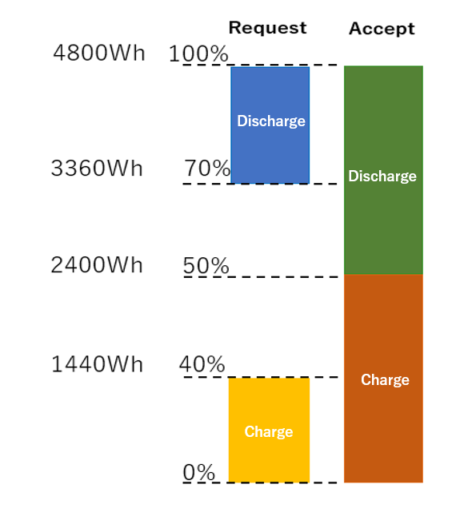

\* All deal points are 10 points.  
Fig. 6-1

## **6.4. policy.json**

Control algorithms needed to maintain the order of the entire system and parameters needed to execute the algorithms safely are set in a JSON-format file.

The file is re-read periodically at the interval specified by refreshingPeriodMsec. It is thus not necessary to restart apis-main and perimeters can be updated dynamically. (While this dynamic update function is available, under normal operations all apis-mains are stopped first and then policy.json is updated.)

Because nodes in a cluster need to have common settings, this file has an integrity monitoring function. When a cluster is created, the apis-main that is first launched places its own policy.json in Hazelcast’s shared memory. Afterwards, each apis-main participating in the cluster compares its own policy.json with the policy.json in shared memory. If all parameters do not match, that apis-main stops in order to maintain the integrity of the cluster.

<table>
<tbody>
<tr class="even">
<td>refreshingPeriodMsec</td>
<td>Interval (ms) at which to re-read the Policy file</td>
</tr>
<tr class="odd">
<td>operationMode</td>
<td>
Set operation mode of all clusters

autonomous: Usual energy sharing mode

heteronomous : Continue existing energy sharing

Disable generation of new energy sharing

stop : Mode in which the energy sharing is stopped

manual : Manual mode (used for testing)
</td>
</tr>
<tr class="even">
<td>memberUnitIds</td>
<td>ID information of all nodes in cluster</td>
</tr>
<tr class="odd">
<td>operationGridVoltageV</td>
<td>Operating voltage (V) of DC grid to be set for the DC/DC converter</td>
</tr>
<tr class="even">
<td>operationGridVoltageVRange.min</td>
<td>Local Safety Check during CV Mode: Minimal operating voltage of DC grid</td>
</tr>
<tr class="odd">
<td>operationGridVoltageVRange.max</td>
<td>Local Safety Check during CV Mode: Maximum operating voltage (V) of DC grid</td>
</tr>
<tr class="even">
<td>gridVoltageSeparationV</td>
<td>Voltage step (V) for voltage authority acquisition action</td>
</tr>
<tr class="odd">
<td>gridVoltageAllowanceV</td>
<td>Allowed error (V) of DC grid voltage</td>
</tr>
<tr class="even">
<td>gridVoltageDropAllowanceV</td>
<td>Maximum allowed voltage drop (V) due to maximum impedance and maximum energy sharing current in DC grid</td>
</tr>
<tr class="odd">
<td>gridCurrentStepA</td>
<td>Current step (A) of DC grid</td>
</tr>
<tr class="even">
<td>gridUvloMaskV</td>
<td>Used when using DC/DC converter EZA2500. When the DC grid voltage approaches the lowest operating voltage, EZA2500 is restricted so it does not start in the CV Mode. Control is applied so that EZA2500 does not start in CV Mode when the voltage is in the range of operationGridVoltageRange.min±gridUvloMaskV on the apis-main side.</td>
</tr>
<tr class="odd">
<td>
safety.sumOfDealingUnitGrid

CurrentAllownacePerUnitA
</td>
<td>Global Safety Check: DC grid current error (A) per node. (A factor of N causes a DC grid current error when N nodes participate in energy sharing.)</td>
</tr>
<tr class="even">
<td>safety.sumOfDealGridCurrentMaxA</td>
<td>Global Safety Check: Maximum current (A) in the DC grid</td>
</tr>
<tr class="odd">
<td>
safety.gridTopologyBasedEvaluation

.enabled
</td>
<td>Setting to enable/disable check of maximum current capacity for each branch on the DC grid line topology</td>
</tr>
<tr class="even">
<td>
safety.gridTopologyBasedEvaluation

.branchIds
</td>
<td>Allocation to each branch of DC grid line topology (used in configuration after IDs are allocated)</td>
</tr>
<tr class="odd">
<td>
safety.gridTopologyBasedEvaluation

.branchAssociation.branchIds

.forwardUnitIds
</td>
<td>List of nodes that exist in the forward direction of each branch’s current.</td>
</tr>
<tr class="even">
<td>
safety.gridTopologyBasedEvaluation

.branchAssociation.branchIds

.backwardUnitIds
</td>
<td>List of nodes that exist in the backward direction of each branch’s current.</td>
</tr>
<tr class="odd">
<td>safety.branchCurrentCapacityA</td>
<td>Current capacity (A) of each branch</td>
</tr>
<tr class="even">
<td>heloPeriodMsec</td>
<td>Interval (ms) at which to send Hello with own ID to the communication line to prevent ID duplications.</td>
</tr>
<tr class="odd">
<td>
controller.dcdc.checkpoint

.retryLimit
</td>
<td>Number of retries when carrying out voltage check of DC/DC converter</td>
</tr>
<tr class="even">
<td>
controller.dcdc.checkpoint

.retryWaitMsec
</td>
<td>Interval (ms) at which to retry voltage check of DC/DC converter</td>
</tr>
<tr class="odd">
<td>
controller.dcdc.voltageReference

.rampUp.first.timeoutMsec
</td>
<td>Timeout (ms) of DC grid voltage ramp-up</td>
</tr>
<tr class="even">
<td>
controller.dcdc.voltageReference

.authorization.numberOfTraials
</td>
<td>
Number of voltage changes for Voltage Reference Authorization after DC grid voltage ramp-up

(7.3 See Voltage Reference Authorization)
</td>
</tr>
<tr class="odd">
<td>
controller.scramVoltageReference

DelayMsec
</td>
<td>If an aberration occurs during energy sharing, all energy sharing processing may stop. The CC Mode of the DC/DC converter is first set to Wait and then the CV Mode of the DC/DC converter is set to Wait. This item sets the waiting time (ms) between the setting of the CC Mode to Wait and the setting of the CV Mode to Wait.</td>
</tr>
<tr class="even">
<td>controller.stopMeTimeoutMsec</td>
<td>If WAIT mode is not set to DC/DC converter by Grid Master even after requesting Grid Master to set WAIT mode for the DC/DC Converter, the node sets the DC/DC Converter to WAIT mode by itself. (ms)</td>
</tr>
<tr class="odd">
<td>controller.stopMeCheckPeriodMsec</td>
<td>Interval (ms) to request Grid Master to set DC/DC Converter to WAIT mode at regular intervals when the DC/DC Converter is set to WAIT mode for error processing.</td>
</tr>
<tr class="even">
<td>
controller.dataAcquisition

PeriodMsec
</td>
<td>Interval (ms) at which to get information from own DC/DC converter and battery</td>
</tr>
<tr class="odd">
<td>controller.retryLimit</td>
<td>Number of times to retry after failing to get information from DC/DC converter or battery.</td>
</tr>
<tr class="even">
<td>user.errorHandlingPeriodMsec</td>
<td>Waiting time (ms) from the end of local error processing until the start of the next local error processing</td>
</tr>
<tr class="odd">
<td>user.errorSustainingMsec</td>
<td>Waiting time (ms) after the end of error handling until starting requests/acceptances of energy sharing</td>
</tr>
<tr class="even">
<td>user.houseKeepingPeriodMsec</td>
<td>Waiting time (ms) after confirming the remaining battery capacity and Scenario file until the start of the next confirmation</td>
</tr>
<tr class="odd">
<td>mediator.deal.gridCurrentA</td>
<td>Current (A) of one energy sharing</td>
</tr>
<tr class="even">
<td>mediator.deal.amountMinWh</td>
<td>Minimum power (Wh) of one energy sharing</td>
</tr>
<tr class="odd">
<td>mediator.deal.amountMaxWh</td>
<td>Maximum power (Wh) of one energy sharing</td>
</tr>
<tr class="even">
<td>mediator.deal.amountUnitWh</td>
<td>Unit of power (Wh) of one energy sharing</td>
</tr>
<tr class="odd">
<td>mediator.negotiationTimeoutMsec</td>
<td>Waiting time (ms) after issuing requests to other apis-mains</td>
</tr>
<tr class="even">
<td>mediator.dealLoggingPeriodMsec</td>
<td>Waiting time (ms) from the completion of log writing during a energy sharing until the start of next log writing</td>
</tr>
<tr class="odd">
<td>gridMaster.VoltageReferenceSide</td>
<td>
Method to set whether the discharging side or the charging side determines the Voltage Reference

charge: Charging side decides.

discharge: Discharging side decides.
</td>
</tr>
<tr class="even">
<td>
gridMaster.VoltageReference

TakeOverDvg
</td>
<td>
Method to determine to destination voltage when moving the Voltage Reference

theoretical: Use the source DC grid voltage

&lt;Other&gt;: Use the destination DC grid voltage
</td>
</tr>
<tr class="odd">
<td>
gridMaster.masterDealSelection

.strategy
</td>
<td>
Method to select the next master deal when the energy sharing that includes the Voltage Reference is complete.

newestDeal: Choose the newest energy sharing

&lt;Other&gt;: Error
</td>
</tr>
<tr class="even">
<td>
gridMaster.gridMasterSelection

.strategy
</td>
<td>
Grid Master selection method (See 4.2 Grid Master Selection)

　　anywhere

fixed

Voltage Reference
</td>
</tr>
<tr class="odd">
<td>
gridMaster.gridMasterEnsuring

.interlockinconsistency.retryWaitMsec
</td>
<td>Waiting time (ms) to retry when mismatch of Grid Master interlocks is detected at startup after detecting the absence of Grid Master</td>
</tr>
<tr class="even">
<td>
gridMaster.gridMasterWatching

.absence.ensureWaitMsecc
</td>
<td>Waiting time (ms) to reconfirm after detecting the absence of Grid Master</td>
</tr>
<tr class="odd">
<td>
gridMaster.deal.forceStopCondition

.dischargeUnitLowerLimitRsoc
</td>
<td>Lower limit of remaining battery capacity (%) to forcibly stop the energy sharing</td>
</tr>
<tr class="even">
<td>
gridMaster.deal.forceStopCondition

.chargeUnitUpperLimitRsoc
</td>
<td>Upper limit of remaining battery capacity (%) to forcibly stop the energy sharing</td>
</tr>
<tr class="odd">
<td>gridMaster.deal.referenceSide</td>
<td>
Method to decide whether the discharging side or the charging side is made the reference when calculating interchange power.

　charging node: Charging side is made the reference.

discharging node: Discharging side is made the reference.
</td>
</tr>
<tr class="even">
<td>gridMaster.deal.resetLimit</td>
<td>Upper limit of number of failures for Voltage Reference Authorization for each energy sharing information</td>
</tr>
<tr class="odd">
<td>
gridMaster.currentCompensation

.limitOfTrials
</td>
<td>
Upper limit of number of times of current compensation

(See 7.4 Current Compensation Function)
</td>
</tr>
<tr class="even">
<td>
gridMaster.currentCompensation

.driftAllowanceA
</td>
<td>
Allowed error (A) after current compensation

(See 7.4 Current Compensation Function)
</td>
</tr>
<tr class="odd">
<td>
gridMaster.GridvoltageOptimization

.enabled
</td>
<td>Enable/disable grid voltage optimization processing</td>
</tr>
<tr class="even">
<td>gridMaster.heloPeriodMsec</td>
<td>Interval (ms) at which to send Hello to the Event Bus in order to prevent duplicate launches of Grid Master</td>
</tr>
<tr class="odd">
<td>gridMaster.dataCollectionPeriodMsec</td>
<td>Interval (ms) at which to collect information from all nodes by Grid Master</td>
</tr>
<tr class="even">
<td>gridMaster.dataCollectionTimeoutMsec</td>
<td>Timeout (ms) for Grid Master to collect information</td>
</tr>
<tr class="odd">
<td>gridMaster.mainLoopPeriodMsec</td>
<td>Waiting time (ms) from the end of Main Loop processing by Grid Master until the start of the next Main Loop processing</td>
</tr>
<tr class="even">
<td>gridMastererrorSustainingMsec</td>
<td>Waiting time (ms) from the end of a global error handling by Grid Master until the start of the next global error handling</td>
</tr>
</tbody>
</table>

 

## **6.5. cluster.xml**

File in XML format that sets the parameters (such as cluster name, password, network settings, multicast settings, etc.) required by Hazelcast when forming clusters.

Encrypted and saved as cluster.xml.encrypted.

 

## **6.6. logging.properties**

File containing settings related to the output of Java’s standard logging API java.util.logging (destination of log file, storage capacity of log file, log level configuration, etc.).

 

## **6.7. start.sh**

Script file for starting up apis-main. It is automatically run when the operating system starts up.

The command to start apis-main in start.sh is as follows:

> java -Djava.net.preferIPv4Stack=true -Duser.timezone=Asia/Tokyo -Djava.util.logging.config.file=./logging.properties -jar ./apis-main-2.xx.x-a01-fat.jar -conf ./config.json -cp ./ -cluster -cluster-host 192.168.0.1 &

The arguments after “java” are described here.

* Djava.net.preferIPv4Stack=true　  
-> Option to bind IPv4 address.

* Duser.timezone=Asia/Tokyo  
-> Timezone setting

* Djava.util.logging.config.file=./logging.properties  
-> Option for specifying the logging configuration file.

* jar ./apis-main-2.xx.x-a01-fat.jar  
-> Option for specifying the execution of program encapsulated in the JAR file.

* conf ./config.json  
-> Option for specifying the configuration file.

* cp ./  
-> Option for specifying the location of cluster.xml file.

* cluster-host 192.168.0.1 &  
-> Option for specifying apis-main’s own IP address.

 

## **6.8. stop-kill.sh**

Script file for stopping apis-main.

After the shutdown function (stop) is executed via the Event Bus, apis-main’s own Java processes are forcefully terminated if time out occurs. It is possible to specify the timeout in seconds in the script.

 

## **6.9. key.pem**

Secret key used when applying SSL to the Event Bus.

 

## **6.10. cert.pem**

Certificate used for applying SSL to the Event Bus.

 

# **7. DC Grid Control Functions**
    
## **7.1. Select Voltage Reference**

When negotiation between nodes is complete and energy sharing begins, if the Voltage Reference does not exist in the DC grid, the Voltage Reference node is determined based on the parameter (gridMaster.voltageReferenceSide) given in the Policy file (policy.json). You can choose whether to apply the Voltage Reference to the charging side or the discharging side. However, if you choose the discharging side, you must verify the specifications of the battery system being used, interchange conditions, and other conditions.

 

## **7.2. Voltage Ramp-Up**

Grid Master changes the mode of the DC/DC converter in the Voltage Reference node from Wait to CV Mode and ramps up the DC grid voltage until it reaches the target voltage (operationGridVoltageV) specified in the Policy file. However, if the DC grid voltage before the voltage ramp-up is more than the specified voltage in the Policy file (operationGridVoltageVRange.min+gridUvloMaskV+10V), a hardware error occurs because it is possible that there is another voltage source, and voltage ramp-up is stopped. If the DC grid voltage falls within the range specified in the Policy file (operationGridVoltageVRange.min±gridUvloMaskV), the mode of the DC/DC converter in the Voltage Reference node is set to Wait. The reason is that under the DC/DC converter specifications, this is a voltage range in which energy sharing cannot start. Voltage ramp-up is complete when it reaches the target voltage within the time period (controller.dcdc.VoltageReference.rampUp.first.timeoutMsec) specified in the Policy file. If voltage ramp-up does not reach the target voltage during this time period, it is stopped.

 

## **7.3. Voltage Reference Authorization**

After voltage ramp-up is complete, the voltage reference node randomly changes the voltage of the DC grid. This is called Voltage Reference Authorization. After the DC grid voltage has been randomly changed, if the target voltage cannot be followed or an abnormal current is detected, a Voltage Reference conflict is considered to have occurred. The target voltage of the DC/DC converter in question is set to the DC grid stop voltage (operationGridVoltageVRange.min+gridUvloMaskV) specified in the Policy file and voltage ramp-up is made by stand by. After waiting for a certain amount of time, voltage is again ramped-up and the Voltage Reference Authorization is carried out. If this action cannot be completed after this series of operations is carried out for a number of configured times, Voltage Reference conflict is considered to have occurred, and the corresponding energy sharing is stopped.

 

## **7.4. Current Compensation Function**

Although ideally the current of the energy sharing should be the same on the discharging side and the charging side, because of sensor error in the ammeter of each node’s DC/DC converter, the sensor on the discharging side may show 2A, for example, while the sensor on the charging side may show 1.9A. To prevent absorption of the error in each node by the Voltage Reference, the current on the Reference side is compensated to the expected value by adjusting the current in the node that is not the Reference.

  - As shown by the figure on the left in Fig. 7.1, when the Reference is on the CV side (Voltage Reference side), compensation is carried out so that the current on the CV side becomes the current value expected by the energy sharing by adjusting the current on the CC side.

  - As shown by the figure on the right in Fig. 7.1, when the Reference is on the CC side, the already set current value is the expected value, so compensation does not take place.

  - In the case of the second or a subsequent energy sharing, after the second energy sharing has started, the current of the CV is compensated so that it returns to the current value before the start of the energy sharing by adjusting the current of the CC that is not the Reference.

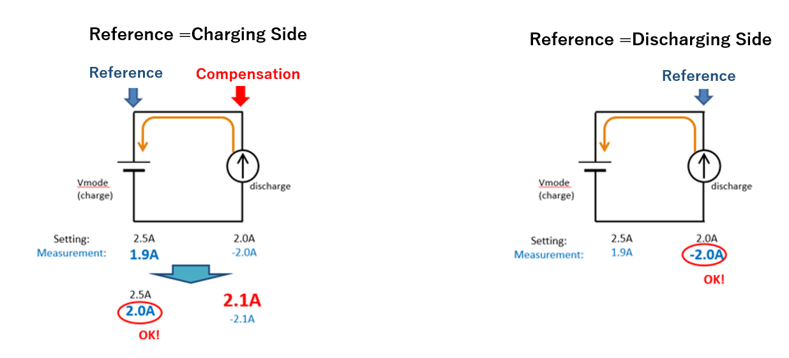  
Fig. 7-1

 

## **7.5. Constant Voltage (CV) Transfer**

The transfer of constant voltage (CV) takes place as shown below with droop control.

* Fig. 7-2 shows two energy sharing taking place.
  
Fig. 7-2

* Fig. 7-3 shows the completion of the energy sharing that has CV.
  
Fig. 7-3

* Fig. 7-4 shows apply droop setting to the old CV and also to the new CV and then starting up.
  
Fig. 7-4

* Fig. 7-5 shows that after the new CV is started, the DC/DC converter with the old CV is set to Wait mode and the droop rate of the new CV is set to 0.
  
Fig. 7-5

 

## **7.6. Voltage Optimization**

To maximize the efficiency of energy sharing, the DC grid voltage is optimized in the following manner in order to run the DC/DC converter at the maximum point of efficiency. (This function can be turned ON/OFF with gridVoltageOptimization in policy.json.)

1)  The input voltage ratio (efficientBatteryGridvoltageRatio) of the battery voltage when the DC/DC converter is at maximum efficiency and the input DC grid voltage is stored in hwConfig.json.
  
2)  The optimal DC grid voltage for each node that carries out energy sharing is calculated as follows:  
   Battery voltage (VBAT) x efficientBatteryGridvoltageRatio
  
3)  The target DC grid voltage (VGRID) is set as the average of all nodes’ optimal DC grid voltage.
  
4)  The range of the DC grid voltage is the determined by the following equations.  
Vmin = operationGridVoltageVRange.min + gridVoltageDropAllowanceV  
Vmax = operationGridVoltageVRange.max – gridVoltageDropAllowanceV  
(operationGridVoltageVRange.min/max and gridVoltageDropAllowanceV are set forth in policy.json.)
  
5)  If the range of Vmin – Vmax calculated in (4) is outside the range of 330 – 370V, the range of the DC grid voltage is adjusted to maintain this range.
  
6)  Confirm that VGRID calculated in (3) is maintained within the voltage range of (5). If maintained within the range, the VGRID value is set to the DC grid voltage. If VGRID \< Vmin, set the DC grid voltage with the Vmin value. If VGRID\> Vmax, the DC grid voltage is set to the Vmax value.
  
7)  When a new energy sharing starts and when the energy sharing completes, the above calculations are carried out to adjust the DC grid voltage.
  

# **8. Grid Master Data Collection**

Grid Master collects the following information for all nodes at the interval set in the Policy file.

Information collected by Grid Master are not recorded in non-volatile memory.

<table>
<tbody>
<tr class="even">
<td rowspan="6">apis</td>
<td>version</td>
<td>apis-main version</td>
</tr>
<tr class="odd">
<td >remaining_capacity_wh</td>
<td>Remaining battery capacity (Wh)</td>
</tr>
<tr class="even">
<td>deal_interlock_capacity</td>
<td>In the case of setting one slot for one interchange, the number of slots that can carry out interchanges simultaneously</td>
</tr>
<tr class="odd">
<td>operation_mode.global</td>
<td>
Set operation mode of clusters globally.

autonomous : Usual energy sharing mode

heteronomous : 
Continue existing energy sharing 
Disable generation of new energy sharing

stop: Mode in which the energy sharing is stopped

manual: Manual Mode (for testing purposes)
</td>
</tr>
<tr class="even">
<td>operation_mode.local</td>
<td>
Set a node’s own operation mode.

&lt;Empty&gt;: Follow operation_mode.global

heteronomous: 
Continue existing energy sharing

Disable generation of new energy sharing

stop: Mode in which the energy sharing is stopped
</td>
</tr>
<tr class="odd">
<td>operation_mode.effective</td>
<td>
Effective operation mode

Determined by combining global and local operation modes
</td>
</tr>
<tr class="even">
<td rowspan="10">oesunit</td>
<td>communityId</td>
<td>Community ID</td>
</tr>
<tr class="odd">
<td>clusterId</td>
<td>Cluster ID</td>
</tr>
<tr class="even">
<td>id</td>
<td>Node ID</td>
</tr>
<tr class="odd">
<td>display</td>
<td>Node name</td>
</tr>
<tr class="even">
<td>sn</td>
<td>Node serial number</td>
</tr>
<tr class="odd">
<td>budo</td>
<td>
Under the previous system, this flag was used to indicate that automatic interchange has become active. However, in the current system, this flag is used to indicate whether or not operation_mode.effective is autonomous.

Autonomous: 1

Otherwise: 0
</td>
</tr>
<tr class="even">
<td>ip</td>
<td>IPv4</td>
</tr>
<tr class="odd">
<td>Ipv6_ll</td>
<td>IPv6 link-local unicast address</td>
</tr>
<tr class="even">
<td>Ipv6_g</td>
<td>IPv6 global unicast address</td>
</tr>
<tr class="odd">
<td>mac</td>
<td>MAC address</td>
</tr>
<tr class="even">
<td rowspan="2">battery</td>
<td>rsoc</td>
<td>Relative remaining capacity (relative state-of-charge) (%)</td>
</tr>
<tr class="odd">
<td>battery_operation_status</td>
<td>
Flag for permitting/denying energy sharing

0x00 Interchange denied

0x01 Charging only permitted (RESERVED)

0x02 Discharging only permitted (RESERVED)

0x03 Interchange permitted
</td>
</tr>
<tr class="even">
<td>time</td>
<td>Time of apis-main node</td>
<td></td>
</tr>
<tr class="odd">
<td rowspan="21">dcdc</td>
<td>status.status</td>
<td>
Status

・Stop mode :0x0000

・CV mode :0x0014

・CC mode (Charge): 0x0041

・CC mode(discharge): 0x0002

APIS’ mode directive is controlled by using these values.
</td>
</tr>
<tr class="even">
<td>status.alarm</td>
<td>
Alarm number

Not necessary because this is not used for control.
</td>
</tr>
<tr class="odd">
<td>status.alarmState</td>
<td>Alarm information</td>
</tr>
<tr class="even">
<td>status.statusName</td>
<td>
Name of DC/DC converter status

Not necessary because this is not used for control.
</td>
</tr>
<tr class="odd">
<td>status.runningState</td>
<td>
DC/DC converter action status

Not necessary because this is not used for control.
</td>
</tr>
<tr class="even">
<td>status.operationMode</td>
<td>
Operation Mode

・Stop mode: &quot;Waiting&quot;

・CV mode: &quot;Grid Autonomy&quot;

・CC mode (Charge):&quot;Heteronomy CV&quot;

・CC mode (Discharge):&quot;Heteronomy CV&quot;
</td>
</tr>
<tr class="odd">
<td>meter.wg</td>
<td>DC grid power (W)</td>
</tr>
<tr class="even">
<td>meter.vg</td>
<td>DC grid voltage (V)</td>
</tr>
<tr class="odd">
<td>meter.ig</td>
<td>DC grid current (A)</td>
</tr>
<tr class="even">
<td>meter.wb</td>
<td>Battery power (W)</td>
</tr>
<tr class="odd">
<td>meter.vb</td>
<td>Battery voltage (V)</td>
</tr>
<tr class="even">
<td>meter.ib</td>
<td>Battery current (A)</td>
</tr>
<tr class="odd">
<td>meter.tmp</td>
<td>Internal temperature (℃)</td>
</tr>
<tr class="even">
<td>vdis.dvg</td>
<td>DC grid’s target voltage (V)</td>
</tr>
<tr class="odd">
<td>vdis.drg</td>
<td>DC grid droop rate (%)</td>
</tr>
<tr class="even">
<td>param.dig</td>
<td>
DC grid upper-limit current (A)

Regardless of the direction, the absolute value of the current is set.
</td>
</tr>
<tr class="odd">
<td>param.ogv</td>
<td>
DC grid’s excess voltage threshold (V)

Not necessary because this is not used for control.
</td>
</tr>
<tr class="even">
<td>param.ugv</td>
<td>
DC grid’s low voltage threshold (V)

Not necessary because this is not used for control.
</td>
</tr>
<tr class="odd">
<td>param.cib</td>
<td>
Battery’s upper-limit current (A)

Not necessary because this is not used for control.
</td>
</tr>
<tr class="even">
<td>param.obv</td>
<td>
Battery’s excess voltage threshold (V)

Not necessary because this is not used for control.
</td>
</tr>
<tr class="odd">
<td>param.ubv</td>
<td>
Battery’s low voltage threshold (V)

Not necessary because this is not used for control.
</td>
</tr>
</tbody>
</table>

 

# **9. Logging Functions**
    
## **9.1. apis-main Action Log**

The standard Java API java.util.logging is used for log output. Logging is divided into the seven levels described below. apis-main logging does not output the “CONFIG” and “FINER” levels. The destinations of the apis-main action log, log levels to be saved, maximum log size, maximum number of records to be saved, etc. are set in the logging.properties file.

\[java.util.logging Log Level\]

1. SEVERE  
   →Information about a critical condition or error. Indicates a condition where an issue has occurred and processing cannot continue.  
   Corresponds to “FATAL” or “ERROR” in apis-main processing.

1. WARNING  
   →Warning information. Indicates a condition where processing continues although there are issues.  
   Corresponds to “WARN” information in apis-main processing.

1. INFO  
   →Normal system information. Outputted when processing of important events occurs.
   Corresponds to “INFO” in apis-main processing.

1. CONFIG  
   →Information related to settings.
   This level is not outputted in the log for apis-main.

1. FINE  
   →Debug information. Corresponds to “DEBUG” in apis-main processing.

1. FINER  
   →Starting and ending information for particular processes. Information related to internal exceptions. This level is not outputted in the log for apis-main.

1. FINEST  
   →Thread information. Corresponds to “TRACE” in apis-main processing.

 

## **9.2. Output Destination of apis-main Action Log**

The apis-main action log has three output destinations: UDP, console, and file. Enabling/disabling each output and applying restrictions on the output level as explained in the previous section can be set in logging.properties. Because UDP is outputted on the communication line, set the log after taking into consideration security against data breaches and the amount of data traffic. Set file output after taking into consideration the amount of non-volatile memory available.

  
Fig. 9-1

 

## **9.3. energy sharing Log**

The same information in both nodes carrying out the energy sharing are saved in the Energy sharing Log.  
The items of the saved content and the destination are specified in the Config file.

<table>
<tbody>
<tr class="even">
<td>unitId</td>
<td>Node ID</td>
</tr>
<tr class="odd">
<td>negotiationId</td>
<td>Energy sharing negotiation ID</td>
</tr>
<tr class="even">
<td>requestUnitId</td>
<td>ID of node that requested the energy sharing</td>
</tr>
<tr class="odd">
<td>acceptUnitId</td>
<td>ID of node that accepted the energy sharing</td>
</tr>
<tr class="even">
<td>requestDateTime</td>
<td>Date and time when energy sharing was requested</td>
</tr>
<tr class="odd">
<td>acceptDateTime</td>
<td>Date and time when energy sharing was accepted</td>
</tr>
<tr class="even">
<td>requestPointPerWh</td>
<td>Points per watt-hour presented by the requesting side</td>
</tr>
<tr class="odd">
<td>acceptPointPerWh</td>
<td>Points per watt-hour presented by the accepting side</td>
</tr>
<tr class="even">
<td>requestDealGridCurrentA</td>
<td>Value of the current in the interchange presented by the requesting side</td>
</tr>
<tr class="odd">
<td>acceptDealGridCurrentA</td>
<td>Value of the current in the interchange presented by the accepting side</td>
</tr>
<tr class="even">
<td>type</td>
<td>Type of energy sharing request (Charge/Discharge)</td>
</tr>
<tr class="odd">
<td>chargeUnitId</td>
<td>ID of charging node</td>
</tr>
<tr class="even">
<td>dischargeUnitId</td>
<td>ID of discharging node</td>
</tr>
<tr class="odd">
<td>pointPerWh</td>
<td>Points per watt-hour during actual energy sharing</td>
</tr>
<tr class="even">
<td>chargeUnitEfficientGridVoltageV</td>
<td>Efficient grid voltage of charging node</td>
</tr>
<tr class="odd">
<td>dischargeUnitEfficientGridVoltageV</td>
<td>Efficient grid voltage of discharging node</td>
</tr>
<tr class="even">
<td>dealGridCurrentA</td>
<td>Current value (A) during energy sharing</td>
</tr>
<tr class="odd">
<td>requestAmountWh</td>
<td>Electrical energy presented by the requesting side</td>
</tr>
<tr class="even">
<td>acceptAmountWh</td>
<td>Electrical energy presented by the accepting side</td>
</tr>
<tr class="odd">
<td>dealAmountWh</td>
<td>Electrical energy (Wh) during energy sharing</td>
</tr>
<tr class="even">
<td>dealId</td>
<td>ID assigned to energy sharing information</td>
</tr>
<tr class="odd">
<td>createDateTime</td>
<td>Date and time when the energy sharing information was created for the energy sharing</td>
</tr>
<tr class="even">
<td>
compensationTargetVoltage

ReferenceGridCurrentA
</td>
<td>Target value (A) of current compensation at Voltage Reference node</td>
</tr>
<tr class="odd">
<td>activateDateTime</td>
<td>Date and time when the Constant Voltage node starts up</td>
</tr>
<tr class="even">
<td>rampUpDateTime</td>
<td>Date and time when DC grid’s voltage ramp-up is complete</td>
</tr>
<tr class="odd">
<td>warmUpDateTime</td>
<td>Date and time when the Constant Current node starts up</td>
</tr>
<tr class="even">
<td>
dischargeUnitCompensated

GridCurrentA
</td>
<td>Discharge current (A) after current compensation</td>
</tr>
<tr class="odd">
<td>
chargeUnitCompensated

GridCurrentA
</td>
<td>Charge current (A) after current compensation</td>
</tr>
<tr class="even">
<td>startDateTime</td>
<td>Date and time when actual energy sharing begins</td>
</tr>
<tr class="odd">
<td>cumulateDateTime</td>
<td>Date and time when interchanged power is actually accumulated</td>
</tr>
<tr class="even">
<td>cumulateAmountWh</td>
<td>Total electrical power (watt-hour) after power is actually interchanged</td>
</tr>
<tr class="odd">
<td>stopDateTime</td>
<td>Date and time when actual energy sharing stops</td>
</tr>
<tr class="even">
<td>deactivateDateTime</td>
<td>Date and time when post-energy sharing processing is complete</td>
</tr>
</tbody>
</table>

 

# **10. Error Handling/Protection Functions**

## **10.1. apis-main Error Handling**

Error handling of apis-main is broadly divided into four categories: Hardware, Framework, Logic, and User. Each category is subdivided into global errors, which affect the enter cluster, and local errors, which affect only the node with the problem. Grid Master carries out error handling for global errors. Each apis-main carries out error handling for local errors.

1)  Hardware  
   A problem occurs in hardware such as a DC/DC converter or battery. If the problem affects the entire DC grid, all energy sharing being executed are stopped. If the problem affects just a node, the energy sharing in which the node in question is involved is stopped. If the problem affects the entire DC grid, it is classified as HARDWARE:GLOBAL:XXXX. If it affects just a node, it is classified as HARDWARE:LOCAL:XXXX. Depending on the conditions of the problem, not only is the energy sharing being executed stopped but the apis-main may also be shut down. In such a case, the problem is classified as FATAL. If only a warning is issued for a local problem, it is classified as WARN.   
   \[Specific examples of hardware problems\]  
      * The DC grid’s voltage is already high when the CV Mode is started for the first energy sharing  
       HARDWARE:GLOBAL:ERROR: All energy sharing are stopped.
      * The voltage ramp-up for CV Mode takes too long and times out.  
       HARDWARE:GLOBAL:ERROR: All energy sharing are stopped.
      * During energy sharing, the sum of charging and discharging currents on the DC grid does not equal zero (there is a power leak).  
       HARDWARE:GLOBAL:ERROR: All energy sharing are stopped.
      * During energy sharing, the currents in the DC grid exceed the allowed amount.
       HARDWARE:GLOBAL:ERROR: All energy sharing are stopped.
      * A problem of hardware such as a DC/DC converter or battery occurs.  
       The category of the error handling differs depending on the problem.

1)  Framework  
   A problem occurs in Vert.x or Hazelcast, the frameworks that generate clusters, or a network or file system error occurs. If the problem affects the entire DC grid, all energy sharing being executed are stopped. If the problem affects just a node, the energy sharing in which the node in question is involved is stopped. If the problem affects the entire DC grid, it is classified as FRAMEWORK:GLOBAL:XXXX. If it affects just a node, it is classified as FRAMEWORK:LOCAL:XXXX. Depending on the conditions of the problem, not only is the energy sharing being executed stopped but the apis-main may also be shut down. In such a case, the problem is classified as FATAL. If only a warning is issued for a local problem, it is classified as WARN.    
      \[Specific examples of Framework problems\]
      * An error occurs during processing on framework Vert.x or Hazelcast.  
       The category of the error handling differs depending on the problem.
      * Log is not written due to insufficient non-volatile memory capacity.  
       FRAMEWORK:LOCAL:FATAL : The apis-main in question is shut down.

1)  Logic  
   An error such as empty content when a energy sharing request is received or a missing parameter occurs. If the problem affects the entire DC grid, all energy sharing being executed are stopped. If the problem affects just a node, the energy sharing in which the node in question is involved is stopped. If the problem affects the entire DC grid, it is classified as LOGIC:GLOBAL:XXXX. If it affects just a node, it is classified as LOGIC:LOCAL:XXXX. Depending on the conditions of the problem, not only is the energy sharing being executed stopped but the apis-main may also be shut down. In such a case, the problem is classified as FATAL. If only a warning is issued for a local problem, it is classified as WARN.     
      \[Specific examples of Logic problems\]
      * A logic exception error occurs, for example when energy sharing participation does not occur even though the mode is CV Mode. This may occur because a perimeter that should exist in a communication packet does not exist or the content of a energy sharing request message is empty. Error handling differs depending on whether the problem affects an entire cluster or only an apis-main.  
       LOGIC:GLOBAL:ERROR: All apis-mains are reset.  
       LOGIC:LOCAL:ERROR: The affected apis-main is reset.

1)  User  
   There is an error or improper setting in the Config, Policy, or Scenario file. If the problem affects the entire DC grid, all energy sharing being executed are stopped. If the problem affects just a node, the energy sharing in which the node in question is involved is stopped. If the problem affects the entire DC grid, it is classified as USER:GLOBAL:XXXX. If it affects just a node, it is classified as USER:LOCAL:XXXX. Depending on the conditions of the problem, not only is the energy sharing being executed stopped but the apis-main may also be shut down. In such a case, the problem is classified as FATAL. If only a warning is issued for a local problem, it is classified as WARN.   
   \[Specific example of User problem\]
    * Nodes with the same ID are discovered.  
     USER:LOCAL:FATAL : Affected apis-mains are shut down.

 

* From the DCDC Converter’s point of view, stopping the energy sharing involved in the error handling of apis-main is the same condition as normal processing in that its mode is set to Wait. From the apis-main’s point of view, when the energy sharing during normal processing stops, apis-main stops it by controlling the DC/DC converter after interchange of power determined by negotiation has been completed. Information such as the energy sharing amount is recorded in the log. In the case of error handling, energy sharing is forcefully stopped even if it is not complete and the content of the problem is recorded in the log. Error handling differs depending on the content of the problem. For example, if apis-main is reset, it can participate in energy sharing again. However, if apis-main is shut down, it is also separated from its cluster so it can no longer participate in a energy sharing. (An apis-main shutdown is a shutdown of the apis-main application. It is not a shutdown of the operating system.)

* An apis-main reset only resets local memory held by the apis-main, energy sharing information stored in shared memory, and information such as interlocks and exclusive locks to their initial state.

* If recovery from the problem does not occur as a result of apis-main reset, the same problem may occur and apis-main reset may be repeated. (For example, if the same problem occurs regularly due to a hardware defect.)

 
Error handling differs for each category. The following processes are carried out for each category.

<table>
<tbody>
<tr class="odd">
<td rowspan="6">HARDWARE</td>
<td rowspan="3">GLOBAL</td>
<td>FATAL</td>
<td>All energy sharing being executed stopped. → All apis-mains are shut down.</td>
</tr>
<tr class="even">
<td>ERROR</td>
<td>All energy sharing being executed stopped. → The energy sharing is stopped.</td>
</tr>
<tr class="odd">
<td>WARN</td>
<td>Output to Warning Log.</td>
</tr>
<tr class="even">
<td rowspan="3">LOCAL</td>
<td>FATAL</td>
<td>The energy sharing in question stopped. → The apis-main in question shuts down.</td>
</tr>
<tr class="even">
<td>ERROR</td>
<td>The energy sharing in question stopped. → The energy sharing is stopped for a certain period of time.</td>
</tr>
<tr class="odd">
<td>WARN</td>
<td>Output to Warning Log.</td>
</tr>

<tr class="odd">
<td rowspan="6">FRAMEWORK</td>
<td rowspan="3">GLOBAL</td>
<td>FATAL</td>
<td>All energy sharing being executed stopped. → All apis-mains are shut down.</td>
</tr>
<tr class="even">
<td>ERROR</td>
<td>All energy sharing being executed stopped. → All apis-mains are reset.</td>
</tr>
<tr class="odd">
<td>WARN</td>
<td>Output to Warning Log.</td>
</tr>
<tr class="even">
<td rowspan="3">LOCAL</td>
<td>FATAL</td>
<td>The energy sharing in question stopped. → The apis-main in question shuts down.</td>
</tr>
<tr class="even">
<td>ERROR</td>
<td>The energy sharing in question stopped. → The apis-main in question is reset.</td>
</tr>
<tr class="odd">
<td>WARN</td>
<td>Output to Warning Log.</td>
</tr>

<tr class="odd">
<td rowspan="6">LOGIC</td>
<td rowspan="3">GLOBAL</td>
<td>FATAL</td>
<td>All energy sharing being executed stopped. → All apis-mains are shut down.</td>
</tr>
<tr class="even">
<td>ERROR</td>
<td>All energy sharing being executed stopped. → All apis-mains are reset.</td>
</tr>
<tr class="odd">
<td>WARN</td>
<td>Output to Warning Log.</td>
</tr>
<tr class="even">
<td rowspan="3">LOCAL</td>
<td>FATAL</td>
<td>The energy sharing in question stopped. → The apis-main in question shuts down.</td>
</tr>
<tr class="even">
<td>ERROR</td>
<td>The energy sharing in question stopped. → The apis-main in question is reset.</td>
</tr>
<tr class="odd">
<td>WARN</td>
<td>Output to Warning Log.</td>
</tr>

<tr class="odd">
<td rowspan="6">USER</td>
<td rowspan="3">GLOBAL</td>
<td>FATAL</td>
<td>All energy sharing are stopped. → All apis-mains are shut down.</td>
</tr>
<tr class="even">
<td>ERROR</td>
<td>All energy sharing are stopped.</td>
</tr>
<tr class="odd">
<td>WARN</td>
<td>Output to Warning Log.</td>
</tr>
<tr class="even">
<td rowspan="3">LOCAL</td>
<td>FATAL</td>
<td>The energy sharing in question stopped. → The apis-main in question shuts down.</td>
</tr>
<tr class="even">
<td>ERROR</td>
<td>The energy sharing in question stopped.</td>
</tr>
<tr class="odd">
<td>WARN</td>
<td>Output to Warning Log.</td>
</tr>
</tbody>
</table>

 

# **11. Other Functions**

## **11.1Topology Detection**

The system for preventing the flow of current that exceeds the allowed current by controlling the current flowing through the DC grid as needed is as follows:

1)  Store the formula for the current of each line of the DC grid and the allowed value of the current in policy.json.

2)  Grid Master calculates the value of the current for each line by using the formula in (1) when energy sharing occurs.

3)  If the value of the current in (2) exceeds the line’s allowed current value, a new energy sharing does not begin.

4)  Even if a new energy sharing does not occur, periodic confirmation that the existing current of the energy sharing does not exceed each line’s allowed current is carried out as safety check (explained in 12. Safety Confirmation Functions).

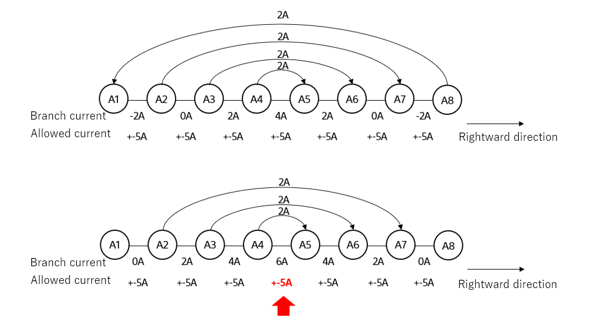  
Fig. 11-1

Because apis-mains carry out energy sharing asynchronously, the above problem may occur. Therefore, the following calculations and comparisons are made to ensure that the current does not exceed each line’s allowed current value.

1)  Calculate line current from the charging node’s point of view  
   Focusing only on the current of the charge node where energy sharing is being carried out, determine the maximum current value of a line by summing the currents for each line in a branch direction and the reverse branch direction.

2)  Calculate line current from the discharging node’s point of view
   Focusing only on the current of the discharge node where energy sharing is being carried out, determine the maximum current value of a line by summing the currents for each line in a branch direction and the reverse branch direction.

3)  Compare with each line’s allowed current value
   Compare the current values calculated in 1) and 2) above with the allowed current value of each line stored in policy.json. If a line exceeded the allowed current value, do not start a new energy sharing.

 

As an example, the currents in the DC grid topology below are calculated as follows.

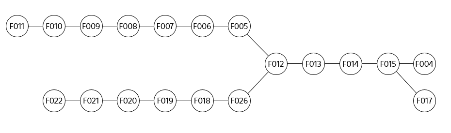  
Fig. 11-2

 

Branch current A-1 is as follows.

  
Fig. 11-3

 

Branch current A-1’s energy sharing current formulas are as follows.

(F021 F022) = F022  
(F020 F021) = F022 + F021  
(F019 F020) = F022 + F021 + F020  
(F019 F018) = F022 + F021 + F020 + F019  
(F026 F018) = F022 + F021 + F020 + F019 + F018  
(F012 F026) = F022 + F021 + F020 + F019 + F018 + F026  

 

Branch current A-2 is as follows.

  
Fig. 11-4

 

Branch current A-2’s energy sharing current formulas are as follows.

(F022 F021) = (F012 F013) + (F012 F005) + F012 + F026 + F018 + F019 + F020 + F021  
(F021 F020) = (F012 F013) + (F012 F005) + F012 + F026 + F018 + F019 + F020  
(F020 F019) = (F012 F013) + (F012 F005) + F012 + F026 + F018 + F019  
(F019 F018) = (F012 F013) + (F012 F005) + F012 + F026 + F018  
(F018 F026) = (F012 F013) + (F012 F005) + F012 + F026  
(F026 F012) = (F012 F013) + (F012 F005) + F012  
(F012 F013) = F004 + F017 + F015 + F014 + F013  
(F012 F005) = F011 + F010 + F009 + F008 + F007 + F006 + F005  

 

Branch current B-1 is as follows.
  
Fig. 11-5

 

Branch current B-1’s energy sharing current formulas are as follows.

(F010 F011) = F011  
(F009 F010) = F011 + F010  
(F008 F009) = F011 + F010 + F009  
(F007 F008) = F011 + F010 + F009 + F008  
(F006 F007) = F011 + F010 + F009 + F008 + F007  
(F005 F006) = F011 + F010 + F009 + F008 + F007 + F006  
(F012 F005) = F011 + F010 + F009 + F008 + F007 + F006 + F005  

 

Branch current B-2 is as follows.
  
Fig. 11-6

 

Branch current B-2’s energy sharing current formulas are as follows.

(F011 F010) = (F012 F013) + (F012 F026) + F012 + F005 + F006 + F007 + F008 + F009 + F010  
(F010 F009) = (F012 F013) + (F012 F026) + F012 + F005 + F006 + F007 + F008 + F009  
(F009 F008) = (F012 F013) + (F012 F026) + F012 + F005 + F006 + F007 + F008  
(F008 F007) = (F012 F013) + (F012 F026) + F012 + F005 + F006 + F007  
(F007 F006) = (F012 F013) + (F012 F026) + F012 + F005 + F006  
(F006 F005) = (F012 F013) + (F012 F026) + F012 + F005  
(F005 F012) = (F012 F013) + (F012 F026) + F012  
(F012 F013) = F013 + F014 + F015 + F004 + F017  
(F012 F026) = F022 + F021 + F020 + F019 + F018 + F026  

 

Branch current C-1 is as follows.

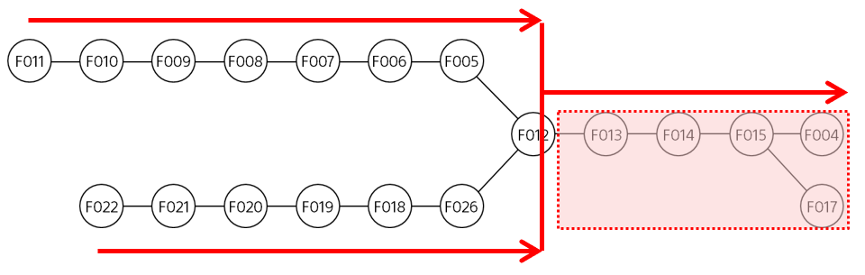  
Fig. 11-7

 

Branch current C-1’s energy sharing current formulas are as follows.

(F015 F004) = F004  
(F015 F017) = F017  
(F014 F015) = F004 + F017 + F015  
(F013 F014) = F004 + F017 + F015 + F014  
(F012 F013) = F004 + F017 + F015 + F014 + F013  

 

Branch current C-2 is as follows.

  
Fig. 11-8

 

Branch current C-2’s energy sharing current formulas are as follows.

(F004 F015) = (F012 F005) + (F012 F026) + F012 + F013 + F014 + F015 + F017  
(F017 F015) = (F012 F005) + (F012 F026) + F012 + F013 + F014 + F015 + F004  
(F015 F014) = (F012 F005) + (F012 F026) + F012 + F013 + F014  
(F014 F013) = (F012 F005) + (F012 F026) + F012 + F013  
(F013 F012) = (F012 F005) + (F012 F026) + F012  
(F012 F005) = F011 + F010 + F009 + F008 + F007 + F006 + F005  
(F012 F026) = F022 + F021 + F020 + F019 + F018 + F026  

 

Comparison with current calculation of each line  
Below summarizes the equation for each branch current so far.

For these formulas, the current values of the charging and discharging nodes are substituted to determine the maximum currents flowing through the lines for the charging and discharging nodes. The maximum currents are compared to the allowed currents.

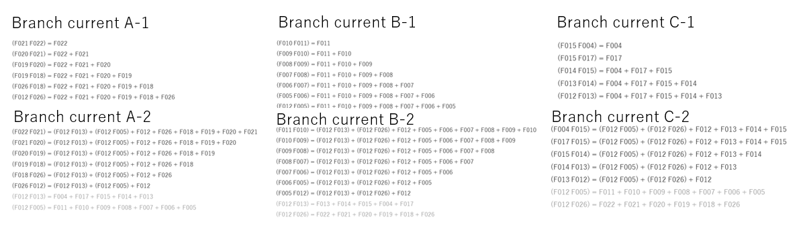

## **11.2. Gateway Function**

This section explains the Gateway function which realizes the energy sharing between clusters. The Gateway function is achieved by Gateway nodes that connect clusters. As shown in Fig. 11-9 below, a Gateway node consists of multiple apis-mains, Device Drivers, and DC/DC converters for one battery.

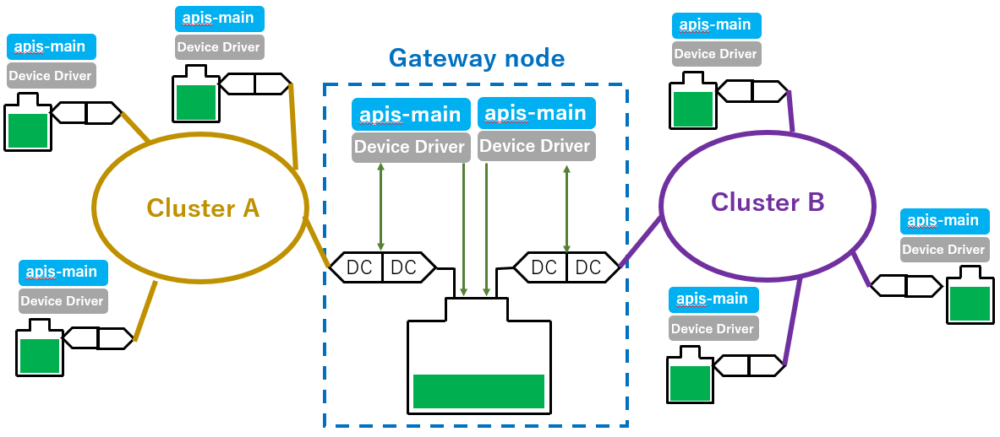  
Fig. 11-9

 

The main hardware and software compositions are as follows.

* Hardware composition
  * Battery … 1 unit
  * DC/DC converter … Same quantity as number of connecting clusters
* Software composition
  * apis-mains … Same quantity as number of connecting clusters
  * Device Drivers … Same quantity as number of connecting clusters

 

Multiple apis-mains within a Gateway node participate in different clusters and act independently. Multiple DC/DC converters carry out processing of energy sharing independently in accordance with control by their corresponding apis-mains. However, a Gateway node differs from a regular node in that because one battery is shared by multiple apis-main, there is a need to make sure that the battery’s maximum current capacity is not exceeded. To ensure that the battery’s maximum current capacity is not exceeded, control is carried out so energy sharing does not take place in the same direction simultaneously by using a File System-based exclusive lock. Because of control by this file-based exclusive lock control, multiple apis-mains must be started on the same operating system.

To carry out exclusive locking, the file-based exclusive lock creates two files—an exclusive lock file for the discharging side and an exclusive lock file for charging side—within a folder specified by the Config file.

When discharging for the energy sharing by apis-main in a Gateway node, first the existence of the exclusive lock file for discharging in the specified folder is confirmed. If the file exists, discharging is abandoned. If the file does not exist, the exclusive lock file for discharging is created and then discharging is carried out. In the case of charging, similarly when apis-mains carries out charging for energy sharing, first the existence of the exclusive lock file for charging in the specified folder is confirmed. If the file exists, charging is abandoned. If the file does not exist, the exclusive lock file for charging is created and then charging is carried out.

To enable the Gateway Function in an apis-main, configure two places in the config file given below.

 

\[config file\]  
> "batteryCapacityManagement.enabled": true  
Starts the battery capacity management function and enables the Gateway function.  
"fileSystemExclusiveLockFileFormat": "/tmp/.apis.%s.lock",  
Specifies the place and name for creating the exclusive lock file.

 

# **12. Safety Confirmation Functions**
    
## **12.1. Global Safety Check**

Grid Master collects and processes all node data at the interval specified by gridMaster.dataCollectionPeriodMsec in the Policy file. The following confirmations are then carried out based on the collected data.

* Sum of absolute values of all energy sharing currents in the DC grid  
  Confirmation that the sum of all energy sharing currents does not exceed the maximum capacity of the DC grid is carried out.  
  The maximum capacity is specified by sumOfDealGridCurrentMaxA in the Policy file.

* Sum of DC grid branch currents
  Confirmation that the sum of the currents flowing through each branch on the DC grid’s topology does not exceed the maximum capacity is carried out.  
  The maximum capacity of each branch is specified by the gridTopologyBasedEvaluation items in the Policy file.

* Sum of all energy sharing currents in the DC grid
  Confirmation that the sum of all energy sharing currents does not exceed the range specified in the Policy file is carried out.  
  The range is specified by ±sumOfDealingUnitGridCurrentAllowancePerUnitA\*N (where N is the number of nodes involved in the energy sharing) in the Policy file.

 

## **12.2. Local Safety Check**

### **12.2.1. Static Local Safety Check**

　Each node confirms whether there is deviation of hardware performance by gathering and processing own data at interval specified by dataAcquisitionPeriodMsec in the hwConfig file.

* DC/DC converter temperature  
  Confirmation that the DC/DC converter temperature is maintained within the range specified in the hwConfig file is carried out. The minimum temperature value is specified by safety.range.DC/DC.meter.tpm.min and the maximum temperature value is specified by safety.range.DC/DC.meter.tpm.max in the hwConfig file.

* DC/DC converter DC grid side voltage  
  Confirmation that the DC/DC converter’s DC grid side voltage is maintained within the range specified by the hwConfig file is carried out. The minimum voltage value is specified by safety.range.DC/DC.meter.vg.min and the maximum voltage value is specified by safety.range.DC/DC.meter.vg.max in the hwConfig file.

* DC/DC converter DC grid side current  
  Confirmation that the DC/DC converter’s DC grid side current is maintained within the range specified by the hwConfig file is carried out. The minimum current value is specified by safety.range.DC/DC.meter.ig.min and the maximum current value is specified by safety.range.DC/DC.meter.ig.max in the hwConfig file.

* DC/DC converter Battery side voltage  
  Confirmation that the DC/DC converter’s battery side voltage is maintained within the range specified by the hwConfig file is carried out. The minimum voltage value is specified by safety.range.emu.DC/DC.meter.vb.min and the maximum voltage value is specified by safety.range.emu.DC/DC.meter.vb.max in the hwConfig file.

* DC/DC converter Battery side current  
  Confirmation that the DC/DC converter’s battery side current is maintained within the range specified by the hwConfig file is carried out. The minimum current value is specified by safety.range.emu.DC/DC.meter.ib.min and the maximum current value is specified by safety.range.emu.DC/DC.meter.ib.max in the hwConfig file.

 

### **12.2.2. Dynamic Local Safety Check**

Confirmation that the voltage and current of the DC/DC converter and DC grid are maintained within the error range specified in the Policy file and hwConfig file is carried out. Confirmation that control is being carried out correctly based on the DC/DC converter’s control mode, e.g. the current not exceeding the maximum allowed value, is also carried out.
 
 Each node gathers and processes its own data at the interval specified by dataAcquisitionPeriodMsec in the hwConfig file. The following confirmations are then carried out based on the collected data.

* DC/DC converter’s DC grid side current  
  Confirmation that the DC/DC converter’s DC grid side current is maintained within the capacity specified by the hwConfig file is carried out. The capacity is specified by gridCurrentCapacityA in the hwConfig file.

* DC/DC converter’s DC grid side current error  
  Confirmation that the DC/DC converter’s DC grid side current error is maintained within the range specified by the hwConfig file is carried out. The range is specified by ±gridCurrentAllowanceA in the hwConfig file.

 

# **13. Security**
    
## **13.1. Communication Security between apis-mains**

Exchanges between apis-mains are carried out using Event Bus communication and Hazelcast communication, which are supported by the frameworks (Vert.x, Hazelcast). Each type of communication is encrypted using the following methods for security.

1) Event Bus communication  
   \-SSL public key cryptography (RSA)  
   \-SSL self-signed certificate

1) Hazelcast communication  
   \-Symmetric key cryptography (AES 128-bit)

 

## **13.2. Device Driver Access Restriction**

The Device Driver accesses using the Web API. By applying IP address and port restriction, it is possible to restrict access from other nodes and allow access only from within the node itself.

 

# **14. Privacy**

Note that under regulations such as the General Data Protection Regulation (GDPR), when a combination of IP address and other information leads to personal identification, this is considered handling of personal information and subject to personal information protection regulations.

In the case of a system that is formed only on a local network, information obtained by apis-main is not sent to an external server. The system is thus not subject to personal information protection regulations. However, attention is needed when information obtained by apis-main is sent to an external server.

 

# **15. Open Source Software Licenses**

The following table shows the software used by apis-main and information about their open source software licenses. apis-main only links to Adopt OpenJDK libraries, so publishing the source code of apis-main is not required due to the application of GPLv2’s Classpath Exception. The licenses of other OSS software also do not require the source code of apis-main to be published.  
 
■Software used by apis-main and information about their open source software licenses

<table>
<thead>
<tr class="header">
<th>Software</th>
<th>Version</th>
<th>License</th>
<th>Revised code</th>
</tr>
</thead>
<tbody>
<tr class="odd">
<td>Adopt OpenJDK</td>
<td>11.0.4+11</td>
<td>GPLv2 with Classpath Exception</td>
<td>No</td>
</tr>
<tr class="even">
<td>Vert.x</td>
<td>3.7.1</td>
<td>
Dual-licensed

(Choose below)

Eclipse Public License 2.0

Apache License, Version 2.0
</td>
<td>No</td>
</tr>
<tr class="odd">
<td>Hazelcast</td>
<td>3.6.3</td>
<td>Apache License, Version 2.0</td>
<td>No</td>
</tr>
<tr class="even">
<td>Netty</td>
<td>4.1.8</td>
<td>Apache License, Version 2.0</td>
<td>No</td>
</tr>
<tr class="odd">
<td>FasterXML/Jackson</td>
<td>2.7.4</td>
<td>Apache License, Version 2.0</td>
<td>No</td>
</tr>
<tr class="even">
<td>ReactiveX/RxJava</td>
<td>1.3.0</td>
<td>Apache License, Version 2.0</td>
<td>No</td>
</tr>
</tbody>
</table>

*The software versions are subject to change.

 

# **16. Operating Environment**
    
## **16.2. Recommended Hardware Specifications**

The recommended hardware specifications for apis-main are as follows.

<table>
<tbody>
<tr class="even">
<td>CPU processor</td>
<td>
600 – 1000MHz, 64-bit single core, 32KB L1 cache or above

ARMv8 recommended.

(If using a CPU besides ARMv8, you need to confirm the behavior of apis-main.)
</td>
</tr>
<tr class="odd">
<td>DRAM</td>
<td>DDR3 1.6Gbps 1 GB or more</td>
</tr>
<tr class="even">
<td>Internal storage</td>
<td>8 GB or more</td>
</tr>
<tr class="odd">
<td>Ethernet</td>
<td>20 Mbps, 1 port or more, support for IPv4 or IPv6</td>
</tr>
</tbody>
</table>

 

## **16.2. Recommended Operating System Specifications**

The recommended operating system specifications for apis-main are as follows.

<table>
<tbody>
<tr class="even">
<td>Type</td>
<td>
64-bit OS, Linux recommended

(If using an operating system besides Linux, you need to confirm the behavior of apis-main.)
</td>
</tr>
<tr class="odd">
<td>Size</td>
<td>
Depends on the internal storage capacity of the IoT Board

(Storage of logs of apis-main, etc., requires at least 3 GB.)
</td>
</tr>
<tr class="even">
<td>Operating software</td>
<td>AdoptOpenJDK (32/64-bit)</td>
</tr>
<tr class="odd">
<td>Open source software license</td>
<td>To prevent the effects of copyleft licenses such as GPL, an operating system that has the open source software and apis-main in one execution file is prohibited (e.g. a real-time operating system).</td>
</tr>
<tr class="even">
<td>Others</td>
<td>Ability to automatically execute apis-main and other software when the operating system starts up.</td>
</tr>
<tr class="odd">
<td></td>
<td>Ability to carry out ssh login/scp file transfer.</td>
</tr>
<tr class="even">
<td></td>
<td>Ability to periodically rename/compress/delete logs, such as by using logrotage.</td>
</tr>
</tbody>
</table>
