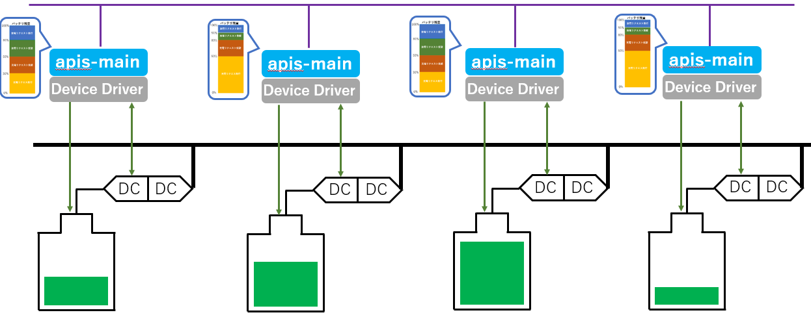
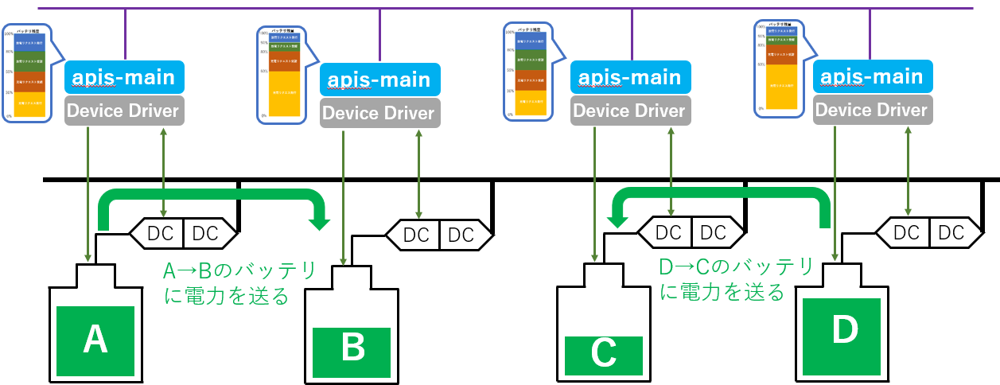
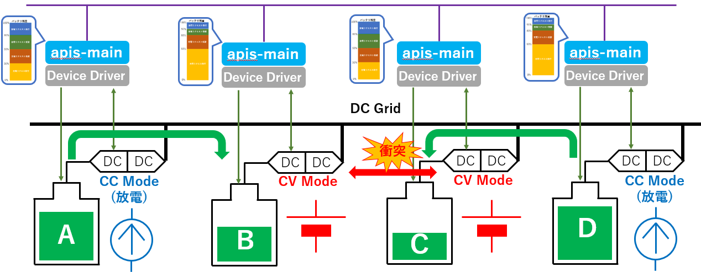
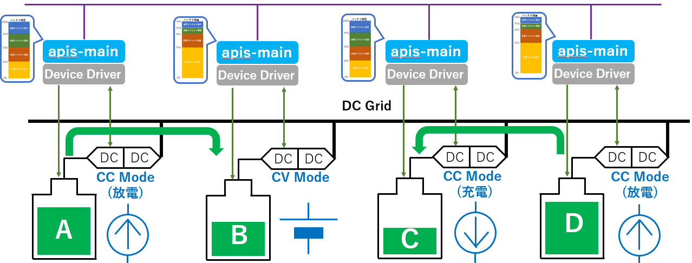
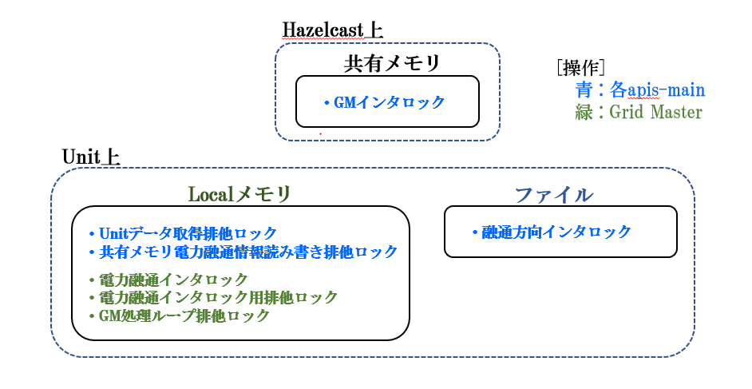
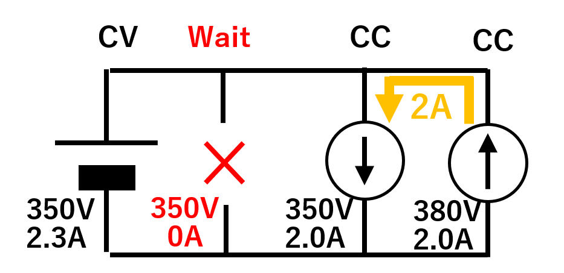
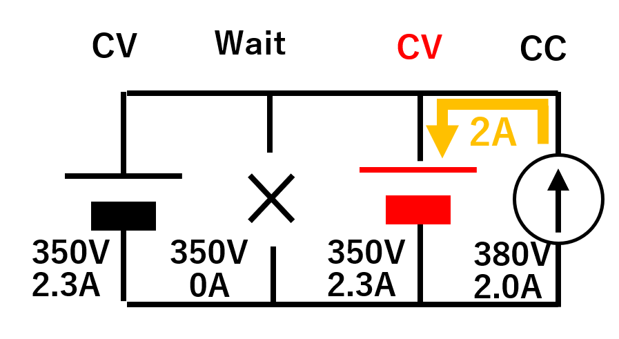
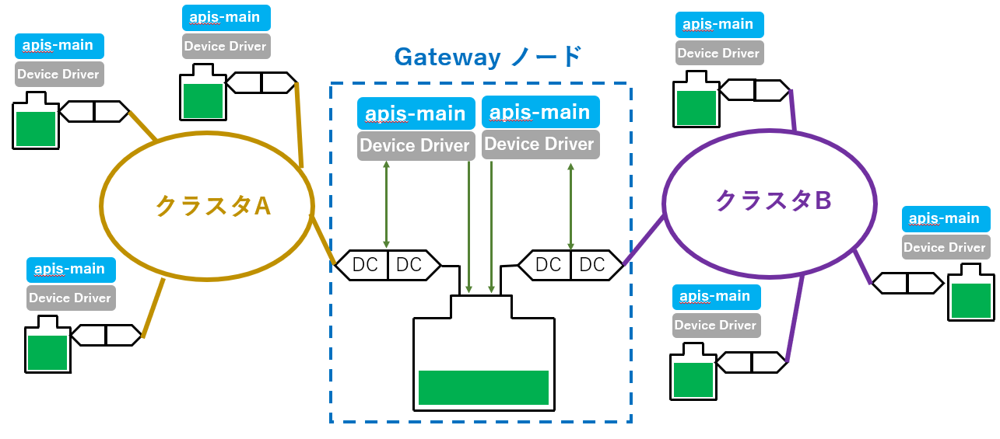

**電力相互融通システム用ソフトウェア**

**APIS (Autonomous Power Interchange System)**

**apis-main仕様書**

**Rev 0.69**

2020年10月5日

株式会社ソニーコンピュータサイエンス研究所

SDGグループOESプロジェクト

**改版履歴**

+-----------+----------+----------+---------------------------------+
| **日付**  | **Rev.** | **担当** | **変更内容**                    |
+===========+==========+==========+=================================+
| 2020/4/17 | 0.5      | 岩瀬     | 初回Release                     |
+-----------+----------+----------+---------------------------------+
| 2020/4/20 | 0.6      | 岩瀬     | OES Member Comment修正          |
+-----------+----------+----------+---------------------------------+
| 2020/4/21 | 0.61     | 岩瀬     | OES Member Comment修正第二弾    |
+-----------+----------+----------+---------------------------------+
| 2020/4/28 | 0.62     | 岩瀬     | "8.Grid Master Data収集"、"9.3  |
|           |          |          | 電                              |
|           |          |          | 力融通Log"の項目不備のため追記  |
+-----------+----------+----------+---------------------------------+
| 2020/9/18 | 0.63     | 岩瀬     | 用語にEZA2500の説明を追記       |
|           |          |          |                                 |
|           |          |          | P.18 5.1 apis-main -- Device    |
|           |          |          | Driver間Web APIの誤記修正       |
+-----------+----------+----------+---------------------------------+
| 2020/9/24 | 0.64     | 岩瀬     | 用                              |
|           |          |          | 語にdcdc_batt_commの説明を追記  |
|           |          |          |                                 |
|           |          |          | P.18 5.1 apis-main -- Device    |
|           |          |          | Driver間Web APIに各Web          |
|           |          |          | API利用時に期待する戻り値を追記 |
+-----------+----------+----------+---------------------------------+
| 2020/9/25 | 0.65     | 岩瀬     | P.18 5.1 apis-main -- Device    |
|           |          |          | Driver間Web                     |
|           |          |          | APIに/dcdc/set系のWeb           |
|           |          |          | API利用時に期待する戻り値を追記 |
+-----------+----------+----------+---------------------------------+
| 2020/9/29 | 0.66     | 岩瀬     | P.19 5.1 apis-main -- Device    |
|           |          |          | Driver間Web API                 |
|           |          |          | についてapi                     |
|           |          |          | s-mainの制御に使用していないWeb |
|           |          |          | APIを削除し、/dcdc/set系のWeb   |
|           |          |          | API利用                         |
|           |          |          | 時に期待する戻り値について修正  |
|           |          |          |                                 |
|           |          |          | P.48 誤記修正                   |
+-----------+----------+----------+---------------------------------+
| 2020/9/29 | 0.67     | 岩瀬     | 目次のPage番号振り直し          |
+-----------+----------+----------+---------------------------------+
| 2020/10/5 | 0.68     | 岩瀬     | P.37の以下の項目の説明を修正    |
|           |          |          |                                 |
|           |          |          | ・contr                         |
|           |          |          | oller.dataAcquisitionPeriodMsec |
|           |          |          |                                 |
|           |          |          | ・controller.retryLimit         |
|           |          |          |                                 |
|           |          |          | P.47の8. Grid                   |
|           |          |          | Master収集データのs             |
|           |          |          | tatus.operationModeに情報を追記 |
+-----------+----------+----------+---------------------------------+
| 2020/10/5 | 0.69     | 岩瀬     | P.47の8. Grid                   |
|           |          |          | Master収集データのs             |
|           |          |          | tatus.operationModeに情報を修正 |
+-----------+----------+----------+---------------------------------+

**目次** {#目次 .TOC-Heading}
========

[**1.** **用語・略語** 6](#用語略語)

[**2.** **概要** 7](#_Toc52292578)

[**ソフトウェア構成** 11](#ソフトウェア構成)

[**3.1. ソフトウェアアーキテクチャ** 11](#ソフトウェアアーキテクチャ)

[**3.2.** **apis-main内Service構成** 11](#apis-main内service構成)

[**4.** **動作詳細説明** 13](#_Toc52292583)

[**4.1.** **クラスタ構築** 13](#クラスタ構築)

[**4.2.** **Grid Master選定** 13](#grid-master選定)

[**4.3.** **apis-main処理** 14](#apis-main処理)

[**4.4.** **Grid Master処理** 15](#_Toc52292588)

[**4.5.** **電力融通処理** 16](#電力融通処理)

[**4.6.** **各種ロック処理** 17](#各種ロック処理)

[**5.** **通信仕様について** 19](#通信仕様について)

[**5.1.** **apis-main -- Device Driver間Web API**
19](#apis-main-device-driver間web-api)

[**5.2.** **apis-main -- Device Driver間の各get 系Web
APIで期待される戻り値**
20](#apis-main-device-driver間の各get-系web-apiで期待される戻り値)

[**5.2.1.** **"/dcdc/get" で期待される戻り値**
20](#dcdcget-で期待される戻り値)

[**5.2.2.** **"/dcdc/get/status" で期待される戻り値**
21](#dcdcgetstatus-で期待される戻り値)

[**5.2.3.** **"/dcdc/set?dig=\<Grid電流\>" で期待される戻り値**
22](#dcdcsetdiggrid電流-で期待される戻り値)

[**5.2.4.** **"/dcdc/set?dvg=\<Grid電圧\>&drg=\<GridDroop率\>"
で期待される戻り値**
22](#dcdcsetdvggrid電圧drggriddroop率-で期待される戻り値)

[**5.2.5.**
**"/dcdc/set?mode=\<Mode\>&dvg=\<Grid電圧\>&dig=\<Grid電流\>&dig=\<GridDroop率\>"
で期待される戻り値**
23](#dcdcsetmodemodedvggrid電圧diggrid電流diggriddroop率-で期待される戻り値)

[**5.2.6.** **"/battery/get" で期待される戻り値**
24](#batteryget-で期待される戻り値)

[**5.2.7.** **"/all/get" で期待される戻り値**
24](#allget-で期待される戻り値)

[**5.2.8.** **"/version/get" で期待される戻り値**
26](#versionget-で期待される戻り値)

[**5.3.** **Device Driver -- ハードウェア間通信仕様**
27](#device-driver-ハードウェア間通信仕様)

[**6.** **設定ファイルについて** 28](#設定ファイルについて)

[**6.1.** **config.json** 28](#config.json)

[**6.2.** **hwConfig.json** 30](#hwconfig.json)

[**6.3.** **scenario.json** 31](#scenario.json)

[**6.4.** **policy.json** 35](#policy.json)

[**6.5.** **cluster.xml** 39](#cluster.xml)

[**6.6.** **logging.properties** 39](#logging.properties)

[**6.7.** **start.sh** 40](#start.sh)

[**6.8.** **stop-kill.sh** 40](#stop-kill.sh)

[**6.9.** **key.pem** 41](#key.pem)

[**6.10.** **cert.pem** 41](#cert.pem)

[**7.** **DC Grid制御機能** 42](#dc-grid制御機能)

[**7.1.** **電圧Referenceの選定** 42](#電圧referenceの選定)

[**7.2.** **電圧Ramp Up** 42](#電圧ramp-up)

[**7.3.** **電圧Reference権限獲得動作** 42](#電圧reference権限獲得動作)

[**7.4.** **電流補正機能** 43](#電流補正機能)

[**7.5.** **Constant Voltage(CV)移動** 44](#constant-voltagecv移動)

[**7.6.** **電圧最適化** 45](#電圧最適化)

[**8.** **Grid Master Data収集** 47](#grid-master-data収集)

[**9.** **Log取得・保存機能** 50](#log取得保存機能)

[**9.1.** **apis-main動作Log** 50](#apis-main動作log)

[**9.2.** **apis-main動作Log出力先** 51](#apis-main動作log出力先)

[**9.3.** **電力融通Log** 52](#電力融通log)

[**10.** **Error処理・保護機能** 54](#error処理保護機能)

[**10.1.** **apis-main Error処理** 54](#apis-main-error処理)

[**11.** **その他の機能** 58](#その他の機能)

[**11.1.** **トポロジー検出** 58](#トポロジー検出)

[**11.2.** **Gateway機能** 64](#gateway機能)

[**12.** **安全確認機能** 66](#安全確認機能)

[**12.1.** **Global Safety Check** 66](#global-safety-check)

[**12.2.** **Local Safety Check** 66](#local-safety-check)

[**12.2.1.静的Local Safety Check** 66](#静的local-safety-check)

[**12.2.2. 動的Local Safety Check** 68](#動的local-safety-check)

[**13.** **セキュリティ** 69](#セキュリティ)

[**13.1.** **apis-main間通信セキュリティ**
69](#apis-main間通信セキュリティ)

[**13.2.** **Device Driver アクセス制限**
69](#device-driver-アクセス制限)

[**14.** **プライバシー** 69](#プライバシー)

[**15.** **OSSライセンス** 70](#ossライセンス)

[**16.** **動作環境** 71](#動作環境)

[**16.1.** **ハードウェア要求** 71](#ハードウェア要求)

[**16.2.** **OS要求** 71](#os要求)

**用語・略語**
==============

  **用語**         **説明**
  ---------------- ------------------------------------------------------------------------------------------------------------------------------------------------------------------------------
  apis-main        Sony CSLが開発した電力相互融通ソフトウェアの名称である。
  PP2P             Physical Peer to Peerの略である。ブロックチェーン等による台帳管理による電力取引ではなく物理的に特定の相手間での電力交換ができるという意味を込めてP2Pと分けた表現にしている。
  Grid Master      APISに含まれるService名称でDC Gridを制御し電力融通を実現する。
  Hazelcast        複数のマシンにDataを分散し並列処理を行うことでアプリケーションを高速化するインメモリ分散コンピューティング運用ライブラリである。
  Vert.x           負荷分散プログラムのフレームワーク。Hazelcastライブラリを利用してEvent Busをクラスタ化しネットワーク上で負荷分散処理を行う。
  Event Bus        Vert.xのプログラムの最小単位をVerticleと呼び。そのVerticle間でお互いに通信するための非同期インターフェースをEvent Busと呼ぶ
  共有メモリ       Hazelcastの機能でクラスタにある共有情報。クラスタに参加しているAPISは参照・編集・削除が可能である。
  EZA2500          本文ではTDKラムダ製EZA-2500-32048のカスタマイズ品を指す。
  dcdc_batt_comm   Sony CSLが開発したEZA2500を制御しBattery情報を取得するDevice Driverである。
                   

**概要**
========

apis-mainはSony
CSLが開発した自律分散制御の電力相互融通ソフトウェアの名称である。apis-mainは各ノード(双方向DC/DC
Converter 経由でDC
Gridと接続された蓄電システム)毎にインストールされ、Device
Driver経由で定期的に自身のBattery残容量を取得し、Battery残容量によって決められた行動ルールに従ってapis-main間でネゴシエーションを行い自動でノード間の電力融通を実現するソフトウェアである。(この行動ルールとは他のapis-mainへ自ら充放電Requestを送るのか、他のapis-mainから受け取った充放電Requestに対してAcceptを返すのかなどの判断を自身のBatteryの残容量を元に決めるためのルールを指す。)
apis-main間のネゴシエーションはEthernetなどのコミュニケーションラインが用いられ、電力融通はDC
Grid上で直流にて行われる。apis-mainは集中管理制御のように中央で制御を行うソフトウェアは存在せず、すべて同一のソフトウェアであるapis-mainのみで自律分散制御が行われる。
(apis-mainはGrid
Masterと呼ばれるアドホックな集中管理ソフトウェアを立てて制御を行う。Grid
Masterは予め設定されたルールに基づいてどのapis-mainでも立てられる。)

{width="4.033333333333333in"
height="1.7489173228346457in"}

Battery間の電力融通例を図2-2に示す。Battery AからBattery
Bへ電力を融通する場合にはapis-mainがDevice
Driver経由で各ノードの双方向DC/DC
ConverterのModeについて放電側をConstant Current Mode(CC
Mode)に、充電側をConstant Voltage Mode(CV
Mode)に制御することによって電力融通が行われる。

{width="0.601155949256343in"
height="0.3016327646544182in"}{width="4.908333333333333in"
height="1.7188396762904636in"}

次にapis-main間のネゴシエーションの流れの例を以下に示す。 (図2-3参照)

1.  apis-mainはDevice
    Driver経由で定期的に自身のBattery残容量を取得する。

2.  ①で取得したBattery残容量を自身の行動ルールAと比較する。

3.  行動ルールAと比較した結果、必要であれば他のapis-mainにRequestを発行する。

4.  Requestを受けた他のapis-mainは自身のBattery残容量を取得する。

5.  ④で取得したBattery残容量を自身の行動ルールBと比較する。

6.  行動ルールBと比較した結果、Requestに承認可能であればRequest発行元にAcceptを発行する。

7.  Requestを出したapis-mainは返ってきた複数のAcceptから適切なものを一つ選択する。(選択アルゴリズムは6.3
    scenario.json参照)

8.  Requestと選択されたAcceptから電力融通取引情報を作成する。

{width="0.5953751093613299in"
height="0.3016327646544182in"}{width="5.9in"
height="2.4583333333333335in"}

単体のapis-mainがコミュニケーションラインとDC
Gridに接続された様子を図2-4に示す。

{width="0.618497375328084in"
height="0.3016327646544182in"}{width="5.012938538932634in"
height="2.025in"}

次に複数のapis-mainによる構成を図2-5に示す。

{width="0.6242782152230971in"
height="0.3016327646544182in"}{width="5.154515529308837in"
height="2.0166666666666666in"}

apis-mainは図2-6のように複数の電力融通を並行して行うことが可能である。

{width="0.6242782152230971in"
height="0.3016327646544182in"}{width="5.0125in"
height="1.9327865266841644in"}

DC Gridを制御する上での注意点は図2-7のようにDC Grid上にCV ModeのDC/DC
Converterが２台以上存在すると電圧の衝突が発生することである。

{width="0.6242771216097988in"
height="0.3016327646544182in"}{width="5.9in"
height="2.2916666666666665in"}

そのため図2-8のようにDC Grid上にCV ModeのDC/DC
Converterは1台のみとし、他のDC/DC ConverterはすべてCC Modeで制御を行う。

{width="5.9in" height="2.2416666666666667in"}

{width="0.601155949256343in"
height="0.3016327646544182in"}

上記の制御を行うためにapis-mainにはGrid
MasterというGridを制御するServiceが存在する。apis-mainは起動時にコミュニケーションライン経由で通信を行ってクラスタを形成し、予め決められたルールに従ってクラスタに1台だけGrid
Masterを選定する。Grid MasterはDevice Driver経由でクラスタ内の全DC/DC
Converterを制御しDC Grid経由で電力融通を行わせる。全apis-mainがGrid
Masterになることができ、決められたルールに従って動的にGrid
Masterの移動を行うことも可能である。

{width="5.9in" height="2.283333333333333in"}

{width="0.7083333333333334in"
height="0.3016327646544182in"}

**ソフトウェア構成**
====================

**3.1. ソフトウェアアーキテクチャ**
-----------------------------------

図3-1はソフトウェアアーキテクチャを示した図である。Linux OS上にJDK(Java
Development
Kit)、その上にイベントドリブンの負荷分散プラットフォームであるVert.xとインメモリ分散コンピューティングのHazelcastの2つのフレームワークを使用してapis-mainを動作させている。apis-mainとDevice
Driver間はWeb
API経由にて情報の受け渡しを行う。(動作確認済みOSSソフトウェアのVersionは15.OSSライセンス参照)

{width="3.6333333333333333in"
height="2.818380358705162in"}

**apis-main内Service構成**
--------------------------

電力融通を実現するソフトウェアであるapis-mainと、BatteryやDC/DC
Converterとのやり取りを行うDevice
Driverで構成しており、apis-mainは以下の4つのServiceに分けられる。(図3-2参照)

(1) User Service

> Battery残容量毎のBattery充放電要求("2.製品概要"では行動ルールとして説明)を記したファイルをScenarioファイルと呼び、そのScenarioファイルの内容と現在のBattery残容量を比較することで充放電に関する要求を判定する。充放電が必要と判定した場合はMediator
> Serviceに対して他のapis-mainとネゴシエーションを行うように要求する。

(2) Mediator Service

> User
> Serviceの要求に基づき、他のapis-mainとネゴシエーションを行い、電力融通取引情報を作成する。必要に応じてGrid
> Masterを起動させる役割も担う。

(3) Grid Master Service

> 自身もしくは他のapis-mainから成立した電力融通取引情報を受け取り、電力融通に必要なDC/DC
> Converterを制御して電力融通を行わせる。電力融通中は融通された電力量を監視し、電力融通取引情報で決められた電力融通量に到達後融通を止める。電力融通記録は電力融通を行った双方のapis-mainが動作するハードウェアの不揮発性メモリに保存される。

(4) Controller Service

> User Serviceの要求でDC/DC ConverterやBatteryの情報を取得する。
>
> また、自身もしくは他のapis-main上のGrid Master
> Serviceからの要求でDC/DC Converterを制御し電力融通を行わせる。

{width="5.001523403324584in"
height="2.783333333333333in"}

3.  **動作詳細説明**
    ================

    1.  **クラスタ構築**
        ----------------

apis-mainは起動時にHazelcastと呼ばれるVert.xフレームワークが使用するクラスタリングマネージャを用いてコミュニケーションライン上に存在する複数のapis-mainとクラスタを構築する。同一クラスタに参加するためには設定ファイルであるcluster.xml上で同一クラスタ名を指定する必要がある。

**Grid Master選定**
-------------------

apis-mainが起動するとMediator Service のGird Master
Management機能が、ランダムなタイミングでクラスタ内にGrid
Masterの存在を問い合わせる。起動直後等でクラスタ内にGrid
Masterが存在しない場合には、設定ルールに従って、適切なGrid
Masterを選定する。Grid Master選定には \"voltageReference\", \"fixed\",
\"anywhere\"の3種類の選定方法がある。

(1) voltageReference

> 電力融通時に電圧Reference(CV Mode)となるノードがGrid
> Masterになる選定方法である。電圧Referenceが変わればそれに伴ってGrid
> Masterも移動する。
>
> 電圧Referenceとなるノードは、電力融通開始時に決定されるためapis-main起動直後にはGrid
> Masterは決まらない。そのため起動時はGrid
> Masterの存在を問い合わせ、返信がなければ自らがGrid
> Masterになろうとする。(複数のGrid
> Masterの同時起動を防ぐため、自身のGrid Master
> Serviceを起動させる前にランダム時間待ち、その後再びGrid
> Masterの不在が確認された場合は自らGrid Master Serviceを起動させる。)

(2) fixed　

> Grid Masterになるノードを固定する選定方法である。fixedでGrid
> Masterを選定する場合はクラスタ内で最初にfixedで指定したノードのapis-mainを起動させる必要がある。

(3) anywhere　

> 最初にapis-mainが起動したノードがGrid
> Masterとなる選定方法である。後に不具合等でGrid
> Masterが不在になった場合には不在を検知したノードが自らGrid
> Masterになろうとする。

**apis-main処理**
-----------------

apis-mainはループ処理として以下の内容を継続して行う。

　1.Event
BusにHelloメッセージを送信し、自身と同じIDがクラスタに存在しないことを確認する。(存在した場合はError処理として自身(apis-main)をShutdownさせる。)

> 2.自身のLocal
> Error情報をキャッシュから取り出して処理を行う。(apis-mainは発生したすべてのError情報をEvent
> Bus上の全ノードに送信する。Error情報を受信したノードは自身かつLocal
> Error情報のみを自身のキャッシュに保存する。Global Error情報はGrid
> Masterが起動しているノードのキャッシュに保存される。具体的なErrorの内容とその処理方法は後述する。Local
> ErrorとGlobal Error及びそれらのError処理に関しては10.1. apis-main
> Error処理参照)
>
> 3.Grid MasterにGlobal Error情報を確認する。

4.自身のSettingを確認する。(Settingの種類は以下)

Run: 電力融通生成を有効にする電力融通稼働時の標準Settingである。

> Soft Stop: 既存の電力融通は実施するが、新たな電力融通生成は行わない。

Force Stop: 既存の電力融通を停止させ、新たな電力融通生成も行わない。

Manual: 検査等でDC/DC Converter等をManualで動作させるためのModeである。

5.Controller Service経由で自身のDC/DC
ConverterやBatteryの情報を取得する。

> 6.Local Safety Checkを行う。(12.2 Local Safety Check参照)

7.自身のScenario情報を取得する。

> 8.自身のBattery情報とScenario情報と比較する。比較した結果、過不足ありと判定した場合はUser
> ServiceはMediator Service
> に指示を出しクラスタ内の全apis-mainに電力融通Requestを発信する。
>
> 9.他のapis-mainから電力融通Requestを受け取ったMediator Service
> は電力融通Requestを 自身のUser Service に渡す。User
> Serviceは⾃ノードのBattery残容量とScenarioファイルを元に電力融通Requestに応じられるかを評価し、応じられる場合は電力融通可能な電力量を計算しその結果をAccept情報としてRequest元に返信する。応じられない場合はRequestを無視してAccept情報は返信しない。
>
> 10.電力融通Request元の Mediator Service は自身のUser
> Serviceに処理を渡して他のapis-mainから返信された電力融通可能電力量を元に、Scenarioファイルにて指定された選択アルゴリズムに従って、最適な電力融通相⼿のノードを選択させ、その後電⼒融通の情報が記載された
> 電力融通取引情報をHazelcastの共有メモリに登録し、Grid
> Masterの処理を待つ。

4.  1.  **Grid Master処理**
        -------------------

Grid Master はループ処理として以下の内容を継続して行う。

1.Grid
Masterを起動する前にHazelcastの共有メモリに自身のIDを登録して他のapis-mainがGrid
Masterにならないようにロックをする。(Grid
Masterを移動する際は共有メモリから登録したIDを削除する。)

2.クラスタ内にGrid Masterが重複していないことを確認するために、Event
BusにHelloメッセージを送信する。重複が確認された場合はError処理を行う。

3.各apis-mainからEvent Bus上に発行されるGlobal
Error情報をキャッシュに保存する。

4.Global Error情報をキャッシュから取り出しError処理を行う。(10.
Error処理・保護機能参照)

5.全apis-mainからDC/DC ConverterとBatteryの情報を取得する。(8. Grid
Master Data収集参照)

6.クラスタ全体の全ノード数やDC Grid上の平均Battery残量等を算出する。

7.Global Safety Checkを行う。(12.1 Global Safety Check参照)

8.Hazelcastの共有メモリに登録された電力融通取引情報に基づき順次電力融通を実施する。

9.Grid Masterの移動が発生した場合は適切なノードにGrid
Masterを移動させる。

> (Grid
> Masterが移動する際に既存の融通情報など引き継ぐ情報はすべてHazelcastの共有メモリ上に存在するため旧新Grid
> Master間で通信し情報を引き継ぐ必要はなく、新Grid
> Masterは起動後、共有メモリ上のGrid
> Masterの情報を参照し動作を開始する。)

**電力融通処理**
----------------

Hazelcastの共有メモリに登録された電力融通取引情報は以下の5つの状態を持つ。

"not activated", "activated", "started", "stopped", "deactivated"

Grid
Masterは共有メモリ上に登録されている全電力融通取引情報を集め、それぞれの状態に合わせて一つずつ、最適な処理を実行する。

\(1\) not activated 　

電力融通が行われておらずDC Gridの電圧がRamp Upしていない状態を示す。

> 共有メモリに登録された電力融通取引情報がこのステータスの場合にはGrid
> Masterは電圧Reference側のapis-mainに対してDC/DC ConverterをCV
> Modeに設定するように指示する。CV Modeに設定されたDC/DC ConverterはDC
> Gridを指定された電圧までRamp Upさせる。Ramp
> Upが完了した場合はステータスを(2)のactivatedへ移行させる。 (7.2
> 電圧Ramp Up参照)

\(2\) activated

> DC Grid の電圧Ramp
> upが完了し電力融通が開始できる状態を示す。既に電力融通が行われておりDC
> Gridの電圧のRamp
> Upが完了している場合には新しく登録された電力融通取引情報のステータスはactivatedになる。共有メモリに登録された電力融通取引情報がこのステータスの場合にはGrid
> Masterは電力融通を実施するapis-mainのDC/DC Converterをそれぞれ適切なCC
> Modeに設定し、(3)のstartedへ移行させる。

\(3\) started

> 共有メモリに登録された電力融通取引情報がこのステータスの場合には既に電力融通が開始されていることを示す。Grid
> Masterは自身のループ処理の中で電力融通した電力量の累積が目標の電力量に達していることを確認する。達していれば、放電ノードのapis-mainに対してDC/DC
> ConverterのModeをWaitに設定するように指示し電力融通を止めてステータスを(4)のstoppedへ移行させる。

\(4\) stopped

> 共有メモリに登録された電力融通取引情報がこのステータスの場合には既に電力融通した電力量の累積が目標の電力量に達し、放電側のDCDC
> ConverterがWait Modeになっていることを示す。Grid
> Masterは充電ノードのapis-mainに対してDC/DC
> ConverterのModeをWaitに設定するように指示し、ステータスを(5)のdeactivateに移行させる。その際、他に継続して電力融通が行われており、CV
> ModeになっていたDC/DC Converterの電力融通を停止する場合にはCV
> Modeの移動を実施 する。 (7.5 Constant Voltage(CV) 移動参照)

\(5\) deactivate

> 共有メモリに登録された電力融通取引情報がこのステータスの場合には既に電力融通が完了したことを示す。放電ノードと充電ノードの双方に電力融通結果をファイルとして書き込み、電力融通情報を共有メモリから削除する。(最終的な
> 電力融通結果の保存は
> 電力融通処理の最後に行われるが、電力融通中も放電側と充電双方のノードにその時点での電力融通情報をファイルとして保存する。)

**各種ロック処理**
------------------

Hazelcastの共有メモリや各ノードのLocalメモリを使用してデータの整合性を保つために同時アクセス制限を行う排他ロックや、ある一定の条件が整わないと他の動作を制限するインタロック機能があり、それらについて以下に説明する。

(1) 共有メモリ上のロック

> ・GMインタロック

　　 Grid Master
Serviceを起動する前に共有メモリ上に自身のIDを設定することで別の

ノードがGrid Master Serviceを起動しないようにロックをかける。

　　 Grid Masterを移動する際はGrid Master
Serviceを終了させた後、共有メモリ上のGMインタロックを解除し新しいノードのIDを設定してロックを行った上で移動する。

(2) Localメモリ上のロック

> ・電力融通インタロック
>
> Grid
> Masterが電力融通を行う両端のノードに対してかけるロックである。DC/DC
>
> Converterの最大電流量と１電力融通の電流量で電力融通数を決めている。
>
> ・電力融通インタロック用排他ロック
>
> 電力融通インタロックの取得/解放は、非同期で行われるが、整合性を取るために

排他ロックで同期を取る。

> ・データ取得排他ロック

　　　apis-mainからDevice
Driverに対してデータを取得する際にLocalにあるデータキャッシュの上書き競合を防ぐため、この排他ロックを使用してデータ取得用Commandと制御用Commandを制御する。all/getと
/dcdc/get/statusと/dcdc/setが排他制御されている。

> ・GM処理ループ排他ロック

　　　Grid MasterのMain loop実行中にGrid
Masterの停止が発生しないようにGrid Masterの移動(起動及び停止)とGrid
MasterのMain Loop処理を排他制御するために使用する。

　　・共有メモリ電力融通情報読み書き排他ロック

　　　自ノード内の複数スレッドによる共有メモリへの同時書き込みを防ぐために使用する。

(3) ファイルシステム上のロック

> ・融通方向インタロック
>
> 同一ノード上の複数のプロセス間で排他制御を実現するための排他ロックである。

　
後述するGateway機能で同一ノード上に複数のプロセス(apis-main)を起動させる際に使用する。ファイルシステムを利用することでプロセス間(apis-main間)の排他制御を行う。(11.2
Gateway機能参照)

　　　{width="4.242424540682415in"
height="2.1945975503062116in"}

　　　　　　　　　　　　　　　　　　　 図4-1

5.  **通信仕様について**
    ====================

    1.  **apis-main -- Device Driver間Web API**
        ---------------------------------------

apis-main とDevice DriverはWeb
APIにて情報のやり取りを行う。以下にそのWeb APIの仕様を説明する。

+------------------+------------------------+------------------------+
| DC/DC Converter  | /dcdc/get              | 情報取得               |
|                  |                        |                        |
| 制御             |                        |                        |
+==================+========================+========================+
|                  | /dcdc/get/status       | ステータス情報のみ取得 |
+------------------+------------------------+------------------------+
|                  | /dcdc/                 | DC Grid側電流値設定    |
|                  | set?dig=\<Grid電流値\> |                        |
+------------------+------------------------+------------------------+
|                  | /dcdc/                 | DC                     |
|                  | set?dvg=\<Grid電圧値\> | Gr                     |
|                  | &drg=\<Grid Droop率\>  | id側電圧値&Droop値設定 |
+------------------+------------------------+------------------------+
|                  | /                      | DC                     |
|                  | dcdc/set?mode=\<Mode\> | Grid側Mode&電圧        |
|                  |                        | 値&電流値&Droop値設定  |
|                  | &dvg=\<Grid電圧値\>    |                        |
|                  |                        |                        |
|                  | &dig=\<Grid電流値\>    |                        |
|                  | &drg=\<Grid Droop率\>  |                        |
+------------------+------------------------+------------------------+
| Battery情報取得  | /battery/get           | 情報取得               |
+------------------+------------------------+------------------------+
| 全Device情報取得 | /all/get               | /dcdc/get              |
|                  |                        | +/battery/get情報取得  |
+------------------+------------------------+------------------------+
| Version情報取得  | /version/get           | Device Driver          |
|                  |                        | Version情報取得        |
+------------------+------------------------+------------------------+

2.  **apis-main -- Device Driver間の各get 系Web APIで期待される戻り値**
    -------------------------------------------------------------------

    1.  ###  **"/dcdc/get" で期待される戻り値**

　以下に/dcdc/getのWeb API利用時に期待されるDevice
Driverからの戻り値のパラメータを示す。(各パラメータの説明に関しては"8.
Grid Master Data収集"の表のdcdcの項目を参照のこと)

\<例\>

{

\"status\" : {

\"status\" : \"0x0000\",　　　　　　

\"alarmState\" : \"No alarm\",　　　

\"operationMode\" : \"Waiting\"　　

},

\"meter\" : {

\"wg\" : -2.44,

\"tmp\" : 29.59,

\"vb\" : 51.47,

\"wb\" : -12.21,

\"vg\" : 358.27,

\"ib\" : -0.24,

\"ig\" : 0

},

\"vdis\" : {

\"dvg\" : 349.99,

\"drg\" : 0

},

\"param\" : {

\"dig\" : 3,

}

}

### **"/dcdc/get/status" で期待される戻り値**

　以下に/dcdc/get/statusのWeb API利用時に期待されるDevice
Driverからの戻り値のパラメータを示す。(各パラメータの説明に関しては"8.
Grid Master Data収集"の表のdcdcの項目を参照のこと)

\<例\>

{

  \"status\" : {

\"status\" : \"0x0000\",　

      \"alarmState\" : \"No alarm\",

      \"operationMode\" : \"Waiting\"

  },

  \"meter\" : {

      \"wg\" : -2.44,

      \"tmp\" : 30.08,

      \"vb\" : 51.45,

      \"wb\" : -12.21,

      \"vg\" : 358.29,

      \"ib\" : -0.23,

      \"ig\" : 0

  }

}

### **"/dcdc/set?dig=\<Grid電流\>" で期待される戻り値**

　以下に/dcdc/set?dig=\<Grid電流\>のWeb API利用時に期待されるDevice
Driverからの戻り値のパラメータを示す。(各パラメータの説明に関しては"8.
Grid Master Data収集"の表のdcdcの項目を参照のこと)

\<例\>

{

\"param\": {

\"dig\": 7.8125,

},

}

### **"/dcdc/set?dvg=\<Grid電圧\>&drg=\<GridDroop率\>" で期待される戻り値**

　以下に/dcdc/set?dvg=\<Grid電圧\>&drg=\<GridDroop率\>のWeb
API利用時に期待されるDevice
Driverからの戻り値のパラメータを示す。(各パラメータの説明に関しては"8.
Grid Master Data収集"の表のdcdcの項目を参照のこと)

\<例\>

{

\"vdis\": {

\"dvg\": 299.98291015625,

},

}

###  **"/dcdc/set?mode=\<Mode\>&dvg=\<Grid電圧\>&dig=\<Grid電流\>&dig=\<GridDroop率\>" で期待される戻り値**

　以下に/dcdc/set?mode=\<Mode\>&dvg=\<Grid電圧\>&dig=\<Grid電流\>&drg=\<GridDroop率\>のWeb
API利用時に期待されるDevice
Driverからの戻り値のパラメータを示す。(各パラメータの説明に関しては"8.
Grid Master Data収集"の表のdcdcの項目を参照のこと)

\<例\>

{

\"status\": {

\"status\": \"0x0002\",

\"operationMode\": \"Heteronomy CV\",

},

\"meter\": {

\"vg\": 380,

},

\"vdis\": {

\"dvg\": 380,

},

\"param\": {

\"dig\": 7.8125,

},

}

### **"/battery/get" で期待される戻り値**

　以下に/battery/getのWeb API利用時に期待されるDevice
Driverからの戻り値のパラメータを示す。(各パラメータの説明に関しては"8.
Grid Master Data収集"の表のbatteryの項目を参照のこと)

\<例\>

{

\"rsoc\" : 70,

\"battery_operation_status\" : 3

}

### **"/all/get" で期待される戻り値**

　以下に/all/getのWeb API利用時に期待されるDevice
Driverからの戻り値のパラメータを示す。(各パラメータの説明に関しては"8.
Grid Master Data収集"のdcdcとbatteryの項目を参照のこと)

\<例\>

{

\"dcdc\" : {

{

\"status\" : {

\"status\" : \"0x0000\",

\"alarmState\" : \"No alarm\",

\"operationMode\" : \"Waiting\"

},

\"meter\" : {

\"wg\" : -2.44,

\"tmp\" : 29.59,

\"vb\" : 51.47,

\"wb\" : -12.21,

\"vg\" : 358.27,

\"ib\" : -0.24,

\"ig\" : 0

},

\"vdis\" : {

\"dvg\" : 349.99,

\"drg\" : 0

},

\"param\" : {

\"dig\" : 3,

},

\"battery\" : {

{

\"rsoc\" : 70,

\"battery_operation_status\" : 3

}

}

### **"/version/get" で期待される戻り値**

　以下に/version/getのWeb API利用時に期待されるDevice
Driverからの戻り値のパラメータを示す。

"6.1 config.json"の "systemType"
が"dcdc_v2"でdcdc_batt_comm利用設定の場合はapis-mainは起動時に/version/getのWeb
APIを発行する。その際にDevice
Deriverから以下のパラメータが戻らない場合にはapis-mainはShutdownする。

\<例\>

{

\"comm_protocol_version\" : \"1.0\"

\"dcdc_batt_comm_version\" : \"1.0 \"

}

・Version情報について

Device Driverはapis-mainから/version/get
コマンドを受けると以下2つの情報を返す。

\"comm_protocol_version\" : \"1.0\"

\"dcdc_batt_comm_version\" : \"1.0\"

common_protocol_versionはapis-mainとの通信プロトコルのVersionを示しておりdcdc_batt_comm_versionはDevice
DriverのVersionを示している。

各情報は下記のようにmajor versionとminor
versionをピリオドで分けた表記になる。

　"comm_protocol_version" : \[major version\] . \[minor
version\]　　　\<例\> "1.0"

apis-mainとDevice
Driver間のインターフェースを定義することで、各ソフトウェアのVersionに関連なく動作が可能な構造にすることを目的としている。

各Web APIコマンド(/dcdc/getや/battery/get等)に対してDevice
Driverから返されるパラメータに追加や削除、変更が発生した場合で、かつ、apis-main側に何らかの対応が必要な場合はmajor
versionを上げる。apis-main側の対応が不要な場合はminor
versionを上げる。apis-mainは通信プロトコルのVersionとしてmajor
versionのみを持ち、起動時に一度/version/getコマンドを発行しDevice
Driverよりcomm_protocol_versionを取得する。apis-main
は取得したcomm_protocol_versionのmajor versionと自身の持つmajor
versionを比較しapis-main側のmajor versionがcomm_protocol_versionのmajor
versionと比較して等しいかそれより大きいときに起動処理を継続し、小さい場合には組み合わせに不都合があるとしてFATALでapis-mainをShutdownする。
　　

起動処理継続 : apis-main major ver. ≧ dcdc_batt_comm major ver.

　　apis-main Shutdown : apis-main major ver. \< dcdc_batt_comm major
ver.

**Device Driver -- ハードウェア間通信仕様**
-------------------------------------------

ハードウェア環境の違いはDevice Driverによって吸収する。Device Driver
--ハードウェア間の通信は環境によって異なる為、各ハードウェアの通信仕様書を参照し適切にDevice
Driverを開発する。

**設定ファイルについて**
========================

apis-mainには複数の設定ファイルや鍵ファイル等が存在する。それらのファイルについて説明する。

**config.json**
---------------

json形式のファイルで以下のノード固有の基本情報を設定する。apis-main起動時に一度だけ読み込まれるためパラメータを変更した場合はapis-mainの再起動が必要となる。

+----------------------------+----------------------------------------+
| programId                  | プログラム識別文字列                   |
+============================+========================================+
| comminityId                | コミュニティ識別文字列で               |
|                            | 1つ以上のクラスタをまとめる上位概念の  |
|                            | ID、clusterId及びapis-mainのVersion文  |
|                            | 字列と共に暗号化のSeedとして用いられる |
+----------------------------+----------------------------------------+
| clusterId                  | クラスタ識別文字列                     |
|                            | でcomminityId及びapis-mainのVersion文  |
|                            | 字列と共に暗号化のSeedとして用いられる |
+----------------------------+----------------------------------------+
| security.enable            | 共有メモリ暗号化とEvent Bus            |
|                            | SSL化の有効/無効設定                   |
+----------------------------+----------------------------------------+
| security.pemKeyFile        | Event Bus SSL化に使われる秘密鍵        |
+----------------------------+----------------------------------------+
| security.pemCertFile       | Event Bus SSL化に使われる証明書        |
+----------------------------+----------------------------------------+
| unitId                     | ノード識別文字列                       |
+----------------------------+----------------------------------------+
| unitName                   | ノード名称                             |
+----------------------------+----------------------------------------+
| serialNumber               | ノードシリアル番号　(IoT               |
|                            | Board管理番号として使用可能)           |
+----------------------------+----------------------------------------+
| systemType                 | ハードウェアの種類                     |
|                            |                                        |
|                            | dcdc_emulator :                        |
|                            | ハードウェアエミュレータ               |
|                            |                                        |
|                            | dcdc_v1 : 旧Device Driver              |
|                            | dcdc_controller 用                     |
|                            |                                        |
|                            | dcdc_v2 : dcdc_batt_comm用             |
+----------------------------+----------------------------------------+
| hwConfigFile               | hwConfigファイル保存先                 |
+----------------------------+----------------------------------------+
| policyFile                 | Policyファイル保存先                   |
+----------------------------+----------------------------------------+
| scenarioFile               | Scenarioファイル保存先                 |
+----------------------------+----------------------------------------+
| stateFileFormat            | Local Operation                        |
|                            | Mode保存先&フォーマット                |
+----------------------------+----------------------------------------+
| dealLogDirFormat           | 電力融通Log保存先&フォーマット         |
+----------------------------+----------------------------------------+
| fileSystemExclusive        | ファイルシス                           |
|                            | テムを用いたプロセス間排他制御で用いる |
| LockFileFormat             | ロックファイルの保存先及びフォーマット |
+----------------------------+----------------------------------------+
| policyFileReadTimeoutMsec  | PolicyファイルのRead Timeout設定       |
+----------------------------+----------------------------------------+
| connection.emulator.host   | systemTypeがdcdc_emulat                |
|                            | orの場合のハードウェアエミュレータのIP |
|                            | Address                                |
+----------------------------+----------------------------------------+
| connection.emulator.port   | systemTypeがdcdc_emulatorの場          |
|                            | 合のハードウェアエミュレータのPort番号 |
+----------------------------+----------------------------------------+
| connection.dcdc_controller | systemTy                               |
|                            | peがdcdc_v1の場合のdcdc_controller用IP |
| .host                      | Address情報、もし                      |
|                            | くはdcdc_v2の場合のdcdc_batt_comm用IP  |
|                            | Address                                |
+----------------------------+----------------------------------------+
| connection.dcdc_controller | systemTypeがdcdc_v1の場合              |
|                            | のdcdc_controller用Port番号、もしくはd |
| .port                      | cdc_v2の場合のdcdc_batt_comm用Port番号 |
+----------------------------+----------------------------------------+
| connection.emu_driver.host | systemTypeがdcdc_v1の場合のEMU         |
|                            | Driver用IP Address                     |
+----------------------------+----------------------------------------+
| connection.emu_driver.port | systemTypeがdcdc_v1の場合のEMU         |
|                            | Driver用Port番号                       |
+----------------------------+----------------------------------------+
| controlCenter.enabled      | Service Centerの有効/無効設定          |
+----------------------------+----------------------------------------+
| controlCenter.account      | Service Centerへのログインアカウント   |
+----------------------------+----------------------------------------+
| controlCenter.password     | Service Centerへのログインパスワード   |
+----------------------------+----------------------------------------+
| controlCenter.account      | Service                                |
|                            | Ce                                     |
| .encrypted                 | nterへの暗号化されたログインアカウント |
|                            |                                        |
|                            | (項目毎の個別暗号化用)                 |
+----------------------------+----------------------------------------+
| controlCenter.password     | Service                                |
|                            | Ce                                     |
| .encrypted                 | nterへの暗号化されたログインパスワード |
|                            |                                        |
|                            | (項目毎の個別暗号化用)                 |
+----------------------------+----------------------------------------+
| controlCenter.encrypted\_  | Service                                |
|                            | Centerへの暗号化された有効/無効設定    |
| .enabled                   |                                        |
|                            | (controlCenter.encrypted               |
|                            | 以下全体暗号化用)                      |
+----------------------------+----------------------------------------+
| controlCenter.encrypted\_  | Service                                |
|                            | Ce                                     |
| .account                   | nterへの暗号化されたログインアカウント |
|                            |                                        |
|                            | (controlCenter.encrypted               |
|                            | 以下全体暗号化用)                      |
+----------------------------+----------------------------------------+
| controlCenter.encrypted\_  | Service                                |
|                            | Ce                                     |
| .password                  | nterへの暗号化されたログインパスワード |
|                            |                                        |
|                            | (controlCenter.encrypted               |
|                            | 以下全体暗号化用)                      |
+----------------------------+----------------------------------------+
| watchdog.enabled           | apis-mian Alive情報有効無効設定        |
+----------------------------+----------------------------------------+
| watchdog.periodMsec        | Watch Dog Reset周期　(ms)              |
+----------------------------+----------------------------------------+
| watchdog.host              | Watch                                  |
|                            | DogがperiodMsec間隔でAccessするIP      |
|                            | Address                                |
+----------------------------+----------------------------------------+
| watchdog.port              | Watch                                  |
|                            | D                                      |
|                            | ogがperiodMsec間隔でAccessするPort番号 |
+----------------------------+----------------------------------------+
| watchdog.uri               | Watch DogサービスのURI                 |
+----------------------------+----------------------------------------+
| watchdog.requestTimeout    | Watch DogのTimeout時間(ms)             |
|                            |                                        |
| Msec                       |                                        |
+----------------------------+----------------------------------------+
| batteryCapacityManagement  | Battery容量管理機能有効/無効設定       |
|                            |                                        |
| .enabled                   |                                        |
+----------------------------+----------------------------------------+

**hwConfig.json**
-----------------

json形式のファイルでノード固有のハードウェア情報を設定する。refreshingPeriodMsecで設定された間隔毎にファイルの再読み込みが行われるためapis-mainを再起動することなくパラメータを動的に変更することが可能である。

+---------------------------------+-----------------------------------+
| refreshingPeriodMsec            | h                                 |
|                                 | wConfigファイル再読み込み間隔(ms) |
+=================================+===================================+
| batteryNominalCapacityWh        | Battery容量(Wh)                   |
+---------------------------------+-----------------------------------+
| gridCurrentCapacityA            | 自ノードがDC                      |
|                                 | Gridに充放電可能な最大電流(A)     |
+---------------------------------+-----------------------------------+
| gridCurrentAllowanceA           | 自ノードが充放電する電流のDC      |
|                                 | Gridに対する誤差(A)               |
+---------------------------------+-----------------------------------+
| droopRatio                      | CV移動時のDroop率　(%)            |
+---------------------------------+-----------------------------------+
| efficientBatteryGrid            | DC/DC                             |
|                                 | Convert                           |
| valtageRatio                    | erの効率が最大となる入出力電圧比N |
|                                 |                                   |
|                                 | 設定                              |
+---------------------------------+-----------------------------------+
| safety.range.dcdc.meter.tmp.min | Local Safety Check : DC/DC        |
|                                 | Converter温度最小値 (℃)           |
+---------------------------------+-----------------------------------+
| safety.range.dcdc.meter.tmp.max | Local Safety Check : DC/DC        |
|                                 | Converter 温度最大値 (℃)          |
+---------------------------------+-----------------------------------+
| safety.range.dcdc.meter.vg.min  | Local Safety Check : DC           |
|                                 | Grid電圧最小値 (V)                |
+---------------------------------+-----------------------------------+
| safety.range.dcdc.meter.vg.max  | Local Safety Check : DC           |
|                                 | Grid電圧最大値 (V)                |
+---------------------------------+-----------------------------------+
| safety.range.dcdc.meter.vb.min  | Local Safety Check :              |
|                                 | Battery電圧最小値 (V)             |
+---------------------------------+-----------------------------------+
| safety.range.dcdc.meter.vb.max  | Local Safety Check :              |
|                                 | Battery電圧最大値 (V)             |
+---------------------------------+-----------------------------------+
| safety.range.dcdc.meter.ig.min  | Local Safety Check : DC           |
|                                 | Grid電流最小値 (A)                |
+---------------------------------+-----------------------------------+
| safety.range.dcdc.meter.ig.max  | Local Safety Check : DC           |
|                                 | Grid電流最大値 (A)                |
+---------------------------------+-----------------------------------+
| safety.range.dcdc.meter.ib.min  | Local Safety Check :              |
|                                 | Battery電流最小値 (A)             |
+---------------------------------+-----------------------------------+
| safety.range.dcdc.meter.ib.max  | Local Safety Check :              |
|                                 | Battery電流最大値 (A)             |
+---------------------------------+-----------------------------------+

**scenario.json**
-----------------

json形式のファイルでノード毎に独自に定義することが可能な電力融通のためのRequestを設定する。refreshingPeriodMsecで設定された間隔毎にファイルの再読み込みが行われるためapis-mainを再起動することなくパラメータを動的に変更することが可能である。

+---------------------------+-----------------------------------------+
| refreshingPeriodMsec      | Scenarioファイル再読み込み間隔 (ms)     |
+===========================+=========================================+
| acceptSelection.storategy | 電力融通Requestに対して複数のAcceptが   |
|                           | 届いた際の選択アルゴリズムを設定する。  |
|                           |                                         |
|                           | "amount" :                              |
|                           |                                         |
|                           | 電力融通可能で                          |
|                           | ある電力量が最も多いノードを選択する。  |
|                           |                                         |
|                           | "pointAndAmount" :                      |
|                           |                                         |
|                           | 電力融通に売買概念の導入や、電力融通Re  |
|                           | questの優先度を調整する場合に設定する。 |
|                           |                                         |
|                           | ・自ノードが充電側の場合                |
|                           |                                         |
|                           | 　                                      |
|                           | 　最低価格を提示したノードを選択する。  |
|                           |                                         |
|                           | ・自ノードが放電側の場合                |
|                           |                                         |
|                           | 　                                      |
|                           | 　最高価格を提示したノードを選択する。  |
|                           |                                         |
|                           | > ＊価格が同じ場合は電力融通可          |
|                           | 能な電力量が最も多いノードを選択する。  |
+---------------------------+-----------------------------------------+
| "00:00:00-24:00:00" : {   | Scenario有効の時間帯設定                |
|                           |                                         |
| }                         | 左は24時間同じS                         |
|                           | cenarioを利用する際の設定を示している。 |
|                           | 例として12時間毎にScenario設            |
|                           | 定を切り替える場合は以下のようにする。  |
|                           |                                         |
|                           | "00:00:00-12:00:00" : {                 |
|                           |                                         |
|                           | }                                       |
|                           |                                         |
|                           | "12:00:00-24:00:00" : {                 |
|                           |                                         |
|                           | }                                       |
|                           |                                         |
|                           | 時間帯を区切ることで例えば1時間毎にSce  |
|                           | narioを分けるなどの使い方が可能である。 |
|                           |                                         |
|                           | {}の中にそ                              |
|                           | の時間帯で利用するScenarioを記述する。  |
+---------------------------+-----------------------------------------+

+-----------------------+---------------------------------------------+
| "request" : {         | 他のapi                                     |
|                       | s-mainに充放電Requestを出す条件を記載する。 |
| "excess" : {          |                                             |
|                       | ・"excess"                                  |
| "discharge" : {       |                                             |
|                       | > 自ノード                                  |
| "pairUnitId" : "E002" | のBattery残容量が3360Whになるまで放電Reques |
|                       | tを発行する。また、その際の取引条件として10 |
| "limitWh" : 3360      | > point以上と提示する。                     |
|                       |                                             |
| "pointPerWh":10       | ・"sufficient"の状態                        |
|                       |                                             |
| }                     | 　 充放電要求せず                           |
|                       |                                             |
| }                     | ・"scarce"　                                |
|                       |                                             |
| "sufficient" : {      | 充放電要求せず                              |
|                       |                                             |
| }                     | ・"short"                                   |
|                       |                                             |
| "scarce" : {          | > 自ノード                                  |
|                       | のBattery残容量が1440Whになるまで充電Reques |
| }                     | tを発行する。また、その際の取引条件として10 |
|                       | > point以下と提示する。                     |
| "short" : {           |                                             |
|                       | "pairUnitId"を指定                          |
| "charge" : {          | することによりそのノードとのみ取引を行う。  |
|                       |                                             |
| "pairUnitId" : "E002" |                                             |
|                       |                                             |
| "limitWh" : 1440      |                                             |
|                       |                                             |
| "pointPerWh" : 10     |                                             |
|                       |                                             |
| }                     |                                             |
|                       |                                             |
| }                     |                                             |
+=======================+=============================================+
| "accept" : {          | 他のapis-mainからの                         |
|                       | 充放電RequestにAcceptを出す条件を記載する。 |
| "excess" : {          |                                             |
|                       | ・"excess"                                  |
| "discharge" : {       |                                             |
|                       | 自ノードのBattery残容量が2400Whに           |
| "pairUnitId" : "E002" | なるまで他のapis-mainの放電Requestに対してA |
|                       | cceptを行う。また、その際の取引条件として10 |
| "limitWh" : 2400      | point以上と提示する。                       |
|                       |                                             |
| "pointPerWh":10       | ・"sufficient"の状態                        |
|                       |                                             |
| }                     | 自ノードのBattery残容量が2400Whに           |
|                       | なるまで他のapis-mainの放電Requestに対してA |
| }                     | cceptを行う。また、その際の取引条件として10 |
|                       | point以上と提示する。                       |
| "sufficient" : {      |                                             |
|                       | ・"scarce"　                                |
| "discharge" : {       |                                             |
|                       | 自ノードのBattery残容量が2400Whに           |
| "pairUnitId" : "E002" | なるまで他のapis-mainの充電Requestに対してA |
|                       | cceptを行う。また、その際の取引条件として10 |
| "limitWh" : 2400      | point以下と提示する。                       |
|                       |                                             |
| "pointPerWh":10       | ・"short"                                   |
|                       |                                             |
| }                     | 自ノードのBattery残容量が2400Whになる       |
|                       | まで他の他のapis-mainの充電Requestに対してA |
| }                     | cceptを行う。また、その際の取引条件として10 |
|                       | point以下と提示する。                       |
| "scarce" : {          |                                             |
|                       |                                             |
| "charge" : {          |                                             |
|                       |                                             |
| "pairUnitId" : "E002" |                                             |
|                       |                                             |
| "limitWh" : 2400      |                                             |
|                       |                                             |
| "pointPerWh":10       |                                             |
|                       |                                             |
| }                     |                                             |
|                       |                                             |
| }                     |                                             |
|                       |                                             |
| "short" : {           |                                             |
|                       |                                             |
| "charge" : {          |                                             |
|                       |                                             |
| "pairUnitId" : "E002" |                                             |
|                       |                                             |
| "limitWh" : 2400      |                                             |
|                       |                                             |
| "pointPerWh" : 10     |                                             |
|                       |                                             |
| }                     |                                             |
|                       |                                             |
| }                     |                                             |
+-----------------------+---------------------------------------------+

Battery容量の最大が4800Whとし上記の設定を行った際のScenarioは図6-1のようになる。

"pairUnitId"を指定することによりそのノードとのみ取引を行う。

{width="3.1519991251093615in"
height="4.2102241907261595in"}

　　　　　　　※取引pointはすべて10 point

{width="0.601155949256343in"
height="0.3016327646544182in"}

**policy.json**
---------------

json形式のファイルでシステム全体の秩序を維持するために必要な制御アルゴリズムとそのアルゴリズムを安全に実行するために必要なパラメータを設定する。

refreshingPeriodMsecで設定された間隔毎にファイルの再読み込みが行われるためapis-mainを再起動することなくパラメータを動的に変更することが可能である。(動的更新機能は機能としては存在するが、通常の運用では全apis-mainの停止後にpolicy.jsonを変更する。)

このファイルはクラスタの中で共通の設定を持つ必要があるため整合性監視機能がある。クラスタ生成時、最初に起動したapis-mainがHazelcastの共有メモリ上に自身のpolicy.jsonを置き、その後クラスタに参加するapis-mainは共有メモリに置かれたpolicy.jsonと自身が持つpolicy.jsonを比較し、全てのパラメータが一致しなければ自身(apis-main)を停止させることにより整合性を取る。

+--------------------------------+------------------------------------+
| refreshingPeriodMsec           | Policyファイル再読み込み間隔 (ms)  |
+================================+====================================+
| operationMode                  | クラスタ全体のOperation Mode設定   |
|                                |                                    |
|                                | autonomous : 通常の電力融通Mode    |
|                                |                                    |
|                                | heteronomous : 既存電力融通継続    |
|                                |                                    |
|                                | 新電力融通生成無効                 |
|                                |                                    |
|                                | stop : 電力融通停止Mode            |
|                                |                                    |
|                                | manual : 手動Mode (評価用)         |
+--------------------------------+------------------------------------+
| memberUnitIds                  | クラスタの全ノードのID情報         |
+--------------------------------+------------------------------------+
| oprationGridVoltageV           | DC/DC Converterに設定するDC        |
|                                | Grid動作電圧 (V)                   |
+--------------------------------+------------------------------------+
| operationGridVoltageVRange.min | CV Mode時Local Safety Check : DC   |
|                                | Grid最小動作電圧 (V)               |
+--------------------------------+------------------------------------+
| operationGridVoltageVRange.max | CV Mode時Local Safety Check : DC   |
|                                | Grid最大動作電圧 (V)               |
+--------------------------------+------------------------------------+
| gridVoltageSeparationV         | 電圧権限獲得動作の電圧Step (V)     |
+--------------------------------+------------------------------------+
| gridVoltageAllowanceV          | DC Gird電圧の許容誤差 (V)          |
+--------------------------------+------------------------------------+
| gridVoltageDropAllowanceV      | Gridの最大インピーダンスと最大電力 |
|                                | 融通電流による電圧Dropの最大値(V)  |
+--------------------------------+------------------------------------+
| gridCurrentStepA               | DC Gridの電流Step(A)               |
+--------------------------------+------------------------------------+

+----------------------------------+----------------------------------+
| gridUvloMaskV                    | DC/DC Converter                  |
|                                  | EZA2500を                        |
|                                  | 使用する際に用いる。EZA2500はDC  |
|                                  | Grid電圧                         |
|                                  | が最小動作電圧付近にある場合、CV |
|                                  | Modeで起動できないとい           |
|                                  | う制限がある。そこでapis-main側  |
|                                  | で　operationGridVoltageRange.m  |
|                                  | in±gridUvloMaskVの電圧範囲ではCV |
|                                  | Mode                             |
|                                  | で起動しないように制御している。 |
+==================================+==================================+
| safety.sumOfDealingUnitGrid      | Global Safety Check :            |
|                                  | 1ノード毎のDC Grid電流誤差 (A)   |
| CurrentAllownacePerUnitA         | (N台のノー                       |
|                                  | ドが電力融通に参加していた場合は |
|                                  | N倍がDC Grid電流誤差となる。)    |
+----------------------------------+----------------------------------+
| safety.sumOfDealGridCurrentMaxA  | Global Safety Check : DC         |
|                                  | Grid上の最大電流 (A)             |
+----------------------------------+----------------------------------+
| sa                               | DC                               |
| fety.gridTopologyBasedEvaluation | Grid配線トポロジーの各ブランチの |
|                                  | 最大電流容量Checkの有効/無効設定 |
| .enabled                         |                                  |
+----------------------------------+----------------------------------+
| sa                               | DC                               |
| fety.gridTopologyBasedEvaluation | Grid配線トポロジー               |
|                                  | の各ブランチへの割振り　(割り振  |
| .branchIds                       | られたIDは後の設定で使用する。)  |
+----------------------------------+----------------------------------+
| sa                               | 各ブランチの                     |
| fety.gridTopologyBasedEvaluation | 支流の前方向に存在するノード列挙 |
|                                  |                                  |
| .branchAssociation.branchIds     |                                  |
|                                  |                                  |
| .forwardUnitIds                  |                                  |
+----------------------------------+----------------------------------+
| sa                               | 各ブランチの                     |
| fety.gridTopologyBasedEvaluation | 支流の後方向に存在するノード列挙 |
|                                  |                                  |
| .branchAssociation.branchIds     |                                  |
|                                  |                                  |
| .backwardUnitIds                 |                                  |
+----------------------------------+----------------------------------+
| safety.branchCurrentCapacityA    | ブランチ毎の電流容量 (A)         |
+----------------------------------+----------------------------------+
| heloPeriodMsec                   | 自身のIDが重複するの             |
|                                  | を防ぐためにコミュニケーションラ |
|                                  | インに自身のIDでHelloを送る間隔  |
|                                  | (ms)                             |
+----------------------------------+----------------------------------+
| controller.dcdc.checkpoint       | DC/DC                            |
|                                  | Converterの                      |
| .retryLimit                      | 電圧Checkを行う際のリトライ回数  |
+----------------------------------+----------------------------------+
| controller.dcdc.checkpoint       | DC/DC                            |
|                                  | Converterの                      |
| .retryWaitMsec                   | 電圧Checkを行う際のリトライ間隔  |
|                                  | (ms)                             |
+----------------------------------+----------------------------------+
| controller.dcdc.voltageReference | DC Grid 電圧Ramp UpのTimeout時間 |
|                                  | (ms)                             |
| .rampUp.first.timeoutMsec        |                                  |
+----------------------------------+----------------------------------+
| controller.dcdc.voltageReference | DC Grid電圧 Ramp                 |
|                                  | Up後の電圧Reference              |
| .authorization.numberOfTraials   | 権限獲得動作の電圧変更回数       |
|                                  |                                  |
|                                  | (7                               |
|                                  | .3電圧Reference権限獲得動作参照) |
+----------------------------------+----------------------------------+
| controller.scramVoltageReference | 電力融通中                       |
|                                  | に異常が発生した場合には全電力融 |
| DelayMsec                        | 通処理を止めることがあり、先にCC |
|                                  | ModeのDC/DC ConverterをWait      |
|                                  | M                                |
|                                  | odeに設定した後でCV　ModeのDC/DC |
|                                  | ConverterをWait                  |
|                                  | Modeに設定する。この項目はCC     |
|                                  | ModeをWait ModeにしてからCV      |
|                                  | ModeをWait                       |
|                                  | Mode                             |
|                                  | にするまでの待ち時間を設定する。 |
|                                  | (ms)                             |
+----------------------------------+----------------------------------+
| controller.stopMeTimeoutMsec     | Grid Masterに自身のDC/DC         |
|                                  | Converter                        |
|                                  | のWaitを依頼後、この設定時間待っ |
|                                  | てもWaitしない場合は自身でDC/DC  |
|                                  | ConverterをWaitさせる。(ms)      |
+----------------------------------+----------------------------------+
| controller.stopMeCheckPeriodMsec | Error処理で自身のDC/DC           |
|                                  | ConverterをWaitする際に定期      |
|                                  | 的に電力融通の有無を確認し、Grid |
|                                  | MasterにWaitを依頼する間隔 (ms)  |
+----------------------------------+----------------------------------+
| controller.dataAcquisition       | 自身のDC/DC                      |
|                                  | Converte                         |
| PeriodMsec                       | rやBatteryから情報を取得する間隔 |
|                                  | (ms)                             |
+----------------------------------+----------------------------------+
| controller.retryLimit            | 自身のDC/DC                      |
|                                  | Conv                             |
|                                  | erterやBatteryから情報を取得する |
|                                  | 際に失敗した場合にRetryする回数  |
+----------------------------------+----------------------------------+
| user.errorHandlingPeriodMsec     | Local                            |
|                                  | Error処理を終了してから次のLocal |
|                                  | E                                |
|                                  | rror処理を開始するまでの待ち時間 |
|                                  | (ms)                             |
+----------------------------------+----------------------------------+
| user.errorSustainingMsec         | Error処理後から電力融通Request   |
|                                  | やAcceptを開始するまでの待ち時間 |
|                                  | (ms)                             |
+----------------------------------+----------------------------------+
| user.houseKeepingPeriodMsec      | Battery残容量                    |
|                                  | とScenarioファイルを確認してから |
|                                  | 次の確認を開始するまでの待ち時間 |
|                                  | (ms)                             |
+----------------------------------+----------------------------------+
| mediator.deal.gridCurrentA       | 1電力融通の電流 (A)              |
+----------------------------------+----------------------------------+
| mediator.deal.amountMinWh        | 1電力融通の最小電力量 (Wh)       |
+----------------------------------+----------------------------------+
| mediator.deal.amountMaxWh        | 1電力融通の最大電力量 (Wh)       |
+----------------------------------+----------------------------------+
| mediator.deal.amountUnitWh       | 1電力融通の電力量の単位 (Wh)     |
+----------------------------------+----------------------------------+
| mediator.negotiationTimeoutMsec  | 他のapis-mainにR                 |
|                                  | equestを発行した後に待つ時間(ms) |
+----------------------------------+----------------------------------+
| mediator.dealLoggingPeriodMsec   | 電力融                           |
|                                  | 通中のLogの書き込み完了から次の  |
|                                  | Logの書き込み開始までの待ち時間  |
|                                  | (ms)                             |
+----------------------------------+----------------------------------+
| gridMaster.voltageReferenceSide  | 電圧Referen                      |
|                                  | ceが放電側か充電側か決定する方法 |
|                                  |                                  |
|                                  | charge : 放電側                  |
|                                  |                                  |
|                                  | discharge : 充電側　             |
+----------------------------------+----------------------------------+
| gridMaster.voltageReference      | 電圧Reference                    |
|                                  | 移動時の移動先電圧を決定する方法 |
| TakeOverDvg                      |                                  |
|                                  | 　theoretical : 移動元DC         |
|                                  | Grid電圧使用                     |
|                                  |                                  |
|                                  | 上記以外 : 移動先DC Grid電圧使用 |
+----------------------------------+----------------------------------+
| gridMaster.masterDealSelection   | 電圧Referenceを含んだ電          |
|                                  | 力融通が終了するときに次のmaster |
| .strategy                        | dealを選択する方法               |
|                                  |                                  |
|                                  | 　newestDeal :                   |
|                                  | 最新電力融通を選択               |
|                                  |                                  |
|                                  | 　それ以外 : Error               |
+----------------------------------+----------------------------------+
| gridMaster.gridMasterSelection   | Grid Master選択方法 (4.2 Grid    |
|                                  | Master選定参照)                  |
| .strategy                        |                                  |
|                                  | 　　anywhere                     |
|                                  |                                  |
|                                  | fixed                            |
|                                  |                                  |
|                                  | voltageReference                 |
+----------------------------------+----------------------------------+
| gridMaster.gridMasterEnsuring    | Grid                             |
|                                  | Master不在検知後の起動でGrid     |
| .inte                            | Masterのインタロックの不整合を   |
| rlockinconsistency.retryWaitMsec | 検知した時の再試行までの待ち時間 |
|                                  | (ms)                             |
+----------------------------------+----------------------------------+
| gridMaster.gridMasterWatching    | Grid                             |
|                                  | Master不在                       |
| .absence.ensureWaitMsecc         | 検知後に再確認するまでの待ち時間 |
|                                  | (ms)                             |
+----------------------------------+----------------------------------+
| gr                               | 電力融通を強制                   |
| idMaster.deal.forceStopCondition | 的に停止するBattery残容量の下限  |
|                                  | (%)                              |
| .dischargeUnitLowerLimitRsoc     |                                  |
+----------------------------------+----------------------------------+
| gr                               | 電力融通を強制                   |
| idMaster.deal.forceStopCondition | 的に停止するBattery残容量の上限  |
|                                  | (%)                              |
| .chargeUnitUpperLimitRsoc        |                                  |
+----------------------------------+----------------------------------+
| gridMaster.deal.referenceSide    | 融通電力算出する際に放電         |
|                                  | 側をReferenceにするか、充電側を  |
|                                  | Referenceにするかを決定する方法  |
|                                  |                                  |
|                                  | 　chargeノード : 充電側          |
|                                  |                                  |
|                                  | dischargeノード : 放電側         |
+----------------------------------+----------------------------------+
| gridMaster.deal.resetLimit       | 電力融通情報ごとの電圧           |
|                                  | Reference権限獲得失敗回数の上限  |
+----------------------------------+----------------------------------+
| gridMaster.currentCompensation   | 電流補正の回数の上限             |
|                                  |                                  |
| .limitOfTraials                  | (7.4 電流補正機能参照)           |
+----------------------------------+----------------------------------+
| gridMaster.currentCompensation   | 電流補正後の許容誤差 (A)         |
|                                  |                                  |
| .driftAllowanceA                 | (7.4 電流補正機能参照)           |
+----------------------------------+----------------------------------+
| gr                               | Grid電圧最適化処理有効/無効設定  |
| idMaster.gridVoltageOptimization |                                  |
|                                  |                                  |
| .enabled                         |                                  |
+----------------------------------+----------------------------------+
| gridMaster.heloPeriodMsec        | Grid                             |
|                                  | M                                |
|                                  | asterの重複起動を防ぐためにEvent |
|                                  | BusにHelloを送る間隔 (ms)        |
+----------------------------------+----------------------------------+
| gri                              | Grid                             |
| dMaster.dataCollectionPeriodMsec | Ma                               |
|                                  | sterが全ノードからの情報収集間隔 |
|                                  | (ms)                             |
+----------------------------------+----------------------------------+
| grid                             | Grid Master情報収集Timeout時間   |
| Master.dataCollectionTimeoutMsec | (ms)                             |
+----------------------------------+----------------------------------+
| gridMaster.mainLoopPeriodMsec    | Grid MasterのMain                |
|                                  | Loop処理が終了し、次のMain       |
|                                  | Loop処理を開始するまでの待ち時間 |
|                                  | (ms)                             |
+----------------------------------+----------------------------------+
| gridMastererrorSustainingMsec    | Grid MasterがGlobal              |
|                                  | E                                |
|                                  | rror処理を終了してから次のGlobal |
|                                  | E                                |
|                                  | rror処理を開始するまでの待ち時間 |
|                                  | (ms)                             |
+----------------------------------+----------------------------------+

**cluster.xml**
---------------

xml形式のファイルでHazelcastがクラスタを構築する際に必要なパラメータ(クラスタ名称、パスワード、ネットワーク設定、マルチキャスト設定など)を設定する。

暗号化しcluster.xml.encrypted として保存される。

**logging.properties**
----------------------

Javaの標準APIであるjava.util.loggingのLogの出力に関する設定(Logファイルの保存先、Log
の保存容量、Logレベルの設定など)が記述されているファイル。

**start.sh**
------------

apis-mainを起動させるスクリプトファイル。OS起動時の自動実行で実行される。

以下にstart.sh内でのapis-mainを起動させるコマンドを示す。

java -XX:OnOutOfMemoryError=\"\'kill -KILL %p\'\"
-Duser.timezone=Asia/Tokyo
-Djava.util.logging.config.file=./logging.properties -jar
./apis-main-2.xx.x-a01-fat.jar -conf ./config.json -cp ./ -cluster
-cluster-host 192.168.0.1 &

"java"の後の引き数の意味を以下に説明する。

-XX:OnOutOfMemoryError=\"\'kill -KILL %p\'\"　

-\> メモリ不足(OOM Error)発生時プロセスをKillするオプション。

-Duser.timezone=Asia/Tokyo

　-\> Timezone設定。

-Djava.util.logging.config.file=./logging.properties

　-\>Log構成ファイルを指定するオプション。

-jar ./apis-main-2.xx.x-a01-fat.jar

-\>JARファイルの中にカプセル化されたプログラムの実行を指定するオプション。

-conf ./config.json

　-\>構成ファイルを指定するオプション。

-cp ./

　-\>cluseter.xmlファイルの位置を指定するオプション。

-cluster-host 192.168.0.1 &

-\>自身のIP Addressを指定するオプション。

**stop-kill.sh**
----------------

apis-mainを停止させるスクリプトファイル。

Event
Bus経由のShutdown機能(stop)を実施した後、それがタイムアウトした場合に自身の

Javaプロセスを強制終了させる処理を行う。スクリプトの中でタイムアウトを秒で指定する

ことが可能である。

**key.pem**
-----------

Event BusのSSL化に使われる秘密鍵。

**cert.pem**
------------

Event BusのSSL化に使われる証明書。

7.  **DC Grid制御機能**
    ===================

    1.  **電圧Referenceの選定**
        -----------------------

ノード間の交渉が成立し電力融通を開始する際に、DC
Grid上に電圧Referenceが存在しない場合には、Policyファイルに記載されたパラメータ(gridMaster.voltageRefereceSide)を元に電圧Referenceのノードを決定する。電圧Referenceを充電側にするか放電側にするか選択可能だが放電側を選択する場合には、使用する蓄電システム仕様や融通条件などの検証が必要である。

**電圧Ramp Up**
---------------

Grid Masterは電圧ReferenceとなるノードのDC/DC ConverterのModeをWait
ModeからCV
Modeに変更し、Policyファイル内に記載されたターゲット電圧値(oprationGridVoltageV)になるまでDC
Grid電圧をRamp Upさせる。ただし、電圧Ramp Up前にDC
Grid電圧がPolicyファイルに規定された電圧(
operationGridVoltageVRange.min+gridUvloMaskV+10V)以上である場合には、他に電圧源が存在する可能性があるためハードウェアエラーを発生させ電圧Ramp
Upを停止させる。DC
Grid電圧がPolicyファイルに規定された電圧領域(operationGridVoltageVRange.min±gridUvloMaskV)である場合には、DC/DC
Converterの仕様で起動できない電圧領域であるため、電圧Reference
ノードのDC/DC ConverterのModeをWait状態とする。DC
Grid電圧がPolicyファイル内に規定された時間内(controller.dcdc.voltageReference.rampUp.first.timeoutMsec)にターゲット電圧値まで上がったら電圧Ramp
upは完了するが、時間内にターゲット電圧に達しない場合には電圧Ramp
Upを停止させる。

**電圧Reference権限獲得動作**
-----------------------------

電圧Ramp Up完了後、電圧Referenceの ノードはDC
Gridの電圧をランダムに変化させる。これを電圧Reference権限獲得動作と呼ぶ。DC
Grid電圧をランダムに変化させた際に、一度でもターゲット電圧に追従できない、もしくは異常電流が検知される場合には電圧Referenceの競合が発生したとして、該当するDC/DC
Converterのターゲット電圧をPolicyファイルに規定されたDC Grid停止電圧(
operationGridVoltageVRange.min+gridUvloMaskV)に設定後、待機状態にして、一定時間Waitした後、再度電圧Ramp
up、電圧Reference権獲得動作を実施する。この一連の動作を設定回繰り返しても電圧Reference権獲得動作が終了しない場合には、電圧Referenceの競合が発生したとして、該当する電力融通を停止する。

**電流補正機能**
----------------

電力融通の電流値は理想的には放電側と充電側は同じ値になるべきだが、各
ノードのDC/DC
Converter搭載の電流計にはセンサ誤差があるため、例えば放電側のセンサが2Aと表示しても充電側のセンサでは1.9Aの表示になることがある。そこで各ノードの誤差を電圧Referenceが吸収してしまうのを防ぐためReference側ではない方のノードの電流を調整してReference側の電流を期待値に補正する。

・図7-1の右図のようにReferenceがCV側(電圧Reference側)の場合はCC側の電流値を

調整しCV側の電流値が期待された電力融通電流になるように補正を行う。

・図7-1の左図のようにReferenceがCC側の場合は自ら設定した値が期待値になるため

特に補正は行わない。

・二つ目以降の電力融通の場合は二つ目の電力融通を立ち上げた後にReferenceではない方のCCの
電流を調整しCVの電流を電力融通立ち上げ前の電流に戻すように補正する。

{width="0.601155949256343in"
height="0.3016327646544182in"}{width="5.902777777777778in"
height="2.5743055555555556in"}

**Constant Voltage(CV)移動**
----------------------------

Constant Voltage(CV)の移動は以下のようにDroop制御によって行われる。

・図7-2は２つの電力融通が行われている様子を示している。

> {width="2.7302832458442694in"
> height="1.3391294838145231in"}

・図7-3はCVを含んだ電力融通が終了した様子を示している。

> {width="2.8806397637795276in" height="1.4in"}
>
> {width="0.601155949256343in"
> height="0.3016327646544182in"}

・図7-4は旧CVにDroop設定を行い、さらに新CVもDroop設定を行って起動させる様子を示している。

{width="2.773912948381452in"
height="1.5179724409448818in"}

{width="0.601155949256343in"
height="0.3016327646544182in"}

・図7-5は新CVが起動したら旧CVのDC/DC ConverterはWait
Modeにして新CVのDroop率を0に設定する様子を示している。

{width="2.7478258967629046in"
height="1.509656605424322in"}

{width="0.601155949256343in"
height="0.3016327646544182in"}

**電圧最適化**
--------------

電力融通の効率最大化を目的としてDC/DC
Converterを最大効率点で動作させるために以下の流れでDC
Grid電圧の最適化を行う。(この機能はpolicy.json
のgridVoltageOptimizationでON/OFF可能である。)

(1) DC/DC Converterの効率が最大となるBattery電圧とDC
    Grid電圧の入出力電圧比(efficientBatteryGridvaltageRatio)をhwConfig.jsonに保持する。

(2) 電力融通を実施する各ノードに対して、最適なDC
    Grid電圧を下記にて算出する。

> Battery電圧(VBAT) x efficientBatteryGridvaltageRatio

(3) 全ノードの最適DC Grid電圧の平均値をターゲットのDC
    Grid電圧(VGRID)とする。

(4) DC Grid電圧の範囲を以下の式で求める。

Vmin = operationGridVoltageVRange.min + gridVoltageDropAllownaceV

Vmax = operationGridVoltageVRange.max -- gridVoltageDropAllownaceV

> (operationGridVoltageVRange.min/max,
> gridVoltageDropAllowanceVはpolicy.jsonに記載。)

(5) (4)で算出されたVmin～Vmaxが330～370Vの範囲外である場合はその範囲に収まるようにDC
    Gridの電圧範囲を調整する。

(6) (3)で算出されたVGRIDが(5)の電圧範囲に収まることを確認する。範囲に収まればVGRIDをDC
    Grid電圧に設定し、VGRID \< Vminの場合はVminを、 VGRID\>
    VmaxのVmaxをDC Grid電圧として設定する。

(7) 新たな電力融通を起きる際、電力融通が終了する際に上記計算を実施して、DC
    Grid電圧を調整する。

**Grid Master Data収集**
========================

Grid
Masterは以下の情報をPolicyファイルで設定された間隔で全ノードから収集している。

Grid Masterが収集した情報を不揮発性メモリに記録することはない。

+---------+--------------------------+----------------------------+
| apis    | version                  | apis-main version          |
+=========+==========================+============================+
|         | remaining_capacity_wh    | Battery残容量(Wh)          |
+---------+--------------------------+----------------------------+
|         | deal_interlock_capacity  | 1融通                      |
|         |                          | 1スロットとした場合に、    |
|         |                          | 同時に融通可能なスロット数 |
+---------+--------------------------+----------------------------+
|         | operation_mode.global    | クラスタ全体のOperation    |
|         |                          | Mode設定                   |
|         |                          |                            |
|         |                          | autonomous :               |
|         |                          | 通常の電力融通Mode         |
|         |                          |                            |
|         |                          | heteronomous :             |
|         |                          | 既存電力融通継続           |
|         |                          |                            |
|         |                          | 新電力融通生成無効         |
|         |                          |                            |
|         |                          | stop : 電力融通停止Mode    |
|         |                          |                            |
|         |                          | manual : 手動Mode (評価用) |
+---------+--------------------------+----------------------------+
|         | operation_mode.local     | 自ノードのOperation        |
|         |                          | Mode設定                   |
|         |                          |                            |
|         |                          | 空 : operation_mode.global |
|         |                          |                            |
|         |                          | に従う                     |
|         |                          |                            |
|         |                          | heteronomous :             |
|         |                          | 既存電力融通継続           |
|         |                          |                            |
|         |                          | 新電力融通生成無効         |
|         |                          |                            |
|         |                          | stop : 電力融通停止Mode    |
+---------+--------------------------+----------------------------+
|         | operation_mode.effective | 有効Operation Mode         |
|         |                          |                            |
|         |                          | globalとlocalのOperation   |
|         |                          | Modeの組み合わせにて決定   |
+---------+--------------------------+----------------------------+
| oesunit | communityId              | コミュニティID             |
+---------+--------------------------+----------------------------+
|         | clusterId                | クラスタID                 |
+---------+--------------------------+----------------------------+
|         | id                       | ノードID                   |
+---------+--------------------------+----------------------------+
|         | display                  | ノード名称                 |
+---------+--------------------------+----------------------------+
|         | sn                       | ノードシリアルNo.          |
+---------+--------------------------+----------------------------+
|         | budo                     | 旧システムでは自           |
|         |                          | 動融通がActiveになっている |
|         |                          | ことを示すフラグだったが、 |
|         |                          |                            |
|         |                          | 現行システムで             |
|         |                          | はoperation_mode.effective |
|         |                          |                            |
|         |                          | がautonomousかそれ以外か   |
|         |                          | を示すフラグとなっている。 |
|         |                          |                            |
|         |                          | autonomous : 1             |
|         |                          |                            |
|         |                          | それ以外 : 0               |
+---------+--------------------------+----------------------------+
|         | ip                       | IPv4                       |
+---------+--------------------------+----------------------------+
|         | Ipv6_ll                  | IPv6                       |
|         |                          | リンクローカルユニキャスト |
+---------+--------------------------+----------------------------+
|         | Ipv6_g                   | IPv6グローバルユニキャスト |
+---------+--------------------------+----------------------------+
|         | mac                      | MAC address                |
+---------+--------------------------+----------------------------+
| battery | rsoc                     | 相対残容量 (%)             |
+---------+--------------------------+----------------------------+
|         | battery_operation_status | 電力融通許可/不許可フラグ  |
+---------+--------------------------+----------------------------+
| time    | apis-mainノードの時間    |                            |
+---------+--------------------------+----------------------------+
| dcdc    | status.status            | 状態                       |
|         |                          |                            |
|         |                          | ・停止モード ：0x0000      |
|         |                          |                            |
|         |                          | ・CVモード ：0x0014        |
|         |                          |                            |
|         |                          | ・CCモード(放電)：0x0041   |
|         |                          |                            |
|         |                          | ・CCモード(放電)：0x0002   |
|         |                          |                            |
|         |                          | APISからのMode指示はこち   |
|         |                          | らの値を使用して制御される |
+---------+--------------------------+----------------------------+
|         | status.alarm             | Alarm番号                  |
|         |                          |                            |
|         |                          | 制御には使                 |
|         |                          | われないため必須ではない。 |
+---------+--------------------------+----------------------------+
|         | status.stateAlarm        | Alarm情報                  |
+---------+--------------------------+----------------------------+
|         | status.statusName        | DC/DC Converter Status名称 |
|         |                          |                            |
|         |                          | 制御には使                 |
|         |                          | われないため必須ではない。 |
+---------+--------------------------+----------------------------+
|         | status.runningState      | DC/DC Converter動作 Status |
|         |                          |                            |
|         |                          | 制御には使                 |
|         |                          | われないため必須ではない。 |
+---------+--------------------------+----------------------------+
|         | status.operationMode     | Operation Mode             |
|         |                          |                            |
|         |                          | ・停止モード ：\"Waiting\" |
|         |                          |                            |
|         |                          | ・CVモード ：\"Grid        |
|         |                          | Autonomy\"                 |
|         |                          |                            |
|         |                          | ・CC                       |
|         |                          | モード(放電)：\"Heteronomy |
|         |                          | CV\"                       |
|         |                          |                            |
|         |                          | ・CC                       |
|         |                          | モード(放電)：\"Heteronomy |
|         |                          | CV\"                       |
+---------+--------------------------+----------------------------+
|         | meter.wg                 | DC Grid 電力 (W)           |
+---------+--------------------------+----------------------------+
|         | meter.vg                 | DC Grid電圧 (V)            |
+---------+--------------------------+----------------------------+
|         | meter.ig                 | DC Grid電流 (A)            |
+---------+--------------------------+----------------------------+
|         | meter.wb                 | Battery電力 (W)            |
+---------+--------------------------+----------------------------+
|         | meter.vb                 | Battery電圧 (V)            |
+---------+--------------------------+----------------------------+
|         | meter.ib                 | Battery電流 (A)            |
+---------+--------------------------+----------------------------+
|         | meter.tmp                | 内部温度 (℃)               |
+---------+--------------------------+----------------------------+
|         | vdis.dvg                 | DC Grid目標電圧値 (V)      |
+---------+--------------------------+----------------------------+
|         | vdis.drg                 | DC Grid Droop率 (%)        |
+---------+--------------------------+----------------------------+
|         | param.dig                | DC Grid上限電流 (A)        |
|         |                          |                            |
|         |                          | 電流は向きに関             |
|         |                          | わらず、絶対値で指示される |
+---------+--------------------------+----------------------------+
|         | param.ogv                | DC Grid過電圧閾値 (V)      |
|         |                          |                            |
|         |                          | 制御には使                 |
|         |                          | われないため必須ではない。 |
+---------+--------------------------+----------------------------+
|         | param.ugv                | DC Grid低電圧閾値 (V)      |
|         |                          |                            |
|         |                          | 制御には使                 |
|         |                          | われないため必須ではない。 |
+---------+--------------------------+----------------------------+
|         | param.cib                | Battery上限電流 (A)        |
|         |                          |                            |
|         |                          | 制御には使                 |
|         |                          | われないため必須ではない。 |
+---------+--------------------------+----------------------------+
|         | param.obv                | Battery過電圧閾値 (V)      |
|         |                          |                            |
|         |                          | 制御には使                 |
|         |                          | われないため必須ではない。 |
+---------+--------------------------+----------------------------+
|         | param.ubv                | Battery低電圧閾値 (V)      |
|         |                          |                            |
|         |                          | 制御には使                 |
|         |                          | われないため必須ではない。 |
+---------+--------------------------+----------------------------+

9.  **Log取得・保存機能**
    =====================

    1.  **apis-main動作Log**
        --------------------

Log出力にはJava標準APIのjava.util.loggingを使っており以下の7つのLevelに分類されている。apis-mainとしては"CONFIG",
"FINER"のLevelは使用しない。これらのapis-mainの動作Logはlogging.propertiesファイルに記載することでLogファイルの保存先、保存するLog
Level、最大Logサイズ、最大保存Log数などの設定を行っている。

\[java.util.logging Log Level\]

1.SEVERE

→致命的な状況やErrorについての情報で、問題が発生し処理が継続不能な状況である。

apis-main処理の"FATAL", "ERROR"に対応する。

2.WARNING

→警告についての情報で、問題が発生しているが処理は継続可能な状況である。

apis-main処理の"WARN"の情報に対応する。

3\. INFO

→正常系の情報で、特に動作として重要なイベントを行った場合に出力する。

apis-main処理の"INFO"に対応する。

4.CONFIG

　　→設定に関する情報である。

apis-mainとしてはこのLevelのLog出力はない。

5.FINE　

→デバッグ情報である。apis-main処理の"DEBUG"に対応する。

6.FINER

　　→特定の処理についての開始及び終了の情報。内部に発生した例外に関する情報である。

　　　apis-mainとしてこのLevelのLog出力はない。

7.FINEST

→トレース情報である。apis-main処理の"TRACE"に対応する。

**apis-main動作Log出力先**
--------------------------

apis-mainの動作LogはUDP、Console、ファイルの3つの出力先がある。logging.propertiesの設定でそれぞれの出力の有無や前頁で述べた出力Levelの制限をかけることができる。UDPはCommunication
Lineに出力されるため情報漏洩や通信のトラフィックを考慮して設定し、ファイルへの出力は不揮発性メモリの容量を考慮して設定する。

{width="0.601155949256343in"
height="0.3016327646544182in"}{width="4.717791994750656in"
height="3.2820516185476816in"}

**電力融通Log**
---------------

電力融通を行った両側のノードに同じ内容の情報が電力融通Logとして保存される。

保存される内容は以下の項目で、保存先はConfigファイルにて指定する。

+----------------------------------+----------------------------------+
| unitId                           | ノード識別ID                     |
+==================================+==================================+
| negotiationId                    | 電力融通交渉ID                   |
+----------------------------------+----------------------------------+
| requestUnitId                    | 電力融通をRequestしたノードID    |
+----------------------------------+----------------------------------+
| acceptUnitId                     | 電力融通をAcceptしたノードID     |
+----------------------------------+----------------------------------+
| requestDateTime                  | 電力融通をRequestした日時        |
+----------------------------------+----------------------------------+
| acceptDateTime                   | 電力融通をAcceptした日時         |
+----------------------------------+----------------------------------+
| requestPointPerWh                | Reques                           |
|                                  | t側が提示した1Wh当たりのポイント |
+----------------------------------+----------------------------------+
| acceptPontPerWh                  | Accep                            |
|                                  | t側が提示した1Wh当たりのポイント |
+----------------------------------+----------------------------------+
| requestDealGridCurrentA          | Request側が提示した融通の電流値  |
+----------------------------------+----------------------------------+
| acceptDealGridCurrentA           | Accept側が提示した融通の電流値   |
+----------------------------------+----------------------------------+
| type                             | 電                               |
|                                  | 力融通Requestのタイプ(充電/放電) |
+----------------------------------+----------------------------------+
| chargeUnitId                     | 充電側のノードID                 |
+----------------------------------+----------------------------------+
| dischargeUnitId                  | 放電側のノードID                 |
+----------------------------------+----------------------------------+
| pointPerWh                       | 実際の                           |
|                                  | 電力融通時の1Wh当たりのポイント  |
+----------------------------------+----------------------------------+
| chargeUnitEfficientGridVoltageV  | 充電側ノードの効率が良いGrid電圧 |
+----------------------------------+----------------------------------+
| di                               | 放電側ノードの効率が良いGrid電圧 |
| schargeUnitEfficientGridVoltageV |                                  |
+----------------------------------+----------------------------------+
| dealGridCurrentA                 | 電力融通時電流値(A)              |
+----------------------------------+----------------------------------+
| requestAmountWh                  | Request側が提示した電力量        |
+----------------------------------+----------------------------------+
| acceptAmountWh                   | Accept側が提示した電力量         |
+----------------------------------+----------------------------------+
| dealAmountWh                     | 電力融通時電力量(Wh)             |
+----------------------------------+----------------------------------+
| dealId                           | 電力融通情報に付与されたID       |
+----------------------------------+----------------------------------+
| createDateTime                   | 電力                             |
|                                  | 融通の電力融通情報が作られた日時 |
+----------------------------------+----------------------------------+
| compensationTargetVoltage        | 電圧Referenceを担ってい          |
|                                  | るノードの電流補正のターゲット値 |
| ReferenceGridCurrentA            | (A)                              |
+----------------------------------+----------------------------------+
| activateDateTime                 | Constant                         |
|                                  | Vol                              |
|                                  | tageノード側の起動を開始した日時 |
+----------------------------------+----------------------------------+
| rampUpDateTime                   | DC Gridの電圧Ramp                |
|                                  | Upが完了した日時                 |
+----------------------------------+----------------------------------+
| warmUpDateTime                   | Constant                         |
|                                  | Currentノード側を起動した日時    |
+----------------------------------+----------------------------------+
| dischargeUnitCompensated         | 電流補正後の放電電流 (A)         |
|                                  |                                  |
| GridCurrentA                     |                                  |
+----------------------------------+----------------------------------+
| chargeUnitCompensated            | 電流補正後の充電電流 (A)         |
|                                  |                                  |
| GridCurrentA                     |                                  |
+----------------------------------+----------------------------------+
| startDateTime                    | 実際の電力融通を開始した日時     |
+----------------------------------+----------------------------------+
| cumulateDateTime                 | 実際                             |
|                                  | に電力融通した電力を積算した日時 |
+----------------------------------+----------------------------------+
| cumulateAmountWh                 | 実際に電力融通した総電力量 (Wh)  |
+----------------------------------+----------------------------------+
| stopDateTime                     | 実際の電力融通を停止した日時     |
+----------------------------------+----------------------------------+
| deactiveateDateTime              | 電力融通後の処理が完了した日時   |
+----------------------------------+----------------------------------+

10. **Error処理・保護機能**
    =======================

    1.  **apis-main Error処理**
        -----------------------

apis-mainのError処理は大きく分けてHardware, Framework, Logic,
Userの4つのカテゴリがある。それぞれのカテゴリの中にはクラスタ全体に影響があるGlobalと、不具合が発生したノードだけに影響があるLocalがあり、Globalの場合はGrid
MasterがError処理を行い、Localの場合は各apis-mainがError処理を行う。

(1) Hardware

> DC/DC ConverterやBatteryなどのハードウェアに不具合が発生し、DC
> Grid全体に影響を及ぼす場合には実行中の全電力融通を停止し、不具合が発生したノードだけに影響がある場合には該当
> ノードの電力融通を停止させる。DC
> Grid全体に影響を及ぼす場合はHARDWARE:GLOBAL:XXXX、不具合が発生したノードだけに影響がある場合はHARDWARE:LOCAL:XXXXと分類する。不具合の状況によって実行中の電力融通を停止させるだけではなくapis-mainをShutdownさせることもあり、この場合をFATALと分類し、
> Warningだけ残す場合はWARNと分類する。
>
> \[Hardware不具合具体例\]

-最初の電力融通でCV Modeを起動する際に既にDC Grid電圧が高い場合

> HARDWARE:GLOBAL:ERROR : 全電力融通停止。

-CV Modeの電圧Ramp Up時間が長すぎてTimeoutする場合

> HARDWARE:GLOBAL:ERROR : 全電力融通停止。

-電力融通中にDC Grid上の電流の充放電の合計がゼロでない場合
(どこかで漏れている)

> HARDWARE:GLOBAL:ERROR : 全電力融通停止。

-電力融通中にDC Grid上の電流値が許容量を超えている場合

> HARDWARE:GLOBAL:ERROR : 全電力融通停止。

-DC/DC ConverterやBatteryなどのハードウェアに不具合が発生した場合

> 不具合によるため異常系処理のカテゴリは一意には決まらない。

(2) Framework

> クラスタを生成するフレームワークであるVert.x,
> Hazelcast上の問題や、ネットワーク, ファイル
> Systemに不具合がありGrid全体に影響を及ぼす場合には実行中の全電力融通を停止し、不具合が発生したノードだけに影響がある場合には該当ノードの電力融通を停止させる。Grid全体に影響を及ぼす場合はFRAMEWORK:GLOBAL:XXXX、不具合が発生した
> ノードだけに影響がある場合はFRAMEWORK:LOCAL:XXXXと分類する。不具合の状況によって実行中の電力融通を停止させるだけではなくapis-mainをShutdownさせることもあり、この場合をFATALと分類し、
> Warningだけ残す場合はWARNと分類する。
>
> \[Framework不具合具体例\]
>
> -フレームワークであるVert.x, Hazelcast上の処理でErrorが発生した場合
>
> 不具合によるため異常系処理のカテゴリは一意には決まらない。
>
> -不揮発性メモリの容量不足でLogが残せない場合
>
> FRAMEWORK:LOCAL:FATAL : 該当するapis-mainをShutdownする。

(3) Logic

> 電力融通Requestを受けたが内容が無かったリ、設定されるべきパラメータが欠けているなどのErrorが発生し、Grid全体に影響を及ぼす場合には実行中の全電力融通を停止し、不具合が発生したノードだけに影響がある場合には該当ノードの電力融通を停止させる。Grid全体に影響を及ぼす場合はLOGIC:GLOBAL:XXXX、不具合が発生したノードだけに影響がある場合はLOGIC:LOCAL:XXXXとカテゴリ分けされる。不具合の状況によって実行中の電力融通を停止させるだけではなくapis-mainをShutdownさせることもあり、この場合をFATALと分類し、
> Warningだけ残す場合はWARNと分類する。
>
> \[Logic不具合具体例\]
>
> -通信パケット内にあるはずのパラメータが存在しない場合、電力融通Requestメッセージの中身が空の場合、CV
> Modeなのに電力融通に参加していないなどLogic的な例外Errorが発生した場合など。不具合の影響がクラスタ全体に関わるか、該当するapis-mainのみに関わるかによって異なる。

LOGIC:GLOBAL:ERROR : 全apis-main をResetする。

LOGIC:LOCAL:ERROR : 該当するapis-main をResetする。

(4) User

> Config, Policy,
> Scenarioファイルの不備や設定値の不備があり、Grid全体に影響を及ぼす場合には実行中の全電力融通を停止し、不具合が発生した
> ノードだけに影響がある場合には該当
> ノードの電力融通を停止させる。Grid全体に影響を及ぼす場合はUSER:GLOBAL:XXXX、不具合が発生した
> ノードだけに影響がある場合はUSER:LOCAL:XXXXと分類する。不具合の状況によって実行中の電力融通を停止させるだけではなくapis-mainをShutdownさせることもあり、この場合をFATALと分類し、
> Warningだけ残す場合はWARNと分類する。
>
> \[User不具合具体例\]
>
> -同一IDのノードが見つかった場合

USER:LOCAL:FATAL : 該当するapis-main をShutdownする。

・apis-mainのError処理における電力融通停止はDCDC
Converter視点では自身のModeをWaitに設定するという点では通常処理と同じ状態である。apis-main視点では通常処理の電力融通停止の場合はネゴシエーションによって決められた電力量の電力融通完了後DC/DC
Converterを制御して電力融通を停止し、電力融通量等をLogとして記録するが、Error処理の場合は電力融通が未完了であっても強制的に電力融通を終了させ不具合の内容をLogとして記録する。異常系処理は不具合の内容によって対応が変わり、例えばapis-main
Resetの場合はapis-mainをResetした後、再度電力融通に参加することができるが、apis-main
Shutdownの場合はapis-main自身をShutdown
させるためクラスタからも離脱し以後の電力融通には参加できない状態となる。(apis-main
Shutdownはapis-mainアプリケーションのShutdownであり、OS
のShutdownではない。)

・apis-main
Resetはapis-mainが個々に持つLocalメモリや、共有メモリに保存されている電力融通情報や、各種インタロックや排他ロックなどの情報を初期状態に設定するのみである。

・apis-main
Resetで復帰しない場合は状況によっては同じ不具合が発生し、apis-main
Reset処理が繰り返されることがある。(例えばHardware不良など常に同じ不具合が発生する場合等)

分類毎にその後の処理が異なり、それぞれ以下の処理を行う。

  HARDWARE    GLOBAL   FATAL   実行中の全電力融通停止 → 全apis-main Shutdown
  ----------- -------- ------- -----------------------------------------------
                       ERROR   実行中の全電力融通停止 → 電力融通停止
                       WARN    Warning Log出力
              LOCAL    FATAL   該当電力融通停止 → 該当apis-main Shutdown
                       ERROR   該当電力融通停止 → 一定期間電力融通停止
                       WARN    Warning Log出力
  FRAMEWORK   GLOBAL   FATAL   実行中の全電力融通停止 → 全apis-main Shutdown
                       ERROR   実行中の全電力融通停止 → 全apis-main Reset
                       WARN    Warning Log出力
              LOCAL    FATAL   該当電力融通停止 → 該当apis-main Shutdown
                       ERROR   該当電力融通停止 → 該当apis-main Reset
                       WARN    Warning Log出力
  LOGIC       GLOBAL   FATAL   全電力融通停止 → 全apis-main Shutdown
                       ERROR   実行中の全電力融通停止 → 全apis-main Reset
                       WARN    Warning Log出力
              LOCAL    FATAL   該当電力融通停止 → 該当apis-main Shutdown
                       ERROR   該当電力融通停止 → 該当apis-main Reset
                       WARN    Warning Log出力
  USER        GLOBAL   FATAL   全電力融通停止 → 全apis-main Shutdown
                       ERROR   全電力融通停止
                       WARN    Warning Log出力
              LOCAL    FATAL   該当電力融通停止 → 該当apis-main Shutdown
                       ERROR   該当電力融通停止
                       WARN    Warning Log出力

11. **その他の機能**
    ================

    1.  **トポロジー検出**
        ------------------

DC
Gridに流れる電流を随時管理することにより、許容電流以上の電流を流せない仕組みがあり以下にその方法を示す。

(1) DC Gridの各配線の電流値の計算式と電流許容値をpolicy.jsonに保持する。

(2) Grid
    Masterは電力融通発生時に(1)の計算式を使用して各配線の電流値を計算する。

(3) (2)の電流値が配線の電流許容値を超える場合には新しい電力融通を開始しない。

(4) 新しい電力融通が発生しなくてもSafety
    Check(12.安全確認機能で説明)として定期的に既存の電力融通電流が各配線の電流許容値を超えていない事を確認する。

以下の図はA8 -\>
A1への電力融通が終了すると、逆向きの電流による相殺が消えてしまうためA4-A5配線の電流値が6Aとなり許容電流値の5Aを超えてしまうケースを示したものである。

{width="0.7870374015748032in"
height="0.3013888888888889in"}{width="4.484663167104112in"
height="2.6805610236220474in"}

apis-mainは各ノードが非同期で電力融通を行うため上記のような問題が発生する可能性があるため以下の計算と比較を行って各配線の許容電流値以上を流せないようにしている。

1)  Chargeノード視点の配線電流の計算

> 現在電力融通を行っているChargeノードの電流のみに焦点を当て、ある支流方向とその逆の支流方向それぞれに対して配線毎に電流値を合算して配線の電流として考えられる最大値を求める。

2)  Dischargeノード視点の配線電流の計算

> 現在電力融通を行っているDischargeノードの電流のみに焦点を当て、ある支流方向とその逆の支流方向それぞれに対して配線毎に電流値を合算して配線の電流として考えられる最大値を求める。

3)  配線許容電流値との比較

> 1),
> 2)で計算した電流値をpolicy.jsonに保存してあるそれぞれの配線の許容電流値と比較し、一つでも許容値を超える配線が存在する場合には新しい電力融通を発生させない。

例として以下のDC Gridのトポロジーで計算方法について説明する。

{width="0.7870374015748032in"
height="0.3013888888888889in"}{width="5.895833333333333in"
height="1.742361111111111in"}

支流A-1を以下とする。

{width="0.7870374015748032in"
height="0.3013888888888889in"}{width="5.902083333333334in"
height="2.1534722222222222in"}

支流A-1の電力融通電流計算式は以下のようになる。

(F021 F022) = F022

(F020 F021) = F022 + F021

(F019 F020) = F022 + F021 + F020

(F019 F018) = F022 + F021 + F020 + F019

(F026 F018) = F022 + F021 + F020 + F019 + F018

(F012 F026) = F022 + F021 + F020 + F019 + F018 + F026

{width="0.7870374015748032in"
height="0.3013888888888889in"}支流A-2を以下とする。{width="5.902083333333334in"
height="1.8097222222222222in"}

支流A-2の電力融通電流計算式は以下のようになる。

(F022 F021) = (F012 F013) + (F012 F005) + F012 + F026 + F018 + F019 +
F020 + F021

(F021 F020) = (F012 F013) + (F012 F005) + F012 + F026 + F018 + F019 +
F020

(F020 F019) = (F012 F013) + (F012 F005) + F012 + F026 + F018 + F019

(F019 F018) = (F012 F013) + (F012 F005) + F012 + F026 + F018

(F018 F026) = (F012 F013) + (F012 F005) + F012 + F026

(F026 F012) = (F012 F013) + (F012 F005) + F012

(F012 F013) = F004 + F017 + F015 + F014 + F013

(F012 F005) = F011 + F010 + F009 + F008 + F007 + F006 + F005

{width="0.7870374015748032in"
height="0.3013888888888889in"}支流B-1を以下とする。{width="5.907638888888889in"
height="1.9506944444444445in"}

支流B-1の電力融通電流計算式は以下のようになる。

(F010 F011) = F011

(F009 F010) = F011 + F010

(F008 F009) = F011 + F010 + F009

(F007 F008) = F011 + F010 + F009 + F008

(F006 F007) = F011 + F010 + F009 + F008 + F007

(F005 F006) = F011 + F010 + F009 + F008 + F007 + F006

(F012 F005) = F011 + F010 + F009 + F008 + F007 + F006 + F005

支流B-2を以下とする。

{width="5.902083333333334in"
height="1.7916666666666667in"}

{width="0.7870374015748032in"
height="0.3013888888888889in"}

支流B-2 の電力融通電流計算式は以下のようになる。

(F011 F010) = (F012 F013) + (F012 F026) + F012 + F005 + F006 + F007 +
F008 + F009 + F010

(F010 F009) = (F012 F013) + (F012 F026) + F012 + F005 + F006 + F007 +
F008 + F009

(F009 F008) = (F012 F013) + (F012 F026) + F012 + F005 + F006 + F007 +
F008

(F008 F007) = (F012 F013) + (F012 F026) + F012 + F005 + F006 + F007

(F007 F006) = (F012 F013) + (F012 F026) + F012 + F005 + F006

(F006 F005) = (F012 F013) + (F012 F026) + F012 + F005

(F005 F012) = (F012 F013) + (F012 F026) + F012

(F012 F013) = F013 + F014 + F015 + F004 + F017

(F012 F026) = F022 + F021 + F020 + F019 + F018 + F026

{width="0.7870374015748032in"
height="0.3013888888888889in"}支流C-1を以下とする。{width="5.902083333333334in"
height="1.8770833333333334in"}

支流C-1の電力融通電流計算式は以下のようになる。

(F015 F004) = F004

(F015 F017) = F017

(F014 F015) = F004 + F017 + F015

(F013 F014) = F004 + F017 + F015 + F014

(F012 F013) = F004 + F017 + F015 + F014 + F013

{width="0.7870374015748032in"
height="0.3013888888888889in"}支流C-2を以下とする。{width="5.905555555555556in"
height="1.8541666666666667in"}

支流C-2の電力融通電流計算式は以下のようになる。

(F004 F015) = (F012 F005) + (F012 F026) + F012 + F013 + F014 + F015 +
F017

(F017 F015) = (F012 F005) + (F012 F026) + F012 + F013 + F014 + F015 +
F004

(F015 F014) = (F012 F005) + (F012 F026) + F012 + F013 + F014

(F014 F013) = (F012 F005) + (F012 F026) + F012 + F013

(F013 F012) = (F012 F005) + (F012 F026) + F012

(F012 F005) = F011 + F010 + F009 + F008 + F007 + F006 + F005

(F012 F026) = F022 + F021 + F020 + F019 + F018 + F026

各配線の電流計算と比較

これまでの各支流の計算式をまとめたのが以下である。

これらの計算式に対してChargeノード、Dischargeノードそれぞれの電流値を代入しCharge
ノード、Dischargeノードそれぞれに対して配線に流れる電流の最大値を求め、各配線の許容電流値と比較する。

{width="5.905555555555556in" height="1.55in"}

**Gateway機能**
---------------

クラスタ間の電力融通を実現するGateway機能について説明する。Gateway機能はクラスタ間を繋ぐGatewayノードによって実現する。Gatewayノードは以下の図11-9のようにBattery　1台に対して複数のapis-mainとDevice
DriverそしてDC/DC Converterを持つ構成となる。

{width="0.7870374015748032in"
height="0.3013888888888889in"}{width="5.9in"
height="2.591666666666667in"}

ハードウェアとソフトウェアの主な構成を以下に示す。

・ハードウェア構成

-Battery ... 1台

-DC/DC Converter ... 接続するクラスタ数と同じ台数

・ソフトウェア構成

-apis-main ... 接続するクラスタ数と同じ台数

-Device Driver ... 接続するクラスタ数と同じ台数

Gatewayノード内の複数のapis-mainはそれぞれ異なるクラスタに参加し互いに独立して動作を行う。そして複数のDC/DC
Converterもそれぞれに対応するapis-mainの制御に従って独立して電力融通処理を実行するが、1つのBatteryを複数のapis-mainで共有しているためBatteryの最大電流容量を超えないように制御を行う必要がありそこが通常のノードと異なる点である。Batteryの最大電流容量を超えないようにファイルシステムベースの排他ロックを用いて同時に同方向の電力融通が行えないように制御を行っている。このファイルベースの排他ロック制御のため複数のapis-mainは同一のOS上で起動させる必要がある。

ファイルベースの排他ロックはConfigファイルで指定したフォルダ内に放電用の排他ロックファイルと、充電用の排他ロックファイルの2種類のファイルを作成し排他ロックを行う。

Gatewayノード上のapis-mainが電力融通のために放電を行う場合には、最初に指定フォルダの放電用排他ロックファイルの存在を確認し、ファイルが存在する場合には放電を断念し、ファイルが存在しない場合には放電用排他ロックファイルを作成した後に放電を行う。充電の場合も同様にapis-mainが電力融通のために充電を行う場合には、最初に指定フォルダの充電用排他ロックファイルの存在を確認し、ファイルが存在する場合には充電を断念し、ファイルが存在しない場合には充電用排他ロックファイルを作成した後に放電を行う。

apis-main上でGateway機能をEnableするためにはconfigファイルの以下の

2箇所を設定する。

\[configファイル\]

\"batteryCapacityManagement.enabled\" : true

Battery容量管理機能を起動しGateway機能を有効にする。

\"fileSystemExclusiveLockFileFormat\" : \"/tmp/.apis.%s.lock\",

排他ロックファイルを作成する場所と名前を指定する。

12. **安全確認機能**
    ================

    1.  **Global Safety Check**
        -----------------------

> Grid
> MasterはPolicyファイルのgridMaster.dataCollectionPeriodMsecで規定された間隔で全ノードDataの収集処理を行う。その後収集されたDataを元に以下の確認を行う。

・DC Grid上の全電力融通電流の絶対値の合算値

　 全電力融通電流の合算値がDC
Gridの最大容量を超えていないことを確認する。　

最大容量はPolicyファイルのsumOfDealGridCurrentMaxAで規定される。

・DC Gridのブランチ電流合計値

DC
Gridのトポロジーの各ブランチに流れる電流が最大容量を超えていないことの

確認を行う。

各ブランチの最大容量はPolicyファイルのgridTopologyBasedEvaluationの項目で

規定されている。

・DC Grid上の全電力融通電流の合算値

　
全電力融通電流の合算値指定値に対してPolicyファイルで規定されている範囲を超えていないことを確認する。　

> 範囲はPolicyファイルの±sumOfDealingUnitGridCurrentAllowancePerUnitA\*N
> (N : 電力融通に関わるノード数)で規定される。

**Local Safety Check**
----------------------

### **12.2.1.静的Local Safety Check**

　各ノードはhwConfigファイルのdataAcquisitionPeriodMsecで規定された間隔で自身Dataの収集処理を行いハードウェア性能に対する逸脱確認を行う。

　

・DC/DC Converter温度

　　DC/DC
Converter温度がhwConfigファイルで規定されたスペックに収まっていることを確認する。温度の最小値はhwConfigファイルのsafety.range.DC/DC.meter.
tpm.min で、最大値はsafety.range.DC/DC.meter.tpm.maxで規定されている。

・DC/DC Converter DC Grid側電圧

　　DC/DC ConverterのDC
Grid側の電圧がhwConfigファイルで規定されたスペックに収まっていることを確認する。電圧の最小値はhwConfigファイルのsafety.range.　DC/DC.meter.vg.min
で、最大値はsafety.range.DC/DC.meter.vg.maxで規定されている。

・DC/DC Converter DC Grid側電流

　　DC/DC ConverterのDC
Grid側の電流がhwConfigファイルで規定されたスペックに収まっていることを確認する。電流の最小値はhwConfigファイルのsafety.range.　DC/DC.meter.ig.min
で、最大値はsafety.range.DC/DC.meter.ig.maxで規定されている。

・DC/DC Converter Battery側電圧

　　DC/DC
ConverterのBattery側の電圧がhwConfigファイルで規定されたスペックに収まっていることを確認する。電圧の最小値はhwConfigファイルのsafety.range.emu.　DC/DC.meter.vb.min
で、最大値はsafety.range.emu.DC/DC.meter.vb.maxで規定されている。

・DC/DC Converter Battery側電流

　　DC/DC
ConverterのBattery側の電流がhwConfigファイルで規定されたスペックに収まっていることを確認する。電流の最小値はhwConfigファイルのsafety.range.emu.　DC/DC.meter.ib.min
で、最大値はsafety.range.emu.DC/DC.meter.ib.maxで規定されている。

### **12.2.2. 動的Local Safety Check**

> DC/DC ConverterやDC
> Gridの電圧、電流がPolicyファイルやhwConfigファイルで規定された誤差範囲に収まっていることや、最大許容電流を超えていないことなどDC/DC
> Converterの制御Modeに基づき正しく制御が行われていることを確認する。
>
> 各ノードはhwConfigファイルのdataAcquisitionPeriodMsecで規定された間隔で自身Dataの収集処理を行う。その後収集されたDataを元に以下の確認を行う。

・DC/DC Converter DC Grid側電流

　　DC/DC ConverterのDC
Grid側の電流がhwConfigファイルで規定された許容量に収まっていることを確認する。許容量はhwConfigファイルのgridCurrentCapacityAで規定されている。

・DC/DC Converter DC Grid側電流誤差

　　DC/DC ConverterのDC
Grid側の電流誤差がhwConfigファイルで規定された範囲に収まっていることを確認する。範囲はhwConfigファイルの±gridCurrent
AllowanceAで規定されている。

13. **セキュリティ**
    ================

    1.  **apis-main間通信セキュリティ**
        -------------------------------

apis-main間のやり取りはフレームワーク(Vertx, Hazelcast
)がサポートするEvent
Bus通信とHazelcast通信によって行われている。それぞれの通信ではセキュリティのため以下の方法で暗号化を行っている。

\(1\) Event Bus通信

-SSL公開鍵暗号方式 (RSA)

-SSL自己署名証明書

\(2\) Hazelcast通信

　 -共通鍵暗号方式(AES 128bit)

**Device Driver アクセス制限**
------------------------------

Device DriverはWeb APIでアクセスを行うが、IP
AddressとPortで制限をかけることにより他のノードからのアクセスは制限され自身内からのみアクセスを可能とする。

**プライバシー**
================

GDPR等は、IP
Addressとその他の情報との組み合わせで個人識別につながる場合には個人情報扱いとなり個人情報保護規制の対象になるため注意が必要である。

Localネットワーク内のみで成立するSystem構成の場合はapis-mainで取得された情報は外部サーバに送信することはないため個人情報保護規制の対象にはならないが、外部のサーバに送信する場合には注意が必要である。

**OSSライセンス**
=================

以下にapis-mainが使用するソフトウェアとそのOSSライセンスの情報を記載する。Adopt
OpenJDKはライブラリのリンクのみを行っているためClasspath
Exceptionが適用されGPLv2であってもapis-mainのソースコードの公開を要求されない。その他のOSSソフトウェアもapis-mainのソースコードの公開を要求するライセンスはない。

■apis-mainで使用されるソフトウェアとそのOSSライセンス情報

+-------------------+------------+--------------------------------+------------+
| ソフトウェア      | バージョン | ライセンス                     | コード改変 |
+===================+============+================================+============+
| Adopt OpenJDK     | 11.0.4+11  | GPLv2 with Classpath Exception | 無         |
+-------------------+------------+--------------------------------+------------+
| Vert.x            | 3.7.1      | デュアルライセンス(以下選択)   | 無         |
|                   |            |                                |            |
|                   |            | Eclipse Public License2.0      |            |
|                   |            |                                |            |
|                   |            | Apache License2.0              |            |
+-------------------+------------+--------------------------------+------------+
| Hazelcast         | 3.6.3      | Apache License2.0              | 無         |
+-------------------+------------+--------------------------------+------------+
| Netty             | 4.1.8      | Apache License2.0              | 無         |
+-------------------+------------+--------------------------------+------------+
| FasterXML/Jackson | 2.7.4      | Apache License2.0              | 無         |
+-------------------+------------+--------------------------------+------------+
| ReactiveX/RxJava  | 1.3.0      | Apache License2.0              | 無         |
+-------------------+------------+--------------------------------+------------+

※諸事情によりソフトウェアバージョンは変更される可能性があります。

16. **動作環境**
    ============

    1.  **ハードウェア要求**
        --------------------

以下にapis-mainのハードウェア要求を示す。

+----------------+----------------------------------------------------+
| CPUプロセッサ  | 600～1000MHz, 64bit シングルコア, 32KB L1          |
|                | cache以上                                          |
|                |                                                    |
|                | ARMv8推奨                                          |
|                |                                                    |
|                | (ARMv8以外の                                       |
|                | CPU採用の場合はapis-mainの動作確認を行う必要あり)  |
+================+====================================================+
| DRAM           | DDR3 1.6Gbps 1GB 以上                              |
+----------------+----------------------------------------------------+
| 内部ストレージ | 8GB以上                                            |
+----------------+----------------------------------------------------+
| Ethernet       | 20Mbps 1ポート以上, IPv4 IPv6 サポート             |
+----------------+----------------------------------------------------+

**OS要求**
----------

以下にapis-main用のコンピュータのOS要求を示す。

+------------------+--------------------------------------------------+
| 種類             | 64bit OS, Linux 推奨                             |
|                  |                                                  |
|                  | (Linux以外のOSの                                 |
|                  | 場合には採用前にapis-main動作確認を行う必要あり) |
+==================+==================================================+
| サイズ           | IoT Boardの内部ストレージ容量次第                |
|                  |                                                  |
|                  | (ap                                              |
|                  | is-main等のLog保存場所用に3GB以上は確保すること) |
+------------------+--------------------------------------------------+
| 動作ソフトウェア | AdoptOpenJDK (32/64bit)                          |
+------------------+--------------------------------------------------+
| OSSライセンス    | GPL等のコピーレフト型ライセンスの影              |
|                  | 響を避けるため、それらのライセンスを持つソフトウ |
|                  | ェアとapis-mainが1つの実行ファイルとなるOSは禁止 |
|                  | (例:RTOS)                                        |
+------------------+--------------------------------------------------+
| その他           | OS起動時にapis-main等の自動実行が行えること      |
+------------------+--------------------------------------------------+
|                  | ssh login/scpファイル転送が行えること            |
+------------------+--------------------------------------------------+
|                  | logrotage                                        |
|                  | 等でログを定期的にリネーム/圧縮/削除が行えること |
+------------------+--------------------------------------------------+
